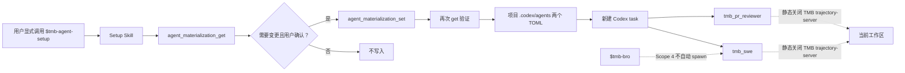

# TrustMyBot Codex Scope 4 产品需求与实施基线

## 1. 文档信息

| 字段 | 内容 |
|---|---|
| 文档状态 | 已确认，作为 Scope 4 的实施与验收基线 |
| 产品 | TrustMyBot Codex Adapter |
| Scope | Scope 4：Codex SWE / PR Reviewer Agent Materialization |
| 目标里程碑 | v1.1.0；本 Scope 不修改正式版本号 |
| 上级任务 | [Issue #1151](https://github.com/trustmybot/plugin/issues/1151) |
| 已完成前置 | [PR #1174](https://github.com/trustmybot/plugin/pull/1174)、[Issue #1173](https://github.com/trustmybot/plugin/issues/1173) |
| 后续范围 | Scope 5 Hooks、Scope 6 Worktree / E2E |
| 实施 Issue | [Issue #1175](https://github.com/trustmybot/plugin/issues/1175) |
| 目标分支 | `dev` |
| 基线提交 | `390cdcdebf97e0950f49b96af6b565f11829c567` |
| 基线日期 | 2026-08-15 |
| 主要读者 | 产品负责人、维护者、实施工程师、PR Reviewer、发布验证人员 |

这份文档是 Scope 4 的产品、实施和验收基线。用户流程、接口、Agent 行为、文件边界、测试环境和完成条件都在本文中定义。标为“后置硬化”的内容不属于本期。

### 1.1 怎么读这份文档

不需要从头读到尾。

- 想先判断 Scope 4 值不值得做：读第 2、4、7、8 节。
- 想了解用户怎么安装和使用 Agent：读第 11、18、19、20 节。
- 准备写代码：从第 13 节开始，重点看接口、文件状态和路径规则。
- 准备验收：读第 24 至 32 节。

文中几个高频词的含义：

| 词 | 本文中的意思 |
|---|---|
| materialize | 把插件内置的 Agent 模板写进当前项目的 `.codex/agents/` |
| current | 文件与当前内置模板逐字节一致 |
| conflict | 同名文件存在，但不是当前模板，工具不会碰它 |
| mixed | 两个 Agent 中只有一个已安装 |
| disposable 项目 | 专门用于测试的临时 Git 项目，不含真实项目文件 |

## 2. 执行摘要

Scope 4 的目标很直接：让用户在当前项目里安装两个固定角色，需要时再安全移除。

- `tmb_swe` 接收完整实施简报，在当前工作区修改代码并运行验证。
- `tmb_pr_reviewer` 阅读指定变更，给出审查意见，不修改代码。

Codex 从项目的 `.codex/agents/` 读取自定义 Agent，但插件 manifest 不能直接把文件放到这个目录。因此，本期增加一个需要用户主动调用的 Skill `$tmb-agent-setup`，再给它两个用途受限的 MCP 工具：

- `agent_materialization_get`
- `agent_materialization_set`

工具只管理两个路径：

- `.codex/agents/tmb_swe.toml`
- `.codex/agents/tmb_pr_reviewer.toml`

首版故意保持简单。文件只有三种状态：不存在、与当前模板完全相同、同名冲突。只要同名文件不是当前模板，工具就停下来，不覆盖，也不删除。历史模板升级、并发锁、双文件回滚和崩溃恢复留到后续硬化。

两个 Agent 都在自己的普通 `mcp_servers` 配置层里定义一个同名且禁用的
`trajectory-server`：

```toml
[mcp_servers."trajectory-server"]
command = "node"
args = ["--version"]
enabled = false
```

Codex 即使在 `enabled = false` 时也要求完整 transport，所以这里使用不会访问 TMB
的 `node --version` 作为惰性占位。该 transport 在禁用状态下不会启动。同名条目在
Agent 配置层覆盖插件提供的 server，不依赖 Marketplace ID。下文把它称为“同名 MCP
覆盖项”。

本地真实测试先复现了 plugin-scoped override 不可靠的问题：同一台机器上，Codex
`0.147.0` 的 Reviewer child 仍拿到了 TMB 工具。改用上面的同名 MCP 覆盖项后，CLI
`0.146.0` 和 `0.147.0` 的 Reviewer child 都看不到 TMB trajectory-server，并能完成
审查。Scope 4 因此不再设置人为的最低 CLI 版本，也不在 Setup Skill 中加入版本门。

两个 Agent 启动后还会检查自己实际拿到的工具列表。只要看到 TMB
trajectory-server 工具，就返回 `BLOCKED_TMB_MCP_ISOLATION`，不读取仓库，也不执行
命令。同名 MCP 覆盖项是已实测的宿主配置隔离；Agent 自检只是提示词级补充，不能
写成服务器强制门禁。Desktop 仍要直接检查 child Agent 的工具面，不能从 shell CLI
的结果推断 Desktop 已通过。

这不是完整的 TMB 自动工作流。Bro 不会自动派工，Agent 不会管理 TMB task，也不会创建 worktree、提交代码或充当 Hook 门禁。Reviewer 也不输出 `PASS`；它最多只能说，在指定范围内没有发现阻断问题。

## 3. 已验证的当前状态

### 3.1 Scope 3 合并状态

截至 2026-08-13，已重新查询远端并确认：

- PR #1174 状态为 `MERGED`。
- 合并时间为 2026-08-13 11:34:54 UTC。
- 合并提交为 `390cdcdebf97e0950f49b96af6b565f11829c567`。
- Issue #1173 状态为 `CLOSED`。
- `origin/dev` 指向上述合并提交。
- Parent Issue #1151 仍保持 `OPEN`，继续跟踪 Scope 4、5、6。

原 PRD 要求先合并 #1174 并关闭 #1173。两项都已完成，Scope 4 已具备实施条件。

### 3.2 Scope 3 已有能力

当前 `origin/dev` 已提供：

- 一个显式调用 Skill：`$tmb-bro`。
- `allow_implicit_invocation: false` 的 Codex Skill 策略。
- 项目扫描、world model、本地规划 Issue 和 planning discussion。
- 固定 Bro 身份和 caller identity / provenance 拒绝。
- 强制关闭远程 Issue 同步。
- 项目状态限定在 `<project>/.tmb/tmb/`。
- 精确 13 个 Codex MCP 工具。
- installed-cache 冷启动和真实 SQLite 持久化自动化测试。

Scope 3 不提供 Agent、task、validation、worktree、Git 交付或功能性 Codex Hooks。

### 3.3 当前命名与包身份

Scope 4 必须以 `origin/dev` 为准：

| 对象 | 当前值 | Scope 4 决策 |
|---|---|---|
| 已有 Skill | `$tmb-bro` | 保持不变 |
| 新 Setup Skill | 不存在 | 命名为 `$tmb-agent-setup` |
| Plugin manifest name | `tmb` | 保持不变 |
| 本地 Marketplace name | `trustmybot-local` | 保持开发安装来源，不进入 Agent 隔离键 |
| 完整本地 plugin ID | `tmb@trustmybot-local` | 用于本地安装证据，不进入 Agent TOML |
| MCP server name | `trajectory-server` | 同名 MCP 覆盖项依赖该固定名称 |
| SWE Agent | 不存在 | `tmb_swe` |
| Reviewer Agent | 不存在 | `tmb_pr_reviewer` |

不得使用旧草案中的 `$tmb:tmb-bro`、`$tmb:tmb-agent-setup` 或 `[plugins.tmb...]` 写法。

### 3.4 当前 Codex 宿主契约

根据 2026-08-15 刷新的官方 Codex 文档，以及本机对 Codex CLI `0.146.0` 和 `0.147.0` 的对照测试：

- 个人自定义 Agent 位于 `~/.codex/agents/*.toml`。
- 项目自定义 Agent 位于 `.codex/agents/*.toml`。
- 每个 Agent 文件必须有 `name`、`description` 和 `developer_instructions`。
- Agent 文件可设置 `sandbox_mode`、MCP server 和 Skills 配置。
- 未固定 `model` 或 `model_reasoning_effort` 时，由显式 spawn 参数、`[agents]` 默认值和父 task 配置按宿主优先级解析。
- 父 task 的实时 sandbox / approval 覆盖会在 spawn 时重新应用，可能覆盖 Agent TOML 的默认值。
- 插件支持 Codex Desktop 和 Codex CLI；IDE extension 当前不支持插件。
- 插件安装或配置变化后，需要新 task 或新 CLI session 才能可靠发现新的 Skill、工具和 Agent。
- plugin-scoped MCP override 在真实 child task 中表现不可靠，本期不采用。
- `mcp_servers."trajectory-server"` 同名禁用项在 CLI `0.146.0` 和 `0.147.0` 的 disposable 项目中都隐藏了 TMB 工具。

Scope 4 可以设置 Agent 的默认权限和行为，但这些默认值会受父 task 影响，不能当作不可绕过的安全边界。

## 4. 本期决定

### 4.1 保留的核心范围

1. 只交付两个项目级 Agent。
2. 通过一个显式 Setup Skill 安装和移除。
3. 增加两个窄化 MCP 工具，最终工具总数为 15。
4. 不覆盖或删除用户同名文件。
5. 两个 Agent 都关闭 TMB `trajectory-server`，并在工具仍可见时停止工作。
6. Agent 路径只对 CLI 和 Desktop 的本地安装做验收；每个宿主都要检查 child 的真实工具面。
7. 所有真实宿主测试都使用 disposable Git 项目，不使用任何现有开发项目。
8. 保持 Claude Code 行为不变。

### 4.2 首版主动删掉的复杂度

首版只支持以下文件状态：

- `absent`
- `current`
- `conflict`

两个文件状态不一致时，整体状态是 `mixed`。首版没有 `stale`，也不自动升级旧模板。

首版不实现：

- project-local materialization lock；
- stale lock 回收；
- 跨两个文件的补偿事务；
- `fsync` 持久化协议；
- 崩溃后自动清理或恢复；
- 历史模板 catalog；
- BOM / CRLF / 空白规范化；
- Reviewer 的可信 `PASS` 和只读证明。

首版只支持单用户操作，并假设一次调用期间目录不会被其他进程恶意替换。在这个前提下，工具仍要守住三条线：只碰检查过的固定路径，不覆盖用户文件，不删除未知文件。对抗恶意本地进程的 OS 级隔离留到后续硬化。

### 4.3 Reviewer 为什么不输出 `PASS`

Scope 4 的 Reviewer verdict 只有：

- `NO_BLOCKING_FINDINGS`
- `REQUEST_CHANGES`
- `NEEDS_CONTEXT`
- `BLOCKED_TMB_MCP_ISOLATION`

`NO_BLOCKING_FINDINGS` 只表示这次检查没有发现阻断问题。它不表示：

- reviewer 是服务器认证的独立角色；
- 当前 task 被证明为只读；
- 所有测试已经执行；
- Push gate 已满足；
- 代码可以自动合并或发布。

等到后续有可信的只读证明和 validation workflow，再定义 `PASS`。

## 5. 问题定义

### 5.1 用户问题

Scope 3 的 Bro 能理解项目并保存规划。接下来真正写代码和审查时，用户仍要反复告诉 Codex：

- 谁负责实施；
- 谁负责审查；
- 两个角色分别允许做什么；
- 哪些 Git、TMB 和项目配置行为必须停止；
- 如何避免 reviewer 修改自己正在审查的内容；
- 如何在不同项目中获得一致的角色定义。

问题不只是少了两个提示词。插件 manifest 不能直接写 `.codex/agents/`，所以还需要一条用户看得见、可以重复执行、也能撤销的安装流程。

### 5.2 工程问题

直接复制 Claude 的 `agents/swe.md` 和 `agents/pr-reviewer.md` 不可行：

- Claude frontmatter 与 Codex TOML schema 不同。
- Claude Agent 依赖 task、validation、Hook 和 role-scoped MCP；这些能力在 Scope 4 不存在。
- Claude Reviewer 是 Push gate；Scope 4 Reviewer 只是建议性角色。
- Claude SWE 工作在 Bro 创建的隔离 worktree；Scope 4 SWE 只使用用户已经选定的当前工作区。
- Codex 子 Agent 继承父 task 权限，TOML 中的 sandbox 默认值可能被覆盖。
- 同名项目 Agent 可能已经由用户创建，直接覆盖会破坏项目配置。

### 5.3 本期要解决的问题

用户应当能在选定的 Git 项目中安装、检查、移除并单独使用这两个 Agent。整个过程不能覆盖用户文件，也不能让用户误以为完整 TMB workflow 已经就绪。

## 6. 用户与利益相关者

### 6.1 主要用户

主要用户是同时使用 TrustMyBot 与 Codex CLI/Desktop 的开发者。他们已经用 `$tmb-bro` 做本地规划，现在需要固定的实施和审查角色，但暂时不需要自动 task 编排、Push gate 或完整 Claude parity。

### 6.2 次要利益相关者

- TrustMyBot 维护者：确保 Codex 适配不改变 Claude 行为。
- PR Reviewer：区分机器强制边界和 prompt 级行为。
- 发布验证人员：从 installed-cache 和真实宿主重复验证。
- 安全审查者：确认路径、文件所有权、MCP 隔离和权限继承边界。

## 7. 产品目标

1. 用户可以显式查看两个 Agent 的安装状态。
2. 用户确认后，可以安装或移除两个 Agent。
3. 在受支持的单用户、稳定路径条件下，文件写入只发生在当前 canonical Git worktree 的两个精确目标路径。
4. 同名未知或已修改文件不会被覆盖或删除。
5. 新 task 中可以发现并调用 `tmb_swe` 和 `tmb_pr_reviewer`。
6. SWE 能根据完整简报修改当前工作区并运行指定验证。
7. Reviewer 能针对指定 diff 输出有文件位置和严重级别的建议。
8. 两个 Agent 都不能使用本地开发安装中的 TMB `trajectory-server`。
9. Scope 3 的 13 个工具和固定 Bro 语义保持不变。
10. Claude 完整测试保持通过。

## 8. 非目标

Scope 4 明确不包含：

- `$tmb-bro` 自动安装或自动 spawn Agent；
- TMB task 创建、领取、重试、关闭或状态更新；
- validation record、reviewer session 签名或可信 provenance；
- server-issued role token；
- 自动创建、切换、清理或验证隔离 worktree；
- commit、push、merge、rebase、PR 或远程 Issue 操作；
- Scope 5 的功能性 Hooks、Hook trust ceremony 或 Hook 门禁；
- Scope 6 的端到端工作流编排；
- IDE extension 支持声明；
- 非交互 `codex exec` 产品支持声明；
- 公共 Plugin Directory 发布；
- 正式版本 bump、RC 或 stable 发布；
- Claude/Codex 完整 parity；
- 任意 Agent creator；
- 用户自定义 Agent 的通用管理；
- 旧模板自动升级。

## 9. 产品原则

1. **显式触发**：普通对话和 `$tmb-bro` 不得安装 Agent。
2. **项目本地**：不写 `~/.codex/agents/`。
3. **精确目标**：只管理两个固定文件。
4. **未知即冲突**：无法证明是当前模板，就不覆盖、不删除。
5. **当前字节为准**：首版不猜测用户是否只改了换行或注释。
6. **能力按证据声明**：sandbox 默认值不等于不可绕过的门禁。
7. **角色不是身份**：Agent 名称不构成服务器认证。
8. **不固定模型**：由用户和宿主选择模型与 reasoning。
9. **宿主隔离**：Codex adapter 不复用 Claude Agent registry。
10. **最小可恢复**：发生 mixed 状态时，用户可以重新执行同一 desired state 收敛。

## 10. 成功指标

| 指标 | Scope 4 目标 |
|---|---:|
| Codex 公开 Skill 数量 | 精确 2 |
| Codex MCP 工具数量 | 精确 15 |
| 普通 prompt 导致的 Agent 安装次数 | 0 |
| 写入精确目标之外的宿主配置文件数 | 0 |
| 被覆盖的用户文件数 | 0 |
| 被误删的用户或第三方 Agent 文件数 | 0 |
| Agent 导致的 TMB task / validation 写入 | 0 |
| Agent 导致的 commit / push / PR / remote Issue 操作 | 0 |
| CLI 本地固定 SHA 安装、发现、调用、移除流程 | 100% 通过 |
| Desktop 本地固定 SHA 安装、发现、调用、移除流程 | 100% 通过 |
| Claude L1-L4 回归失败 | 0 |
| 无证据的 parity / hard-gate 声明 | 0 |

## 11. 用户流程

### 11.1 首次检查与安装

1. 用户在目标 Git worktree 中显式调用 `$tmb-agent-setup`。
2. Skill 确定当前项目的绝对 Git top-level。
3. Skill 调用只读的 `agent_materialization_get`。Getter 会自行检查 canonical root 和 `.tmb/` ignore 门禁，不打开 TMB 规划数据库。
4. Skill 显示两个目标路径及 `absent/current/conflict` 状态。
5. 当需要写入时，Skill 显示精确动作并请求明确确认。
6. 用户确认后，Skill 调用 `agent_materialization_set`，传入 `desired_state="present"`。
7. Skill 再次调用 `agent_materialization_get`。
8. 只有两个文件都为 `current` 时，Skill 报告安装完成。
9. 如果文件发生变化，Skill 要求用户新建 Codex task 或重启 CLI session。

### 11.2 已安装且为当前版本

当两个文件都与当前模板逐字节一致：

- `overall_status="current"`；
- 不调用 setter，也不写两个 Agent 文件；检查过程不会创建或打开 `.tmb/tmb/`；
- 不要求安装确认；
- 不要求 restart；
- 可以提示用户直接在新 task 中调用 Agent。

### 11.3 Mixed 状态

当一个文件为 `current`、另一个为 `absent`：

- `overall_status="mixed"`；
- Setup Skill 明确列出缺失文件；
- 用户确认安装后只创建缺失文件；
- 已存在的 current 文件不重写；
- 最终必须重新检查为 `current`。

`mixed` 可能只是安装了一半，也可能是上次 I/O 中断留下的结果。首版不自动撤销已经成功的那一步。用户重新执行同一个 desired state，工具继续完成剩余文件。

### 11.4 冲突

以下任一情况都视为 `conflict`：

- 同名文件不是当前模板的精确字节；
- ownership header、模板 ID、版本或 hash 不一致；
- 用户修改了当前模板；
- 文件使用 CRLF、BOM 或其他不同字节。

如果目标不是普通文件、目标或父目录是 symlink，或者检查期间无法再确认路径安全，工具返回 `unsafe_codex_agents_path`。这种情况不是普通文件冲突。

发生任一冲突时：

- 两个文件都不得创建、覆盖或删除；
- 返回冲突路径和原因；
- 不返回冲突文件正文；
- 不返回冲突文件 hash；
- 不提供 force、overwrite 或 adopt 选项；
- 用户自行备份、改名或处理后再重试。

### 11.5 移除

1. 用户显式调用 `$tmb-agent-setup` 并选择移除。
2. Skill 显示两个精确目标。
3. 用户明确确认。
4. Skill 调用 `agent_materialization_set`，传入 `desired_state="absent"`。
5. 工具只删除与当前内置模板逐字节一致的目标。
6. 任何 conflict 都阻止整个移除 preflight。
7. 保留 `.codex/agents/` 目录和所有其他 Agent。
8. Skill 重新调用 getter；只有两个目标均 absent 时报告成功。
9. 用户新建 task 后确认 Agent 不再可发现。

### 11.6 独立使用 SWE

调用方必须提供：

- 目标；
- 允许修改的文件或目录；
- 验收标准；
- 必须运行的测试。

已知约束为可选字段；未提供时按空列表处理。

缺少任一必填部分时，`tmb_swe` 返回 `NEEDS_CONTEXT`，不修改文件。

### 11.7 独立使用 Reviewer

调用方必须提供：

- 需求或验收标准；
- 明确审查边界，例如当前工作区 diff 或 commit range；
- 已运行的测试及结果，未知时要明确写 `not run`。

缺少需求或 diff 边界时，Reviewer 返回 `NEEDS_CONTEXT`。

## 12. 产品架构



### 12.1 代码归属

- Agent materializer 属于 Codex adapter，不进入 Claude Agent registry。
- Agent 模板的唯一源放在 Codex MCP 源码中的只读 catalog 模块，不建立可被 Codex 自动发现的源码 `.codex/agents/` 目录。
- 公共工具接入现有 `mcp/trajectory-server/src/codex-tools.ts` registry。
- 项目根验证应复用或提取 Scope 3 的 canonical Git top-level 和 `.tmb/` ignore 检查，不复制出行为不同的第二套规则。
- Claude 的 `agents/`、`.claude-plugin/`、根 `.mcp.json`、Hook manifest 和 Claude registry 不变。
- 不新增生产依赖。

### 12.2 模板单一来源

必须新增以下模块，或提供职责完全等价的单一来源：

- `mcp/trajectory-server/src/codex-agent-catalog.ts`

该模块保存：

- `template_set_version=1`；
- 两个固定 Agent ID；
- 两个固定相对目标路径；
- 两段 canonical TOML body；
- 由 Node `crypto` 计算的 body SHA-256；
- 由 header 与 body 组合得到的 expected file bytes。

测试直接解析 materializer 生成的最终 TOML。Materializer、测试和文档都不得各自保存 canonical TOML；任何 expected bytes、版本和 hash 都必须来自这个 catalog。

## 13. 公共接口

### 13.1 Skill surface

Scope 4 完成后，Codex 插件只公开两个 Skill：

1. `$tmb-bro`
2. `$tmb-agent-setup`

`$tmb-agent-setup` 必须有自己的 `agents/openai.yaml`，并设置：

```yaml
policy:
  allow_implicit_invocation: false
```

普通实施、审查、规划、安装、升级或“帮我配置一下”的自然语言请求不得隐式运行此 Skill。

### 13.2 MCP surface

在现有 13 个工具后增加：

1. `agent_materialization_get`
2. `agent_materialization_set`

最终 `tools/list` 必须精确为 15。不得暴露 Claude 的：

- `agent_list`、`agent_register`、`agent_resolve`；
- task 工具；
- validation 工具；
- worktree 工具；
- branch、commit、push、PR 或 remote Issue 工具。

### 13.3 `agent_materialization_get`

用途：只读检查两个固定目标的状态。

输入：

```json
{
  "project_root": "/absolute/canonical/git/worktree"
}
```

输入约束：

- `project_root` 必填；
- 必须是绝对路径；
- 必须解析为 canonical Git worktree top-level；
- `.tmb/` 必须被 ignore 且不得 tracked；
- `additionalProperties: false`；
- 不接受目标路径、Agent 名称、模板内容、force、identity 或 provenance。

工具 annotation：

```json
{
  "readOnlyHint": true,
  "destructiveHint": false,
  "idempotentHint": true,
  "openWorldHint": false
}
```

Getter 不能创建 `.tmb/`、`.codex/` 或任何其他文件。Setup Skill 直接用 Getter 做首次检查。即使 TMB 规划数据库损坏、版本较新，或用户已经降级插件，检查和移除 Agent 也不受影响。

成功返回示例：

```json
{
  "ok": true,
  "data": {
    "project_root": "/absolute/canonical/git/worktree",
    "template_set_version": 1,
    "overall_status": "current",
    "agents": [
      {
        "agent_id": "tmb_swe",
        "target_path": ".codex/agents/tmb_swe.toml",
        "status": "current",
        "expected_template_version": 1,
        "expected_body_sha256": "<sha256>",
        "current_content_sha256": "<sha256>"
      },
      {
        "agent_id": "tmb_pr_reviewer",
        "target_path": ".codex/agents/tmb_pr_reviewer.toml",
        "status": "current",
        "expected_template_version": 1,
        "expected_body_sha256": "<sha256>",
        "current_content_sha256": "<sha256>"
      }
    ]
  }
}
```

Per-agent status：

- `absent`：目标不存在。
- `current`：完整文件字节与当前 catalog 完全一致。
- `conflict`：目标是普通文件，但完整字节不等于当前模板。

当 status 为 `conflict` 时，该 Agent entry 额外返回：

```json
{
  "conflict_reason": "content_mismatch"
}
```

路径类型不安全时不返回成功状态，直接返回 `unsafe_codex_agents_path` error envelope。

Overall status：

- `absent`：两个目标均 absent。
- `current`：两个目标均 current。
- `mixed`：一个 current、一个 absent。
- `conflict`：任一目标 conflict。

字段约束：

- `current_content_sha256` 只在 `current` 时返回。
- `absent` 和 `conflict` 不返回 current hash。
- 永不返回文件正文。
- 首版不返回 `stale`。

### 13.4 `agent_materialization_set`

用途：将两个固定 Agent 收敛到全部 present 或全部 absent。

输入：

```json
{
  "project_root": "/absolute/canonical/git/worktree",
  "desired_state": "present"
}
```

`desired_state` 只能为：

- `present`
- `absent`

输入约束：

- `additionalProperties: false`；
- 不接受单 Agent 选择；
- 不接受任意路径、名称、模板正文、force、identity 或 provenance；
- 写入前必须重新做完整项目根、路径和双目标 preflight；
- 不信任之前 getter 的结果。

工具 annotation：

```json
{
  "readOnlyHint": false,
  "destructiveHint": true,
  "idempotentHint": true,
  "openWorldHint": false
}
```

成功返回示例：

```json
{
  "ok": true,
  "data": {
    "project_root": "/absolute/canonical/git/worktree",
    "desired_state": "present",
    "changed": [
      ".codex/agents/tmb_swe.toml",
      ".codex/agents/tmb_pr_reviewer.toml"
    ],
    "unchanged": [],
    "overall_status": "current",
    "restart_required": true
  }
}
```

移除成功示例：

```json
{
  "ok": true,
  "data": {
    "project_root": "/absolute/canonical/git/worktree",
    "desired_state": "absent",
    "changed": [
      ".codex/agents/tmb_swe.toml",
      ".codex/agents/tmb_pr_reviewer.toml"
    ],
    "unchanged": [],
    "overall_status": "absent",
    "restart_required": true
  }
}
```

`changed` 和 `unchanged` 都按 catalog 固定顺序返回：先 `tmb_swe`，再 `tmb_pr_reviewer`。

两个数组在每次成功响应中都必须存在：

- `desired_state="present"` 时，`changed` 是本次创建的文件，`unchanged` 是原本已为 current 的文件。
- `desired_state="absent"` 时，`changed` 是本次删除的文件，`unchanged` 是原本已 absent 的文件。
- 两个数组合起来必须覆盖 catalog 中的两个目标，不能漏项或重复。

当没有文件变化：

- `changed=[]`；
- `restart_required=false`。

当文件发生创建或删除：

- `restart_required=true`；
- Setup Skill 必须要求新 task 或新 CLI session。

### 13.5 稳定错误码

沿用现有 `{ok:false,error:{code,message}}` envelope，并新增：

| 错误码 | 条件 | 用户恢复动作 |
|---|---|---|
| `agent_materialization_conflict` | 任一目标不是当前模板或 preflight 发现同名未知文件 | 备份、改名或手工处理冲突后重试 |
| `unsafe_codex_agents_path` | `.codex`、`agents`、目标路径含 symlink、非目录或非普通文件 | 修复项目路径结构后重试 |
| `agent_materialization_io_failed` | 创建目录、创建文件、写入、关闭或 unlink 失败 | 检查权限和磁盘，再执行 getter |
| `agent_materialization_partial` | 操作后两个文件未达到同一 desired state | 不手工覆盖；重新 get 后重复同一 desired state |

不新增 `agent_materialization_busy`，因为首版不实现进程锁。

既有错误继续复用：

- `missing_project_root`
- `project_root_not_absolute`
- `project_root_not_found`
- `project_root_not_directory`
- `project_root_not_git_toplevel`
- `project_state_not_ignored`
- `invalid_arguments`
- `unsupported_identity_claim`

新错误允许在既有 `error` 对象中增加可选 `details`，既有错误格式不变。

Conflict error 示例：

```json
{
  "ok": false,
  "error": {
    "code": "agent_materialization_conflict",
    "message": "A managed Agent target conflicts with the current template.",
    "details": {
      "conflicts": [
        {
          "agent_id": "tmb_swe",
          "target_path": ".codex/agents/tmb_swe.toml",
          "reason": "content_mismatch"
        }
      ]
    }
  }
}
```

Partial error 的 `details` 必须包含：

- `desired_state`；
- 按 catalog 顺序排列的 `changed`；
- `cause_code`，记录导致未收敛的原始稳定错误码；
- 两个 Agent 的最终 status；无法安全复查时使用 `unknown`；
- `restart_required`，其值为是否已有目标文件发生创建或删除。

Partial error 示例：

```json
{
  "ok": false,
  "error": {
    "code": "agent_materialization_partial",
    "message": "Agent targets did not converge after one target changed.",
    "details": {
      "desired_state": "present",
      "cause_code": "agent_materialization_conflict",
      "changed": [
        ".codex/agents/tmb_swe.toml"
      ],
      "agents": [
        {
          "agent_id": "tmb_swe",
          "target_path": ".codex/agents/tmb_swe.toml",
          "status": "current"
        },
        {
          "agent_id": "tmb_pr_reviewer",
          "target_path": ".codex/agents/tmb_pr_reviewer.toml",
          "status": "conflict"
        }
      ],
      "restart_required": true
    }
  }
}
```

#### 13.5.1 完整错误优先级

一次调用出现多个问题时，必须按下表决定主错误码。实现不得依赖对象键顺序、文件系统枚举顺序或哪一个异步操作先返回。

| 顺序 | 检查 | 主错误 |
|---:|---|---|
| 1 | 参数不是 JSON object | `invalid_arguments` |
| 2 | object 含 caller identity 或 provenance 字段 | `unsupported_identity_claim` |
| 3 | `project_root` 缺失、为空或类型错误 | `missing_project_root` |
| 4 | 其他 schema 错误、额外字段、无效 `desired_state` | `invalid_arguments` |
| 5 | project root 非绝对、缺失、非目录或无法 canonicalize | 对应 `project_root_*` 错误 |
| 6 | 不是 Git top-level，或 Git top-level 检查失败/超时 | `project_root_not_git_toplevel` |
| 7 | `.tmb/` 未 ignore、已 tracked，或相关 Git 检查失败/超时 | `project_state_not_ignored` |
| 8 | `.codex`、`.codex/agents` 父路径不安全 | `unsafe_codex_agents_path` |
| 9 | 任一目标路径类型不安全；同类问题按 catalog 顺序选择第一个 | `unsafe_codex_agents_path` |
| 10 | 普通目标文件内容不匹配；details 按 catalog 顺序列出所有冲突 | `agent_materialization_conflict` |
| 11 | 第一次目标目录项变化前出现 mkdir、exclusive open 失败、pre-unlink read 或 unlink 失败 | `agent_materialization_io_failed` |
| 12 | 至少一个目标变化后出现任何 unsafe、conflict、I/O 或 postflight 不收敛 | `agent_materialization_partial` |

第 12 步一旦成立，主错误码不能再变回根因。原始问题写入 `details.cause_code`；同一步出现多个根因时，仍按第 8 至 11 步和 catalog 顺序选第一个。若 postflight 只知道“没有收敛”而无法得到更具体原因，`cause_code` 使用 `agent_materialization_io_failed`。

“目标变化”按目录项判断，不按完整 TOML 是否写完判断：exclusive open 成功创建文件的那一刻，就算目标已经变化；unlink 成功的那一刻，也算目标已经变化。因此，open 成功后的 write、short write、close 或写后复核失败一律返回 `agent_materialization_partial`。如果 exclusive open 本身失败，或者 unlink 没有成功且此前没有其他目标变化，才返回直接根因错误。

创建 `.codex` 或 `.codex/agents` 目录不计入 `changed`，也不触发 `restart_required`。如果随后在第一个目标创建前失败，可以留下空目录并返回 `agent_materialization_io_failed`；不得删除用户原有目录或文件。这样调用方可以只根据两个受管目标是否发生变化，判断是否需要新 task 和恢复动作。

## 14. Agent 文件所有权

### 14.1 Ownership header

每个托管文件顶部必须是：

```toml
# Managed by TrustMyBot Codex Scope 4.
# tmb-template-id: tmb_swe
# tmb-template-version: 1
# tmb-body-sha256: <sha256>
```

Reviewer 文件的 template ID 为 `tmb_pr_reviewer`。

### 14.2 Canonical bytes

- 编码固定为 UTF-8，无 BOM。
- 换行固定为 LF。
- body 以 `name = ...` 开始。
- body 以一个 LF 结束。
- ownership header 后有一个空行，再接 body。
- `tmb-body-sha256` 计算 canonical body 的 UTF-8 字节，不含 ownership header。
- `current_content_sha256` 计算完整文件字节。
- status 判断以完整 expected bytes 为准，不以注释字符串、部分 header 或 TOML 语义等价为准。

### 14.3 为什么首版按字节判断

按字节判断省掉了所有权猜测：文件与模板完全相同，工具才把它视为自己管理的文件。用户只要改过一个字节，工具就停止。安装和移除也使用同一条判断规则。

代价很明确：CRLF、BOM、注释或空白变化也会触发 conflict。首版接受这个限制，换取更清楚的文件所有权。

## 15. Materializer 行为

### 15.1 Present 收敛

| 当前状态 | `desired_state=present` |
|---|---|
| absent + absent | 创建两个文件 |
| current + current | 不变 |
| current + absent | 只创建缺失文件 |
| absent + current | 只创建缺失文件 |
| 任一 conflict | 两个文件均不修改 |
| unsafe path | 两个文件均不修改 |

创建必须使用 `O_CREAT | O_EXCL | O_NOFOLLOW` 或当前平台等价的 exclusive no-follow 语义。目标在 preflight 后出现时，不得覆盖，并按以下规则处理：

- 新文件与 expected bytes 完全一致：视为另一个同目标操作已经完成，记入 `unchanged`。
- 新文件是普通文件但字节不一致：如果尚无目标变化，返回 `agent_materialization_conflict`；否则返回 `agent_materialization_partial`，并设置 `cause_code=agent_materialization_conflict`。
- 新路径类型不安全：如果尚无目标变化，返回 `unsafe_codex_agents_path`；否则返回 `agent_materialization_partial`，并设置 `cause_code=unsafe_codex_agents_path`。
- 路径无法检查：如果尚无目标变化，返回 `agent_materialization_io_failed`；否则返回 `agent_materialization_partial`，并设置 `cause_code=agent_materialization_io_failed`。

### 15.2 Absent 收敛

| 当前状态 | `desired_state=absent` |
|---|---|
| absent + absent | 不变 |
| current + current | 删除两个精确目标 |
| current + absent | 删除 current 文件 |
| absent + current | 删除 current 文件 |
| 任一 conflict | 两个文件均不删除 |
| 目录含第三方 Agent | 保留目录和第三方文件 |

删除前必须再次读取并确认完整字节仍等于 expected bytes。不得只依赖 ownership header。

### 15.3 I/O 中断与 partial

首版不提供跨文件原子事务。执行顺序固定为：

1. 对项目根、父目录和两个目标完成全量 preflight。
2. 任一 conflict 时，在第一次写入或删除前退出。
3. 按 catalog 固定顺序处理 `tmb_swe`，再处理 `tmb_pr_reviewer`。
4. 每个创建使用 exclusive no-follow create，禁止覆盖已存在路径。
5. 每个删除在 unlink 前再次验证 exact bytes。
6. 操作后重新读取两个目标状态。
7. 未达到 desired state 时返回 `agent_materialization_partial`。

exclusive open 成功或 unlink 成功，就是该目标的 mutation point。mutation point 之前失败，并且此前没有其他目标变化时，返回直接根因错误；mutation point 之后的 write、short write、close、复核或后续目标失败，都必须返回 `agent_materialization_partial`。后续发现的 unsafe、conflict 或 I/O 错误写入 `details.cause_code`。某个目标无法安全复查时，其最终 status 为 `unknown`。

`changed` 必须列出所有从本次 preflight 状态发生目录项或字节变化的受管目标，即使它最后是截断文件、`conflict` 或 `unknown`。只要 `changed` 非空，`restart_required=true`；若仅创建了空父目录且两个目标未变化，则 `changed=[]`、`restart_required=false`。首版不自动 unlink 写坏的目标，因为无法保证清理过程成功，也不把这种补偿清理伪装成原子事务。

如果第一个操作成功、第二个失败，保留第一个成功结果，不做自动补偿删除或恢复。恢复方法是：

- 先运行 getter；
- 若状态为 safe mixed，重复同一 desired state；
- 若状态为 conflict，停止并由用户处理。

### 15.4 并发边界

Scope 4 首版只支持单用户一次运行一个 setup，不承诺多进程安全。

一次调用期间，如果有恶意本地进程持续替换 `.codex` 或 `.codex/agents`，首版可能无法提供完整隔离。`openat` 或 directory-handle 级 TOCTOU 防护留到后续硬化。

仍需做到：

- exclusive create 防止静默覆盖竞争中出现的新文件；
- 每次 setter 都重新 preflight；
- 每个文件操作前再次 `lstat` 和 containment check；
- 操作后复查最终状态；
- 竞争导致的不一致以 conflict 或 partial 结束，不静默成功。

进程锁和 stale lock 恢复也不在首版范围内。

## 16. 路径安全

每次 getter 和 setter 都必须：

1. 要求绝对 `project_root`。
2. canonicalize 路径。
3. 使用 Git 验证它正好是 worktree top-level，不接受子目录。
4. 确认 `.tmb/` 已 ignore 且没有 tracked 文件。
5. 对 `<root>/.codex` 使用 `lstat`；存在时必须是真实目录，不能是 symlink。
6. 对 `<root>/.codex/agents` 使用 `lstat`；存在时必须是真实目录，不能是 symlink。
7. 对两个目标使用 `lstat`；存在时必须是普通文件，不能是 symlink、目录、FIFO、socket 或 device。
8. 缺少目录时，只允许创建 `.codex` 和 `.codex/agents`。
9. 创建目录后再次 `lstat`，确认没有竞争产生的 symlink。
10. 使用固定相对路径，不拼接用户输入的文件名。
11. 目标解析后必须仍位于 canonical `<root>/.codex/agents/` 内。
12. 每个 create/unlink 前重新检查父目录类型和 canonical containment。
13. Create 使用 no-follow exclusive flag；不使用会覆盖现有目标的 rename。

这些检查可以挡住已有 symlink 和普通 setup 竞争，挡不住恶意本地进程持续换目录。所有安全说明都要同时写明第 15.4 节的前提：单用户操作，调用期间路径稳定。

不得写入：

- `~/.codex/agents/`；
- `.claude/`；
- 插件源码之外的其他 worktree；
- installed plugin cache；
- Git index；
- Git remote；
- `.gitignore`；
- `.tmb/` 之外的其他 TMB state。

`.codex/agents/` 是本 Scope 唯一允许由 TMB MCP 写出 `.tmb/tmb/` 的项目配置例外。

生成文件可能出现在 `git status`。Setup Skill 必须告知：

- TMB 不会自动 stage 或 commit；
- 是否纳入版本控制由用户决定；
- TMB 不会修改 `.gitignore`。

## 17. Agent 模板共同要求

两个模板必须：

- 包含 `name`、`description`、`developer_instructions`；
- 不包含 `model`；
- 不包含 `model_reasoning_effort`；
- 明确由 Codex 宿主按当前 spawn、Agent 默认和父 task 配置解析模型；
- 显式包含：

```toml
[mcp_servers."trajectory-server"]
command = "node"
args = ["--version"]
enabled = false
```

- `node --version` 只是满足 Codex 完整 transport schema 的惰性占位，禁用时不得启动；
- 明确禁止调用 `$tmb-bro` 和 `$tmb-agent-setup`；
- 明确禁止修改 `.tmb/`、`.claude/` 和 `.codex/`；
- 明确声明自身不是服务器认证的 TMB workflow role；
- 明确声明自身不会创建 TMB task、validation 或 audit record；
- 明确声明父 task 的 live permission override 可能改变 TOML 默认 sandbox；
- 把工具面检查放在任何仓库读取或命令执行之前；
- 发现 `mcp__trajectory_server__*` 或其他明确属于 TMB trajectory-server 的工具时，立即返回 `BLOCKED_TMB_MCP_ISOLATION`，不继续工作；
- 不引用 Claude 专用 MCP 名称、Hook payload 或 task brief 工具。

Scope 4 的隔离依赖固定 MCP server 名 `trajectory-server`，不依赖 Marketplace ID。任何
宿主或插件改名都必须重新做 live tool-surface 验收，不能只看 TOML 推断仍然安全。

## 18. `tmb_swe` 契约

### 18.1 默认配置

```toml
name = "tmb_swe"
sandbox_mode = "workspace-write"
```

`description` 必须表达：只在收到完整实施简报后，在当前工作区内实施并验证；不负责 TMB workflow 或 Git 交付。

### 18.2 输入契约

完整简报必须包含：

1. `objective`：目标结果。
2. `allowed_paths`：可修改文件或目录。
3. `acceptance_criteria`：可验证完成条件。
4. `required_tests`：必须运行的命令或明确 `none`。
5. `constraints`：可选的已知边界；缺省值为空列表。

缺少前四项任一项时，输出：

```text
NEEDS_CONTEXT
```

并列出缺失字段。不得开始修改。

### 18.3 开始前检查

SWE 必须检查并报告：

- Git top-level；
- 当前分支；
- `git status --short`；
- 简报允许路径内是否已经有用户变更；
- 当前 task 是否具有 workspace-write 或更高权限。

SWE 必须拒绝在以下分支实施：

- `main`
- `master`
- `dev`
- `develop`
- `release/*`
- `rc/*`

该拒绝由 developer instructions 提供，不得表述为机器门禁。

### 18.4 修改规则

- 只修改 `allowed_paths`。
- 允许路径与现有用户改动重叠时停止，报告冲突。
- 无关用户改动保留，不清理、不 reset、不 checkout、不 stash。
- 不创建或切换 branch/worktree。
- 不修改 `.tmb/`、`.claude/`、`.codex/`。
- 不执行 commit、push、merge、rebase、PR 或 remote Issue 操作。
- 不调用 TMB MCP。
- 不自行扩大验收标准或重构无关代码。
- 可以产生正常测试缓存和 ignored build artifact，但不得留下超出 allowed paths 的 tracked 变更。

### 18.5 验证顺序

1. 运行与改动最接近的 focused test。
2. 运行简报中列出的 required tests。
3. 任一 required test 失败或无法运行时，status 必须为 `BLOCKED`，不能写成 `COMPLETED`。
4. 检查最终 `git diff --stat` 和 `git status --short`。
5. 发现超范围 tracked 变更时停止并报告，不自行清理用户文件。

### 18.6 最终输出

必须包含：

- status：`COMPLETED`、`BLOCKED`、`BLOCKED_TMB_MCP_ISOLATION` 或 `NEEDS_CONTEXT`；
- 变更摘要；
- 实际修改文件；
- 实际运行的测试和逐项结果；
- 跳过或失败的验证；
- 剩余风险；
- 用户原有改动是否保留；
- 明确声明未 commit、未 push、未写 TMB workflow 数据。

## 19. `tmb_pr_reviewer` 契约

### 19.1 默认配置

```toml
name = "tmb_pr_reviewer"
sandbox_mode = "read-only"
```

`description` 必须表达：针对指定 diff 做建议性审查，不修改代码，不产生可信 TMB validation。

### 19.2 输入契约

调用方必须提供：

1. `requirements`：需求或验收标准。
2. `diff_scope`：当前工作区、具体 commit 或 commit range。
3. `test_evidence`：已执行测试及结果；未知时明确为 `not run`。

缺少 `requirements` 或 `diff_scope` 时返回 `NEEDS_CONTEXT`。

### 19.3 审查规则

- 只审查指定 diff，不扩大到整个仓库的泛化审计。
- 可以读取相邻代码和测试理解上下文。
- 不编辑文件、不修复问题、不创建 probe 文件。
- 不执行 commit、push、PR、remote Issue 或 TMB 状态变更。
- 不调用 TMB MCP。
- 不把 Agent 名称当作独立 reviewer 身份证明。
- 不把 `sandbox_mode="read-only"` 当作当前 task 的可验证事实。

### 19.4 Finding 格式

每条 finding 必须包含：

- 严重级别：`P0`、`P1`、`P2` 或 `P3`；
- 文件路径；
- 尽量精确的行号；
- 触发条件；
- 用户或工程影响；
- 建议修复方向；
- 证据来源：diff、代码、测试或运行结果。

严重级别：

| 级别 | 定义 |
|---|---|
| P0 | 可导致严重安全、数据损坏或系统不可用，必须阻止交付 |
| P1 | 高概率功能错误、回归或违反核心验收，必须修改 |
| P2 | 有限场景错误、明显维护风险或缺失重要测试，应修改 |
| P3 | 低风险改进、可读性或非阻断建议 |

### 19.5 Verdict 规则

- 有任一 P0/P1：`REQUEST_CHANGES`。
- 核心验收不满足，即使未归类 P0/P1：`REQUEST_CHANGES`。
- 缺少必要上下文：`NEEDS_CONTEXT`。
- 启动时仍能看到 TMB trajectory-server 工具：`BLOCKED_TMB_MCP_ISOLATION`，停止审查。
- 没有阻断 finding：`NO_BLOCKING_FINDINGS`。

`NO_BLOCKING_FINDINGS` 不能写成 `PASS`、`approved`、`safe to merge` 或“通过 Push gate”。

### 19.6 最终输出

必须包含：

- verdict；
- findings；
- 已检查 diff 范围；
- 已复核测试；
- permission note：当前只读仅为 Agent 默认值，父 task override 可能改变它；
- 未验证范围；
- 剩余风险；
- “本结果不构成 TMB validation record 或 Push gate”的声明。

## 20. Setup Skill

### 20.1 固定流程

`$tmb-agent-setup` 必须按以下顺序执行：

1. 确定当前项目绝对 Git top-level。
2. 确认用户要检查、安装还是移除。
3. 调用 `agent_materialization_get`。
4. 解释 overall 和每个 Agent 状态。
5. 如果无需变更，直接结束。
6. 如果有 conflict，停止，不调用 setter。
7. 显示将创建或删除的精确路径。
8. 告知文件可能出现在 `git status`，TMB 不会 stage/commit/ignore。
9. 请求用户明确确认。
10. 只有确认后调用 `agent_materialization_set`。
11. 再次调用 `agent_materialization_get`。
12. 只有最终状态正确时报告成功。
13. 有文件变化时，要求新 task 或重启 CLI session。

### 20.2 禁止行为

Skill 不得：

- 自动 spawn Agent；
- 修改 `$tmb-bro` 的规划记录；
- 创建 TMB task 或 validation；
- 执行 Git 写操作；
- 自动处理 conflict；
- 安装全局 Agent；
- 修改 `.gitignore`；
- 在普通对话中隐式运行；
- 在用户确认前调用 setter；
- 把当前 task 内尚未重新加载的 Agent 描述为已生效；
- 承诺非 `trustmybot-local` Marketplace 下的 MCP 隔离。

### 20.3 固定用户文案

安装确认：

> 将在当前 Git 项目中创建以下文件：
>
> `.codex/agents/tmb_swe.toml`
>
> `.codex/agents/tmb_pr_reviewer.toml`
>
> 不会修改 `.claude`、Git 索引、远程仓库或 TMB 规划数据。文件可能出现在 `git status`，是否纳入版本控制由你决定。确认安装吗？

移除确认：

> 将只删除与当前 TMB 模板逐字节一致的两个 Agent 文件。其他 `.codex/agents` 文件和目录会保留。确认移除吗？

冲突文件：

> 检测到同名文件不是当前 TMB 模板。为避免覆盖或误删用户配置，本次未修改任何 Agent 文件。请先备份、改名或处理该文件后重试。

不安全路径：

> 检测到 `.codex`、`.codex/agents` 或目标文件包含 symlink、错误的文件类型，或无法安全验证。为避免写出项目边界，本次未修改任何 Agent 文件。请修复路径结构后重试。

成功：

> 两个 Agent 配置已写入。Codex 在新 task 或新 CLI session 中读取项目 Agent 配置，请重新打开后再调用 `tmb_swe` 或 `tmb_pr_reviewer`。

Partial：

> 至少一个 Agent 文件已经变化，但两个文件没有达到同一目标状态。不要覆盖或批量删除 `.codex/agents`。请重新运行 `$tmb-agent-setup` 检查状态；如果仍是 safe mixed，可重复同一安装或移除操作。错误详情会保留导致中断的原始原因。

## 21. 功能需求

以下均为 Scope 4 P0 exit gate：

| ID | 需求 |
|---|---|
| S4-FR-001 | Codex 精确公开 `$tmb-bro` 与 `$tmb-agent-setup` 两个 Skill |
| S4-FR-002 | 两个 Skill 都设置 `allow_implicit_invocation: false` |
| S4-FR-003 | Codex 精确公开 15 个 MCP 工具 |
| S4-FR-004 | Getter 准确返回 absent/current/conflict 和 overall mixed |
| S4-FR-005 | Getter 真实只读，不创建任何文件 |
| S4-FR-006 | Setter present 创建缺失的精确目标 |
| S4-FR-007 | Setter absent 只删除 exact-current 目标 |
| S4-FR-008 | 安装和移除均幂等 |
| S4-FR-009 | 任一 conflict 在第一次变更前阻止双目标操作 |
| S4-FR-010 | symlink、目录和非普通文件 fail closed |
| S4-FR-011 | 不提供 force/overwrite/adopt |
| S4-FR-012 | 不自动升级未知或旧模板 |
| S4-FR-013 | mixed safe state 可通过重复 desired state 收敛 |
| S4-FR-014 | 文件变化后要求新 task/session |
| S4-FR-015 | 两个 Agent 都使用完整、禁用的同名 `trajectory-server` MCP 覆盖项，不依赖 Marketplace ID |
| S4-FR-016 | Setup Skill 不做 CLI 版本拦截；是否支持某个宿主，以 child 的实际工具面为准 |
| S4-FR-017 | 两个 Agent 在看到 TMB trajectory-server 工具时返回 `BLOCKED_TMB_MCP_ISOLATION` 并停止 |
| S4-FR-018 | SWE 在完整简报下修改允许路径并运行测试 |
| S4-FR-019 | SWE 不创建 worktree、不 commit、不 push、不写 TMB workflow |
| S4-FR-020 | Reviewer 只提供建议性结论且永不输出 PASS |
| S4-FR-021 | Reviewer 不编辑文件、不写 validation |
| S4-FR-022 | `$tmb-bro` 不自动安装或 spawn Agent |
| S4-FR-023 | 不写 `.claude`、全局 Agent、installed cache、Git index 或 remote |
| S4-FR-024 | 不修改 Claude manifest、registry、Hooks 或运行时行为 |
| S4-FR-025 | CLI 和 Desktop 使用 disposable 项目完成固定 SHA 验收 |
| S4-FR-026 | 文档明确区分 Scope 4 与 Scope 5/6 |

## 22. 非功能需求

### 22.1 安全

- 路径和文件所有权判断 fail closed。
- 不接受任意路径、名称或模板内容。
- unknown bytes 一律 conflict。
- 支持版本中的 Agent 不获得 TMB MCP；工具仍可见时，Agent 必须停止。
- Agent 名称不用于服务器鉴权。
- 不新增 token、credential 或 secret。
- 不新增网络请求。
- Setter 不运行项目扫描、测试、Git fetch 或外部 CLI。

### 22.2 隐私

允许出现在本地诊断中的信息：

- tool name；
- desired state；
- 相对目标路径；
- per-agent / overall state；
- expected template version/hash；
- changed / unchanged；
- stable error code；
- duration。

禁止记录：

- Agent 文件正文；
- conflict 文件 hash；
- 用户源代码；
- 实施简报全文；
- credential；
- 绝对用户 home 路径进入仓库证据；
- 远程 telemetry。

### 22.3 性能

- Getter 只检查两个小文件和固定目录。
- 如果目标文件大小与 expected bytes 不同，可直接判为 conflict，不读取全部正文。
- Setter 不扫描仓库，不连接网络。

性能验证使用 disposable Git 项目，分别测量 absent、current 和 conflict 三种 getter 路径。固定协议如下：

1. 每种状态都使用独立的 fixture 和 measurement MCP 进程。`current` 比较特殊：先启动另一个 installed-cache MCP 进程完成安装，关闭这个准备进程后，再启动 measurement 进程。采样开始前，Git root、`.tmb` ignore 状态和目标文件必须全部就绪。Getter 全程只读，采样期间不重置 fixture。
2. 测试按 `absent`、`current`、`conflict` 的固定顺序执行。每种状态都先启动自己的 measurement MCP 进程，再发送请求。准备进程和 measurement 进程的启动时间都不计入 getter latency。
3. Harness 使用 `process.hrtime.bigint()`：在写出完整 JSON-RPC 请求前开始计时，在收到并解析对应完整响应后停止。计时包含本地 stdio 往返、参数验证、Git/root 检查、文件检查和响应序列化。
4. 单个 JSON-RPC 请求如果 10 秒内没有返回，Harness 必须终止测试并限时回收对应 MCP 进程，不能无限等待。这个超时只用于识别协议或进程故障，不参与 getter latency 统计。
5. 每种状态的第 1 个请求记为 `cold`；接着运行 10 次 warm-up；然后在同一进程、同一 fixture 上连续记录 100 个 warm 样本。三段顺序不得互换，也不手工清理操作系统文件缓存。
6. Copied artifact 根目录必须包含测试专用 `.tmb-artifact-provenance.json`，且只能有一个 40 位小写 `source_sha` 字段。正式测试要从同一 commit 的干净 checkout 运行 Harness。采样前，Harness 先核对 SHA，再逐项比较 artifact 与 checkout 的 tracked 文件、文件类型、可执行位和仓库内 symlink 目标。只要出现 `.git`、`node_modules`、断链或逃出 artifact 的 symlink，就立即终止。Artifact hash 覆盖文件、目录、mode、symlink 目标和 provenance 文件。原始结果保存为 JSONL；每行至少包含 `plugin_sha`、`harness_source_sha`、Codex/Node 版本、操作系统、架构、文件系统、状态、样本类型、样本序号和 `duration_ns`。PR 证据还要保存 Harness 文件 hash。
7. 每种状态分别报告 cold、warm p50、p95 和 max。百分位使用排序后的 nearest-rank 方法；100 个样本的 p95 取第 95 个值。
8. 本机验收目标为每种状态的 warm p95 不高于 100 ms；超出时必须调查并记录原因。这个数值是本机观察门槛，不作为不同 CI runner 之间的硬性能 gate。后续 PR 只有复用同一 harness、fixture 协议和计时边界时才可比较回归。

受版本控制的唯一 harness 路径为：

```text
tests/benchmarks/codex-agent-materialization.mjs
```

唯一正式运行方式为：

```bash
node tests/benchmarks/codex-agent-materialization.mjs \
  --installed-plugin-root /absolute/path/to/fixed-sha-installed-artifact \
  --output-dir /absolute/path/to/disposable-evidence-dir
```

- 两个参数都必填且必须是绝对路径；不提供可改变状态顺序、warm-up 数量、样本数量、计时边界或门槛的参数。
- `--installed-plugin-root` 必须指向本次固定 SHA copied installed artifact，并带有上述 provenance 文件；Harness 只用干净 checkout 绑定 provenance 和 artifact 内容，不从源码目录加载运行依赖，也不修改 artifact。
- `--output-dir` 必须位于 disposable 测试空间且尚不存在。Harness 必须 canonicalize 其已存在父目录，拒绝通过 symlink 父目录写入 installed artifact；创建后再次确认 canonical output 仍在 artifact 外。Harness 在其中创建 fixture，并固定输出 `codex-agent-materialization.samples.jsonl` 与 `codex-agent-materialization.summary.json`。
- Harness 的所有 Git 子进程必须移除继承的 `GIT_*` override，关闭 terminal prompt、system/global config、hooks 和 fsmonitor，避免 fixture 初始化、add 或 commit 作用到其他仓库。
- summary 必须包含三个状态的 cold/p50/p95/max、环境字段、artifact SHA、harness file SHA-256 和 `threshold_status`。`threshold_status` 只能是 `pass` 或 `investigate`。
- 三种状态和全部样本成功完成、证据完整时退出 0。任一参数、fixture、MCP 协议、采样或输出错误时退出 1。p95 超过观察门槛时仍退出 0，但写入 `threshold_status="investigate"`；PR 必须附原因和后续判断，CI 不因不同机器的耗时直接失败。
- `tests/benchmarks/selftest.sh` 必须用受控 stub 或 fixture 验证参数拒绝、固定样本数、nearest-rank 汇总、两个输出文件和上述退出语义；selftest 不启动 live Codex 或联网。

### 22.4 兼容性

- 只使用 Node 标准库和现有依赖。
- installed-cache 中没有源码 `node_modules` 时仍可运行。
- 不依赖 session cwd 定位模板。
- 不增加数据库 migration。
- 不迁移 `.claude` Agent。
- 不改变现有 13 个工具的输入、输出和固定 Bro 语义。
- Scope 4 首版真实宿主验收限定为 macOS arm64 上的 Codex CLI 和 Desktop。Linux、Windows、macOS x64 以及 IDE 均标为未验证，不能从 Node 可移植性推断为已支持。

### 22.5 可维护性

- Agent body、metadata、hash 和 expected file bytes 由一个 catalog 提供。
- tool registry、测试 allowlist、文档数量同步。
- Prompt 通过现有 `scripts/prompt-author-lint.sh`，并按仓库 A-F rubric 进行人工 Grade A 评审。
- Adapter doctrine 变更需要维护者人工审查，不 auto-merge。

## 23. 威胁模型

| 威胁 | 后果 | Scope 4 缓解 | 剩余风险 |
|---|---|---|---|
| 用户已有同名 Agent | 覆盖用户配置 | 非 expected bytes 即 conflict | 用户需手工处理同名冲突 |
| 用户修改 TMB Agent | 移除时误删定制 | exact bytes 不符即 conflict | 不提供自动升级或 adopt |
| 伪造 Managed by 注释 | 误判所有权 | 完整 expected bytes 比较 | 无 |
| `.codex` 或 `agents` 为 symlink | 写出项目边界 | 逐段 `lstat` 拒绝 symlink | 外部进程 TOCTOU 属于后置硬化 |
| 目标为目录/FIFO/socket | 阻塞或破坏路径 | 非普通文件直接拒绝 | 无 |
| 两个安装进程并发 | mixed 或竞争结果 | exclusive create、重做 preflight、最终复查 | 无进程锁，不宣称并发安全 |
| 第二个文件操作失败 | 只变更一个 Agent | 返回 partial，允许重复同一 desired state | 不自动回滚 |
| 进程在写入时崩溃 | 截断文件或 mixed | 下次 getter 报 conflict/mixed | 自动恢复后置 |
| 插件升级改变模板 | 老文件不能自动更新 | 老文件 conflict，不覆盖 | 历史 catalog 后置 |
| plugin-scoped override 被忽略 | Agent 看到全部 TMB 工具 | 不采用该层；使用普通同名 MCP 覆盖项 | Codex 配置合并语义变化时仍需重测 |
| Desktop CLI 与内部 runtime 不一致 | 错误推断宿主安全 | Desktop 验收直接检查 child Agent 工具面 | 未完成该证据前不能声明 Desktop 通过 |
| Agent 继承 TMB MCP | 绕过 Scope 4 写规划数据 | 同名 server 在 Agent 层禁用；工具仍可见时停止 | server 改名或宿主变更后需重新验收 |
| Reviewer 父 task 可写 | Reviewer 能力超出默认 read-only | 不输出 PASS；明确 override 风险 | 仍是 prompt 级约束 |
| 外部 MCP 可写 | Reviewer 不是硬只读 | 明确建议性结论 | 不提供外部 MCP allowlist |
| Repo prompt injection | Agent 偏离角色 | developer instructions、范围检查、TMB MCP 隔离 | 不声明完全防护 |
| 用户误以为完整 workflow | 错误依赖审查或交付门禁 | UI、README、PARITY 重复声明非目标 | 需要文档评审 |

## 24. 隔离开发与测试空间

### 24.1 源码工作区

Scope 4 不得在已有 dirty worktree 中开发或测试。

当前 PRD 已使用以下独立 detached worktree：

```text
<workspace-parent>/plugin-scope4-prd-review
```

这个 worktree 来自 `origin/dev` 的 `390cdcde...`，没有绑定开发分支。用户批准创建 Scope 4 Issue 后，正式实施要从最新 `origin/dev` 另建 worktree 和 feature branch。

禁止：

- 使用任何已有 dirty worktree；
- `git reset --hard`；
- `git clean`；
- 自动 stash；
- 目录级删除；
- 覆盖或还原无关用户文件。

### 24.2 Disposable 项目

所有真实宿主测试必须创建新的临时 Git 项目，例如：

```text
/private/tmp/tmb-codex-scope4-<random>/project
```

Fixture 必须：

- `git init`；
- 使用本地测试身份，不读取或修改全局 Git config；
- `.gitignore` 只包含测试所需 `.tmb/`；
- 建立非保护分支 `test/scope4-agent-acceptance`；
- 包含一个第三方 `.codex/agents/sentinel.toml`；
- 包含一个可安全修改并可测试的最小源码 fixture；
- 无真实 remote，或 remote 指向明确不可写的测试 URL；
- 不包含用户真实项目文件。

测试完成后默认保留 fixture 和证据路径供用户检查。本次流程不自动执行目录级清理。

### 24.3 CLI 配置隔离

CLI plugin 安装和 cache 测试优先使用专用、预先创建的 `CODEX_HOME`：

```text
/private/tmp/tmb-codex-scope4-<random>/codex-home
```

规则：

- 不复制真实 `auth.json`、token 或 credential 到 fixture。
- 需要 live model turn 时，对专用 profile 单独登录，或在用户明确接受后使用当前认证 profile 配合 `--ephemeral`。
- `--ephemeral` 防止保存测试 session。
- 不修改用户现有 plugin、Marketplace 或其他 Codex 配置。
- 测试只安装固定 SHA 产物和 `trustmybot-local` Marketplace。

### 24.4 Desktop 隔离

Desktop 没有在本文中假定可切换独立 `CODEX_HOME`。因此 Desktop 验收采用：

- disposable Git 项目；
- 新建专用测试 task；
- 只安装 `tmb@trustmybot-local`；
- 安装前记录 TMB plugin 是否已经存在；
- 只在本次测试新安装时，测试后通过正常 plugin remove 流程移除该精确插件；
- 不删除整个 cache、Marketplace、task 或其他插件；
- 不操作任何其他项目 task。

Desktop 测试是本 Scope 唯一可能触及当前 Codex profile 的步骤，必须在执行记录中单独标注 before/after 状态。

### 24.5 文件变化哨兵

真实宿主测试前后都要保存：

- fixture `git status --short`；
- fixture tracked file hash 清单；
- `.codex/agents` 文件名清单；
- `.claude` 是否存在及其 hash；
- `.tmb/tmb` SQLite 表计数；
- Git index tree；
- 本地 branch 和 remote 状态。

允许变化只有：

- 显式 setup 创建或删除的两个 Agent 文件；
- Scope 3 `runtime_initialize` 在 fixture 的 `.tmb/tmb/` 中创建的状态；
- SWE 简报允许路径内的 fixture 变更；
- 测试进程产生的 ignored cache。

任何其他 tracked 变化都使验收失败。

## 25. 测试计划

### 25.1 L1 静态与契约测试

必须验证：

1. Codex Skill 目录精确为 `tmb-bro` 和 `tmb-agent-setup`。
2. 两个 Skill 名称与目录一致。
3. 两个 `agents/openai.yaml` 都有 `allow_implicit_invocation: false`。
4. Codex 工具 allowlist 精确为 15。
5. 两个 generated TOML 可被 Python `tomllib` 或当前 Codex strict config 解析。
6. required fields 存在。
7. SWE 为 `workspace-write`。
8. Reviewer 为 `read-only`。
9. 两个模板都不固定 model/reasoning。
10. 两个模板都包含精确的同名 MCP 覆盖项：`command = "node"`、`args = ["--version"]`、`enabled = false`。
11. 两个模板都要求在仓库读取前检查 live tool surface，并包含 `BLOCKED_TMB_MCP_ISOLATION`。
12. Setup Skill 不包含宿主版本门，也不依赖 Marketplace ID。
13. 模板不引用 Claude 专用 MCP、Hook 或 task workflow。
14. ownership header 和 body hash 一致。
15. catalog 只有两个 template entry。
16. source tree 不包含会被项目自动发现的 `.codex/agents/*.toml`。
17. README、CODEX、PARITY 和 MULTI_PLATFORM 不声称完整 parity 或硬只读。
18. `scripts/prompt-author-lint.sh` 通过。
19. Agent prompt 人工 rubric 为 Grade A。

### 25.2 Materializer 单元测试

至少覆盖：

1. 两个文件均 absent。
2. 两个文件均 current。
3. current + absent 返回 mixed。
4. absent + current 返回 mixed。
5. 用户同名文件返回 conflict。
6. Getter conflict entry 返回 `conflict_reason="content_mismatch"`，不返回 current hash。
7. 只有伪造 ownership header 仍返回 conflict。
8. current 文件被追加空白后返回 conflict。
9. CRLF 或 BOM 文件返回 conflict。
10. `.codex` 为 symlink，并返回 unsafe path error。
11. `.codex/agents` 为 symlink，并返回 unsafe path error。
12. 目标为 symlink，并返回 unsafe path error。
13. 目标为目录。
14. 目标为 FIFO 或其他非普通文件；不允许测试阻塞读取。
15. present 首次创建两个目标。
16. present 重复调用无变化。
17. present 从 mixed 收敛到 current。
18. conflict 阻止两个文件全部写入，error details 含相对路径和 reason。
19. create preflight 后出现 exact-current 文件时记为 unchanged，不覆盖。
20. create preflight 后出现不同普通文件时返回 conflict，不覆盖。
21. absent 删除两个 current 目标。
22. absent 重复调用无变化。
23. absent 从 mixed 收敛到 absent。
24. absent 遇 conflict 时不删除另一个 current。
25. 移除保留第三方 Agent。
26. 移除保留 `.codex/agents` 目录。
27. 第一次目标变更前 I/O 失败返回 `agent_materialization_io_failed`。
28. 第一个创建成功、第二个 I/O 失败后返回 partial，details 列出 changed 和最终状态。
29. 第一个删除成功、第二个 I/O 失败后返回 partial，details 列出 changed 和最终状态。
30. partial 后重复相同 desired state 可收敛。
31. getter 不写 `.tmb` 或 `.codex`。
32. getter 不返回 conflict 正文或 hash。
33. schema 拒绝额外字段。
34. schema 拒绝 caller identity/provenance。
35. 不写 `.claude`、全局 Codex、installed cache 或 Git index。
36. 不产生 TMB task、validation 或 remote Issue 数据。
37. 第一个目标创建成功、第二个目标出现不同普通文件时返回 partial，且 `details.cause_code=agent_materialization_conflict`。
38. 第一个目标创建或删除成功、第二个目标变为不安全路径时返回 partial，且 `details.cause_code=unsafe_codex_agents_path`。
39. Post-mutation partial 的 `changed`、两个最终 status、`restart_required` 和 `cause_code` 与实际状态逐字段一致；无法安全复查的目标为 `unknown`。

#### 25.2.1 只读项目根验证

提取出的只读 validator 必须用表驱动测试覆盖下列分支，并确认 getter 在所有失败分支都不创建 `.tmb`、`.codex` 或其他文件：

| 输入或故障 | 预期错误 |
|---|---|
| 相对 `project_root` | `project_root_not_absolute` |
| 路径不存在或无法 stat/realpath | `project_root_not_found` |
| 路径是普通文件 | `project_root_not_directory` |
| Git worktree 内的子目录 | `project_root_not_git_toplevel` |
| `git rev-parse --show-toplevel` 失败或超时 | `project_root_not_git_toplevel` |
| `.tmb/` 未 ignore | `project_state_not_ignored` |
| `.tmb/` 下存在 tracked 文件 | `project_state_not_ignored` |
| `git check-ignore` 失败或超时 | `project_state_not_ignored` |
| `git ls-files` 失败或超时 | `project_state_not_ignored` |

同一组 fixture 还必须分别调用 getter 和 `runtime_initialize`，断言两者对上述 root/state 输入返回相同稳定错误码。成功路径则断言 getter 保持只读，而 `runtime_initialize` 仍按 Scope 3 契约创建或复用 `.tmb/tmb/`。

#### 25.2.2 组合故障与错误优先级

使用表驱动测试覆盖第 13.5.1 节的完整顺序，至少包括：

- identity/provenance 字段与其他 schema 错误同时存在；
- root 错误与 unsafe `.codex` 同时存在；
- unsafe parent 与目标 content mismatch 同时存在；
- 一个目标类型不安全、另一个目标 content mismatch；
- 两个目标都 conflict，details 按 catalog 顺序返回；
- 第一次变化前发生根因错误，与第一次变化后发生同一错误的 direct/partial 对照；
- postflight 未收敛但无法确定更具体根因时，`cause_code=agent_materialization_io_failed`。

#### 25.2.3 I/O 故障注入

使用可注入的文件系统边界或等价测试 seam，分别覆盖：

- 创建 `.codex` 或 `.codex/agents` 目录失败；
- exclusive open 失败；
- short write 或 write 失败；
- close 失败；
- 写后读取/复核失败；
- unlink 失败；
- 删除后 postflight 读取失败。

阶段语义固定如下：

| 注入点 | 本次此前无目标变化 | 本次此前已有目标变化 |
|---|---|---|
| mkdir 失败 | 直接 `agent_materialization_io_failed`；`changed=[]`；`restart_required=false` | 不适用，父目录只在目标操作前创建 |
| exclusive open 失败 | 直接 `agent_materialization_io_failed`；目标未加入 `changed` | `agent_materialization_partial` |
| open 成功后的 short write、write 或 close 失败 | `agent_materialization_partial`；已创建目标加入 `changed`；`restart_required=true` | `agent_materialization_partial` |
| 写后读取/复核失败 | `agent_materialization_partial`；已创建目标加入 `changed`；`restart_required=true` | `agent_materialization_partial` |
| unlink 失败 | 直接 `agent_materialization_io_failed`；目标未加入 `changed` | `agent_materialization_partial` |
| unlink 成功后的 postflight 读取失败 | `agent_materialization_partial`；已删除目标加入 `changed`；`restart_required=true` | `agent_materialization_partial` |

每个适用阶段都要逐字段断言主错误、`cause_code`、`changed`、两个最终 status 和 `restart_required`。测试还必须证明 open 成功后即使零字节写入，也已经越过 mutation point；不得把截断或空目标报告为“没有变化”。

### 25.3 Installed-cache 集成测试

从真实 copied installed artifact 启动，源码 `node_modules` 不可用：

1. 启动 Codex MCP entry point。
2. `tools/list` 精确为 15。
3. installed Skill 精确为 2。
4. 初始化 disposable Git project。
5. Getter 返回 absent 且不创建 `.codex`。
6. `runtime_initialize` 只创建 fixture `.tmb/tmb/`。
7. Setter present 创建精确两个文件。
8. Getter 返回 current。
9. 解析两个 TOML。
10. 验证两个模板的 TMB MCP 静态关闭。
11. Setter present 再次执行无变化。
12. 添加第三方 Agent。
13. Setter absent 删除精确两个 TMB 文件。
14. 验证第三方 Agent 和目录保留。
15. 验证 `.claude`、installed cache、Git index 和 source checkout 无变化。

### 25.4 Scope 3 回归

重复验证原有 13 个工具：

- runtime 初始化；
- inventory/scan；
- world model；
- taxonomy；
- planning issue；
- planning discussion；
- identity spoof rejection；
- remote sync 强制关闭；
- out-of-scope tool rejection；
- installed-cache 持久化。

Scope 4 不得改变这些工具的 schema、返回或固定 Bro 语义。

### 25.5 Claude 回归

必须运行：

```bash
bash tests/run-all.sh
```

并确认：

- Claude manifest 不变；
- Claude root MCP 不变；
- Claude Agent 和 Hook 测试通过；
- L4 workflow simulations 通过；
- dist fresh；
- links、catalog、prompt lint 通过；
- Codex Agent catalog 不进入 Claude registry；
- Claude Agent 不被 Codex package 自动暴露。

### 25.6 Scope 3 合并后真实验收

Scope 3 已有自动化证据。live CLI turn 曾因网络超时中断，Desktop 也还没有合并 SHA 的正式记录。这不妨碍开始写 Scope 4 代码，但在请求维护者审查 Scope 4 PR 之前，两端都必须补测完成。

在 CLI 和 Desktop 分别验证：

1. 使用合并 SHA `390cdcde...` 的 installed-cache/local Marketplace 产物。
2. 新 task 发现 `$tmb-bro`。
3. 普通 prompt 不隐式启动 Bro。
4. 显式调用完成一次 disposable 项目的 local planning write。
5. 验证 remote sync 关闭。
6. 记录 Codex 版本、宿主、SHA、时间和结果。

如果宿主因外部网络或账号问题失败：

- 区分产品失败和环境阻塞；
- 保存错误证据；
- 不把自动化测试替代为 live pass；
- 在 Scope 4 PR 中标为 blocker，直到重新运行通过。

### 25.7 Scope 4 CLI 真实验收

在 disposable 项目中：

1. 从 Scope 4 PR 固定 SHA 安装 `tmb@trustmybot-local`。
2. 新 session 中看到精确两个 Skill。
3. 普通 prompt 不创建 `.codex/agents`。
4. 显式运行 `$tmb-agent-setup`。
5. 验证 getter 预览和独立用户确认。
6. 安装两个 Agent。
7. 当前 session 不声称热加载成功。
8. 新 session 发现两个 Agent。
9. 调用两个 Agent，确认它们的 live tool surface 中没有 TMB `trajectory-server`。
10. SWE 在非保护测试分支修改一个 fixture 文件。
11. SWE 只修改 allowed paths 并运行 required test。
12. SWE 不 commit、不 push、不写 TMB workflow 数据。
13. Reviewer 审查同一 diff，输出带行号 findings 或 `NO_BLOCKING_FINDINGS`。
14. Reviewer 不输出 PASS，不修改文件。
15. 至少在 CLI `0.146.0` 和 `0.147.0` 各完成一次同名 MCP 覆盖项的 child 工具面探针。
16. Setup Skill 移除两个 Agent。
17. 新 session 确认两个 Agent 不再可发现。
18. 第三方 sentinel Agent 保留。
19. 保存 fixed SHA、两个 body hash、Codex 版本和 before/after 哨兵。

### 25.8 Scope 4 Desktop 真实验收

在同类 disposable 项目和独立测试 task 中重复 CLI 的支持版本流程，并额外验证：

- Plugin 安装前后只改变 TMB 自身安装状态；
- 不打开或修改其他项目 task；
- subagent task 的 cwd 是 disposable project；
- Desktop child Agent 的 live tool surface 不含 TMB 工具，不能用 shell 中的 CLI 版本替代这项证据；
- setup 后必须新建 task 才做 Agent discovery 断言；
- 如果本次测试新安装了 TMB plugin，测试结束使用正常 remove 流程移除精确 plugin；
- 不执行 cache 目录级删除。

### 25.9 当前 PRD 阶段允许的前置探针

在实施前可以运行以下无产品代码写入的本地探针：

- 当前 Codex CLI 是否接受自定义 Agent TOML；
- 普通同名 `mcp_servers."trajectory-server"` 禁用条目是否可解析；
- 新 session 是否能发现 disposable 项目里的测试 Agent；
- 父 task 权限覆盖是否仍按官方文档表现。

探针只能写 disposable 项目，不得把临时 Agent 放进任何真实项目。

2026-08-15 已在同一 disposable Git 项目中做过配置对照。plugin-scoped override
表现不可靠：Codex CLI `0.147.0` 的 Reviewer child 仍看到
`mcp__trajectory_server__*`，并按 fail-closed 自检停止。这个失败与仍处于 OPEN 状态的
[openai/codex#35289](https://github.com/openai/codex/issues/35289) 描述的插件配置覆盖问题一致。

改用同名 MCP 覆盖项后，Codex 要求即使 disabled 也提供 transport。最终候选使用
`command = "node"`、`args = ["--version"]`、`enabled = false`。CLI `0.146.0` 和
`0.147.0` 的 Reviewer child 都报告没有 TMB 工具，并完成了同一 fixture diff 审查。
这些探针都只写 disposable 项目，仍不能代替 Scope 4 固定实现 SHA 的完整
CLI/Desktop 验收。

## 26. 验收标准

Scope 4 只有在以下条件全部满足时才完成：

- 基线仍包含已合并 PR #1174，Issue #1173 保持关闭。
- Scope 4 从最新 `origin/dev` 的独立 worktree 开发。
- 独立 Scope 4 Issue #1175 和 feature branch 已建立。
- 两个 Skill 在 CLI/Desktop 新 task 中可发现，且均为 explicit-only。
- Getter 真实只读。
- Materializer 不覆盖或误删用户文件。
- symlink、非普通文件和 conflict 测试通过。
- 两个 Agent 使用完整的同名 MCP 覆盖项隔离 TMB，live tool surface 中没有 TMB 工具。
- CLI `0.146.0` 和 `0.147.0` 的兼容性探针通过；每个正式支持宿主仍有独立 fixed-SHA 证据。
- SWE disposable 实施流程通过。
- Reviewer 建议性审查流程通过且不输出 PASS。
- installed-cache 测试通过。
- Scope 3 回归通过。
- Claude 全量 L1-L4 gate 通过。
- Scope 3 合并 SHA 的 CLI/Desktop live 证据完成。
- Scope 4 固定 SHA 的 CLI/Desktop live 证据完成。
- CLI/Desktop live 证据来自 macOS arm64；其他操作系统和架构在支持矩阵中明确标为未验证。
- 文档没有把 Agent 名称、sandbox 或 prompt 约束写成硬安全保证。
- 维护者完成人工审查。
- PR 不 auto-merge。
- 不 bump version、不发布、不操作 Plugin Directory。

## 27. 文档更新

同一 Scope 4 PR 必须更新：

- `CODEX.md`：增加显式 Agent 安装、移除和独立使用说明。
- `README.md`：修正当前过时的“Codex 只有 runtime foundation”描述。
- `docs/contributing/CODEX_PORT.md`：增加 Scope 4 已实现边界。
- `docs/adapters/codex/PARITY.md`：更新 capability matrix、security delta 和证据。
- `docs/reference/MULTI_PLATFORM.md`：更新 Scope 3/4 状态与 CLI/Desktop/IDE 边界。
- `mcp/trajectory-server/README.md` 或 adapter 工具参考：增加两个新工具 schema。
- `CHANGELOG.md` 的 Unreleased 部分。
- Setup、冲突、移除、partial 恢复和本地测试操作说明。

Parity 必须明确：

- Agent 可以项目级 materialize。
- Agent 未接入 TMB task workflow。
- Agent 名称不是 authenticated identity。
- TMB MCP 通过固定 server name 的同名 MCP 覆盖项静态关闭，不依赖 Marketplace ID。
- plugin-scoped override 不可靠，因此不作为 Scope 4 隔离机制。
- 两个 Agent 在 TMB 工具仍可见时返回 `BLOCKED_TMB_MCP_ISOLATION`，但该自检属于提示词级补充保护。
- Reviewer 是 Tier 3 建议性角色。
- Reviewer 不输出 PASS。
- 父 task 权限覆盖和其他外部 MCP 仍是安全差异。
- Scope 5/6 未完成。
- IDE 不支持插件，因此不在 Scope 4 支持矩阵。

## 28. 可观测性与证据

Scope 4 不增加远程 telemetry。

PR 证据必须记录：

- 固定 commit SHA；
- Codex CLI/Desktop 版本；
- 操作系统；
- 安装来源 `tmb@trustmybot-local`；
- template set version；
- 两个 body SHA-256；
- 15-tool 断言；
- 2-Skill 断言；
- materializer focused test 结果；
- installed-cache 结果；
- Scope 3 live 回归结果；
- SWE / Reviewer 真实结果；
- Claude gate 结果；
- 已知限制和所有 skipped/blocked 检查。

不得只用以下任一项证明完成：

- `tools/list`；
- 两个 TOML 文件存在；
- 一次 smoke test；
- CI green；
- Agent 自述“不能写”；
- Reviewer 输出无 finding。

### 28.1 真实宿主证据格式

CLI 和 Desktop 各保存一份 Markdown 或 JSON 记录，字段至少包括：

| 字段 | 要求 |
|---|---|
| `host` | `cli` 或 `desktop` |
| `codex_version` | 完整版本 |
| `os` | OS 版本和架构 |
| `plugin_sha` | 40 位固定提交 |
| `plugin_id` | 必须为 `tmb@trustmybot-local` |
| `template_set_version` | 必须为 1 |
| `template_hashes` | 两个 body SHA-256 |
| `fixture_id` | 随机 fixture 名，不写真实用户项目路径 |
| `before_state` | Skill、Agent、Git、`.claude`、`.tmb` 和 sentinel 摘要 |
| `steps` | 每个验收步骤的 pass/fail/blocked 与证据位置 |
| `after_state` | 与 before 同结构 |
| `unexpected_changes` | 必须为空；否则整体验收失败 |
| `raw_log` | 本地原始日志路径；不得提交 credential 或用户 home 路径 |

### 28.2 TMB MCP 隔离判定

真实宿主中的 Agent MCP 隔离使用三层证据：

1. 记录宿主版本。Desktop 还要记录 app build，不能用 shell 中的 CLI 版本代替。
2. 解析 materialized TOML，确认精确存在完整的静态同名 MCP 覆盖项。
3. 在 disposable 项目中要求每个 child Agent 先列出自己可见的 TMB 工具，再发出调用 `agent_materialization_get` 的对抗性请求。测试通过必须同时满足：
   - child 明确报告 live tool surface 中没有 TMB trajectory-server 工具；
   - child task 没有成功的 TMB MCP tool event；
   - child 明确报告该工具不可用或拒绝越过 Agent 契约；
   - fixture `.tmb/tmb` 的表计数和文件 hash 不因 child 请求变化。

如果日志分不清“工具不存在”和“模型没有选择调用”，结果只能记为 `UNVERIFIED`。
只看到“没有调用事件”不算通过；Scope 4 PR 至少要保存一份 CLI 原始证据，明确记录
child 的工具面。Desktop 截图和 before/after state 可以补充说明，不能替代 Desktop
child 的工具面证据。

## 29. 依赖与门禁

### Gate A：Scope 3 代码闭环，已完成

- PR #1174 已合并。
- Issue #1173 已关闭。
- `origin/dev` 为 `390cdcde...`。

### Gate B：Scope 3 live 验收，PR 审查前必须完成

- CLI disposable 项目 planning 通过。
- Desktop disposable 项目 planning 通过。
- 普通 prompt 非隐式调用通过。
- remote sync off 通过。

Gate B 可以与 Scope 4 的 catalog/materializer 单元实现并行，不再阻止开始编码；但它阻止 Scope 4 PR 请求最终维护者审查。

### Gate C：隔离开发环境

- 不使用旧 dirty worktree。
- 正式实现从最新 `origin/dev` 创建新的 worktree。
- Issue 和 feature branch 必须专用于 Scope 4；commit、push 和 PR 只限本 Scope 已确认的交付内容。
- merge 仍需单独授权。
- 分支建议命名：

```text
feat/<scope4-issue-id>-codex-agent-materialization
```

### 外部依赖

- Codex project custom agents 保持可用。
- Codex custom Agent 的普通 `mcp_servers` 配置层继续支持同名禁用条目。
- TMB MCP server name 保持 `trajectory-server`。
- 不依赖 Issue #1170 或功能性 Hooks。
- 不依赖新 npm 包。

## 30. 交付顺序

1. 产品负责人确认本 PRD。
2. 创建 Scope 4 Issue，引用本 PRD 并加入 v1.1.0 milestone。
3. 从最新 `origin/dev` 创建独立 worktree 和 feature branch。
4. 先实现 project-root 只读验证复用与 Agent catalog。
5. 实现 getter 和 focused tests。
6. 实现 setter present/absent 和 focused tests。
7. 接入两个 MCP 工具，冻结 15-tool allowlist。
8. 添加 `$tmb-agent-setup`，冻结 2-Skill allowlist。
9. 完成 installed-cache 测试。
10. 完成 Scope 3 自动化回归。
11. 更新用户文档和 PARITY。
12. 运行 prompt lint 和人工 Grade A review。
13. 运行 `bash tests/run-all.sh`。
14. 完成 Scope 3 合并 SHA 的 CLI/Desktop live 验收。
15. 完成 Scope 4 固定 SHA 的 CLI/Desktop live 验收。
16. 在已确认的交付范围内 commit、push，并创建一个 PR 到 `dev`。
17. PR 正文使用 `Closes #<Scope4-Issue-ID>`。
18. 请求维护者人工审查。
19. 不 auto-merge，不 bump version，不发布。

预计工程量：

| 工作 | 估算 |
|---|---:|
| Catalog、路径验证、getter | 0.5-0.75 天 |
| Setter、错误和单元测试 | 0.75-1 天 |
| Setup Skill 与 Agent prompts | 0.5 天 |
| Installed-cache、Scope 3/Claude 回归 | 0.5-0.75 天 |
| CLI/Desktop live 验收与证据 | 0.5 天 |
| 文档与 review 修订 | 0.25-0.5 天 |
| 合计 | 3-4 天 |

## 31. 回滚与恢复

### 31.1 正常移除

1. 在当前版本运行 `$tmb-agent-setup`。
2. 选择移除。
3. 确认两个目标 absent。
4. 新建 task，确认两个 Agent 不再可发现。
5. 再执行插件降级或 PR revert。

### 31.2 插件已降级

旧插件不再提供 Setup Skill 时：

- 只手工检查以下两个文件：
  - `.codex/agents/tmb_swe.toml`
  - `.codex/agents/tmb_pr_reviewer.toml`
- 删除前先建立可信来源链：
  1. 从官方 `trustmybot/plugin` GitHub PR 或 release 页面取得该版本完整 40 字符 commit SHA；短 SHA、文件自己的 header 和本地未知来源文本都不能作为依据。
  2. 从官方仓库 fetch 该精确 Git object，并用 `git cat-file -e '<sha>^{commit}'` 验证对象存在；后续读取都使用该不可变 Git object，不使用可移动分支名。
  3. 从该 Git object 中的 canonical catalog，或与该 SHA 一同提交且明确记录 artifact checksum 的验收证据，导出两个 expected full-file hash。若使用 installed artifact，必须先用同一 Git object 中记录的 artifact checksum 验证其完整性，再读取它的 catalog。
  4. 只有目标完整文件 hash 与 trusted expected full-file hash 完全一致时才可删除。ownership header 和 body hash 只作辅助核对，不能替代完整文件 hash。
- 如果无法取得完整 SHA、官方 Git object、与 SHA 绑定的 catalog/证据，或任一步校验不一致，不要手工删除。应重新安装仍提供 Scope 4 setter 的可信版本，再通过 `$tmb-agent-setup` 移除。
- 不删除 `.codex/agents` 目录。
- 不删除其他 Agent。
- 不需要数据库 migration 或 state rollback。

### 31.3 Mixed 恢复

- 先运行 getter。
- safe mixed 时重复相同 desired state。
- conflict 时不自动修复。
- 用户备份并处理后重试。
- 不使用 Git reset、clean、目录级删除或全局 Codex cache 清理。

### 31.4 Crash 产生截断文件

截断文件会被判为 conflict。进程重启后，工具无法判断这个文件是崩溃残留，还是用户后来改过的内容，所以首版不会自动删除。用户应：

1. 备份冲突文件。
2. 核对路径和 ownership header。
3. 手工改名或删除该单个目标。
4. 重新运行 `$tmb-agent-setup`。

## 32. 后置硬化（P1 / Scope 4.1 候选）

以下项目以后再做，不影响 Scope 4 首版验收：

1. 历史模板 catalog 和 `stale` 状态。
2. 对未修改旧模板执行安全升级。
3. project-local materialization lock。
4. stale lock PID/时间回收。
5. 双文件补偿事务和自动 rollback。
6. temp file + fsync + crash journal。
7. 崩溃残留的自动识别和清理。
8. BOM、CRLF、权限位和规范化策略。
9. 更完整的多进程竞争和 TOCTOU 防护。
10. Reviewer 的受控 read-only 正向/负向证明矩阵。
11. 可信 `PASS` 语义和 validation record。
12. Server-issued role token 和独立 reviewer provenance。
13. 更丰富的 problem/cause/fix 错误结构。
14. 公共 Plugin Directory 与升级/降级兼容矩阵。

文档不能把这些后置项写成现有能力。

## 33. 预期文件变更

| 文件 | 预期变更 |
|---|---|
| `mcp/trajectory-server/src/codex-agent-catalog.ts` | 新增两个 Agent 的单一模板 catalog |
| `mcp/trajectory-server/src/codex-agent-materializer.ts` | 新增状态检查和 present/absent 收敛 |
| `mcp/trajectory-server/src/codex-runtime.ts` 或新的 Codex root validator | 提取可供 getter 使用的只读项目根验证，不改变 Scope 3 行为 |
| `mcp/trajectory-server/src/codex-tools.ts` | 增加两个工具并更新 allowlist 到 15 |
| `mcp/trajectory-server/src/test/codex-agent-materializer.test.ts` | 新增 focused 单元测试 |
| `mcp/trajectory-server/src/test/codex-installed-cache.test.ts` | 扩展 installed artifact 到 15 tools、2 Skills 和 materialization 流程 |
| `mcp/trajectory-server/dist/**` | 重新生成与所有变更 `src/`、`src/test/` 对应的 tracked JS、source map 和 bundle；必须通过 `dist-fresh.sh` |
| `tests/benchmarks/codex-agent-materialization.mjs` | 新增固定参数、采样协议和证据格式的 getter 性能 harness |
| `tests/benchmarks/selftest.sh` | 增加 Scope 4 性能 harness 的离线确定性自测 |
| `adapters/codex/skills/tmb-agent-setup/SKILL.md` | 新增显式 Setup workflow |
| `adapters/codex/skills/tmb-agent-setup/agents/openai.yaml` | 新增 explicit-only metadata |
| `.codex-plugin/plugin.json` | 更新描述和 starter prompt；不 bump version |
| `CODEX.md` | 增加 Scope 4 使用说明 |
| `README.md` | 更新 Codex 当前能力边界 |
| `docs/contributing/CODEX_PORT.md` | 增加 Scope 4 贡献约束 |
| `docs/adapters/codex/PARITY.md` | 更新能力、Tier 和证据 |
| `docs/reference/MULTI_PLATFORM.md` | 更新平台状态 |
| `CHANGELOG.md` | 更新 Unreleased |
| `tests/l1-lint/*` | 增加 Skill/tool/template surface 冻结检查 |
| `tests/run-all.sh` | 仅在需要注册新 L1 脚本时更新 |

不得修改：

- `.claude-plugin/plugin.json`；
- 根 `.mcp.json`；
- `agents/swe.md`；
- `agents/pr-reviewer.md`；
- Claude Hook contract；
- Claude tool registry；
- database schema。

## 34. 决策清单

1. Scope 4 不与 Scope 5/6 合并。
2. Agent 只 materialize 到项目 `.codex/agents/`。
3. 精确交付两个 Agent，不做通用 creator。
4. 新 Skill 名为 `$tmb-agent-setup`，已有 Skill 保持 `$tmb-bro`。
5. 两个 Agent 可独立使用，Bro 不自动 spawn。
6. SWE 使用当前工作区，不创建 worktree。
7. Reviewer 只给建议性结论，不输出 PASS。
8. 两个 Agent 用同名 MCP 覆盖项静态关闭 `trajectory-server`，不依赖 Marketplace ID。
9. Setup Skill 不设置 CLI 版本门；每个 Agent 和支持宿主都检查 live tool surface。
10. 两个 Agent 不固定 model/reasoning。
11. 安装和移除只能显式运行 Setup Skill 或直接高级 MCP 调用。
12. 同名非 current 文件一律 conflict。
13. 不提供 force、overwrite 或 adopt。
14. 首版不自动升级旧模板。
15. 首版不实现 lock、rollback、fsync 或 crash recovery。
16. 不新增生产依赖。
17. 不增加数据库 migration。
18. 不改变 Claude 行为。
19. 不实现功能性 Hooks。
20. 不执行版本 bump、公开发布或 Plugin Directory 操作。
21. 所有真实宿主测试只在 disposable 项目中进行。
22. 不自动删除测试空间或用户文件。
23. Issue、branch、commit、push 和 PR 只限已确认的 Scope 4 交付范围；merge 需要另行授权。

## 35. Definition of Done

仓库里出现两个 TOML 还不算完成。只有下面的结果同时成立，Scope 4 才能关闭：

- 用户可以在当前 Git 项目中显式、可逆地管理两个 Agent。
- Materializer 不覆盖或误删未知用户文件。
- Agent 在 CLI/Desktop 新 task 中实际可发现和调用。
- 静态同名 MCP 覆盖项在真实宿主中通过，child 工具面不含 TMB 工具。
- CLI `0.146.0` 和 `0.147.0` 的配置兼容性探针都通过。
- SWE 完成一次受控 fixture 实施，只修改允许路径，不触碰 Git 交付或 TMB workflow。
- Reviewer 完成一次受控审查，不编辑文件，不输出 PASS。
- installed-cache、Scope 3 和 Claude L1-L4 gates 全部通过。
- Scope 3 合并 SHA 与 Scope 4 固定 SHA 都有 CLI/Desktop 真实证据。
- 文档准确说明固定 server name、单进程、无 rollback、无 hard read-only 等限制。
- PR 经维护者审查后合入 `dev`。
- Parent Issue #1151 保持打开，Scope 5 和 Scope 6 继续独立推进。

## 36. 参考资料

- [Codex Subagents](https://developers.openai.com/codex/subagents/)
- [Codex Configuration Reference](https://developers.openai.com/codex/config-reference/)
- [Codex Plugins](https://developers.openai.com/codex/plugins/)
- [Codex issue #35289: plugin MCP overrides ignored](https://github.com/openai/codex/issues/35289)
- [Plugin Concepts](https://developers.openai.com/plugins/concepts/plugins/)
