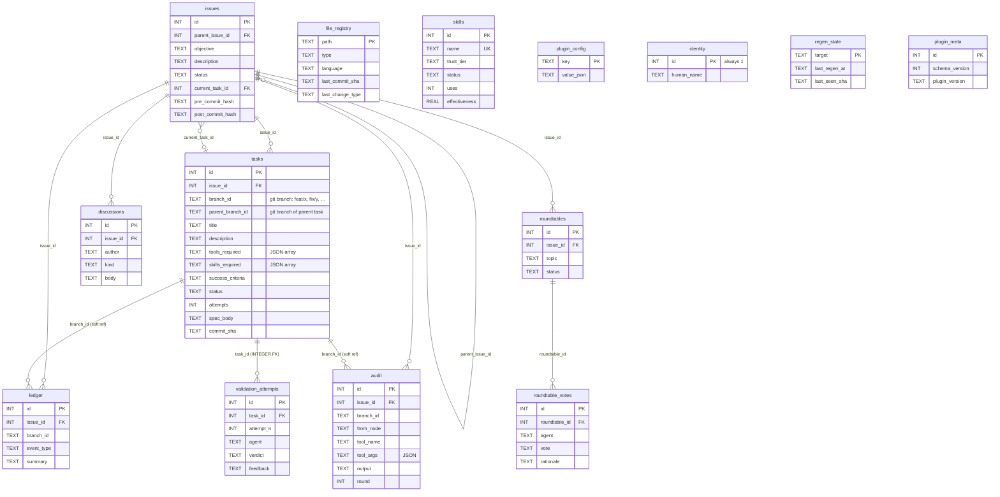

# Trajectory DB — Entity Relationship Diagram

SQLite schema (`mcp/trajectory-server/src/schema.sql`, `schema_version = 1` baseline). Persistent at `<cwd>/.claude/tmb/trajectory.db` — project-local, per-user, gitignored. Override with `TRAJECTORY_DB_PATH` for CI / ephemeral runs (`:memory:`, custom file).

## Overview

14 tables in two groups:

| Group | Tables | Keyed by |
|---|---|---|
| **Workflow** (per-issue) | `issues`, `tasks`, `ledger`, `audit`, `validation_attempts`, `discussions`, `roundtables`, `roundtable_votes` | `issue_id` (directly or transitively) |
| **Registries** (standalone) | `skills`, `file_registry`, `plugin_config`, `identity`, `regen_state`, `plugin_meta` | own primary keys; not tied to any issue |

## Diagram

## Relationships (foreign keys declared in schema)

| From | Column | → To | Semantics |
|---|---|---|---|
| `issues` | `parent_issue_id` | `issues.id` | nested issues (rare; self-ref) |
| `issues` | `current_task_id` | `tasks.id` | points at the task currently running; nullable |
| `tasks` | `issue_id` | `issues.id` | every task belongs to one issue |
| `ledger` | `issue_id` | `issues.id` | event row always scoped to an issue |
| `audit` | `issue_id` | `issues.id` | tool output row always scoped to an issue |
| `discussions` | `issue_id` | `issues.id` | architect ↔ human notes per issue |
| `roundtables` | `issue_id` | `issues.id` | a multi-agent debate belongs to an issue |
| `roundtable_votes` | `roundtable_id` | `roundtables.id` | one vote row per agent per roundtable |
| `validation_attempts` | `task_id` | `tasks.id` | every validation attempt belongs to one task |

## Soft references (no FK, by convention)

`branch_id` is the **git-convention working branch name** (e.g. `feat/user-login`, `fix/null-crash`), enforced via `validateBranchId` in `tools/tasks.ts`. It doubles as the actual git branch SWE creates the worktree on. Tasks are uniquely keyed by `(issue_id, branch_id)` — see the `idx_tasks_issue_branch` UNIQUE INDEX below — so the same `feat/user-login` could in principle exist under two different issues without collision.

| From | Column | → To | Why no FK |
|---|---|---|---|
| `ledger` | `branch_id` | `tasks.branch_id` | `branch_id` alone isn't unique in `tasks` — the UNIQUE constraint is composite `(issue_id, branch_id)`. A composite FK `(issue_id, branch_id)` would work in principle, but `ledger.branch_id` is nullable (some events are issue-scoped, not task-scoped), and nullable composite FKs are awkward. Kept as a soft ref scoped by `ledger.issue_id`. |
| `audit` | `branch_id` | `tasks.branch_id` | Same reason — composite-uniqueness + nullable column. Audit rows are scoped by `audit.issue_id` already. |
| `tasks` | `parent_branch_id` | `tasks.branch_id` (same issue) | Self-reference within an issue. A composite self-FK `(issue_id, parent_branch_id) → (issue_id, branch_id)` is feasible but adds insert-order brittleness; kept soft. |

## Registries (no relationships to workflow tables)

| Table | Purpose |
|---|---|
| `skills` | Registry of curated + agent-created skills with effectiveness stats (`uses`, `successes`, `failures`, `effectiveness`). Looked up by name. |
| `file_registry` | Output of the lazy `git log` diff walker. One row per file. Feeds the 4 auto renderers. |
| `plugin_config` | KV for plugin settings (branching model, protected branches, PR target, etc.). See `mcp/trajectory-server/docs/CONFIG_KEYS.md` for the canonical key list. |
| `identity` | Single-row table (`CHECK id=1`) holding bro name + human name. |
| `regen_state` | Per-target cursor (`last_seen_sha`) for the lazy architecture regen. |
| `plugin_meta` | Schema + plugin version (for future migrations). Current row: `schema_version=1, plugin_version='0.3.2'`. |

## Indexes

- `idx_tasks_issue_branch` — `UNIQUE(issue_id, branch_id)`. Each issue has one task per git branch name; this is also the lookup index for "does this task exist?" checks. Two issues may legitimately have the same `branch_id` (e.g. both have a `feat/user-login` task).
- `idx_discussions_issue_created` — `(issue_id, created_at)`. Feeds the chronological discussion view.
- `validation_attempts` — `UNIQUE(task_id, attempt_n)`. One row per (task, attempt).

## How agents use this

- **bro** — reads `plugin_config`, `identity`, `issues(status='open')` on session start. Writes `discussions` when relaying human intent.
- **architect** — `issue_create` → `discussion_append` → `task_create_batch(spec_body)` → `task_update_status` → `validation_record`. Also edits agent prompts, skill files, and workflow markdown when they drift (see `skills/docs-conventions` prompt-editing rules).
- **swe** — `task_get(id)` for spec → `ledger_log` / `audit_log` during work → `task_update_status('completed')` on success.
- **pr-reviewer** — `task_get(task_id)` to inspect the spec + status of the task passed in the spawn → `validation_record(task_id, attempt_n, verdict, feedback)` to sign off. Never writes to `tasks`; status flip to `closed` is the architect's call.
- **monitors/tmb-trajectory-events.js** — read-only tail of `ledger` for status-line output.

External writers are blocked by role-gating inside each `tools/*.ts` family (see `middleware/agent-scope.ts` for `requireRoles` + `AgentRole` type).

## Migrations

None yet. The plugin is pre-release — every install is a fresh DB. `schema.sql` is applied on open via `CREATE TABLE IF NOT EXISTS` and `INSERT OR IGNORE` into `plugin_meta`. Future breaking schema changes will add a `v1 → v2` path in the same release.
