# Trajectory DB — Entity Relationship Diagram

SQLite schema (`mcp/trajectory-server/src/schema.sql`, `schema_version = 26`). Persistent at `<cwd>/.claude/<plugin-name>/trajectory.db` — project-local, per-user, gitignored. The `<plugin-name>` segment resolves from `CLAUDE_PLUGIN_ROOT/.claude-plugin/plugin.json`'s `name` field; today that's `tmb` for both stable and RC channels, so both write to `.claude/tmb/`. True channel isolation (`tmb/` vs `tmb-rc/`) is tracked in issue #1. Override with `TRAJECTORY_DB_PATH` for CI / ephemeral runs (`:memory:`, custom file).

## Overview

Tables fall in three groups (capability catalog unified into `cheatcodes` in #101; embedding cache from schema v8):

| Group | Tables | Keyed by |
|---|---|---|
| **Workflow** (per-issue) | `issues`, `tasks`, `audit`, `validation_attempts`, `discussions`, `roundtables`, `roundtable_votes` | `issue_id` (directly or transitively) |
| **Registries** (standalone) | `cheatcodes`, `cheatcode_attachments`, `agents`, `repos`, `milestones`, `plugin_config`, `plugin_meta`, `agent_runs`, `pr_review_runs`, `debug_trajectory`, `eval_results` | own primary keys; not tied to any issue |

The **world model** lives in a sibling kuzu graph database (`world-model.kuzu`), not in this SQLite file. See `docs/architecture/WORLD_MODEL.md`.

The `skills` table folded into `cheatcodes` (#101): builtin tmb_* skills are `origin='builtin'` rows in the unified `cheatcodes` registry, alongside the `origin='installed'` cheatcodes acquired via the install pipeline. Skill/plugin usage isn't recorded in the trajectory DB (#118) — verification lives in the stream-json session log.

The onboarded marker lives at `plugin_config('onboarded': true)`. Scan-side drift state rides in `audit(event_type='deep_scan_completed').content_json`; `scan_run` is the single scan-side surface.

`issues.milestone` (#83) is a nullable `TEXT` column that, since schema v23 (#155), is a foreign key into a real `milestones(name, repo, state)` table. Milestones are GitHub-style and **per-repo**: the table's primary key is the composite `(name, repo)`, so the same milestone name can exist independently under each repo. The FK is the composite `issues.(milestone, repo) → milestones.(name, repo)` (`ON DELETE RESTRICT`), nullable so an issue need not carry a milestone. Milestone rows are seeded on demand by `issue_create` rather than pre-populated.

## Diagram

```mermaid
erDiagram
    issues ||--o{ tasks : "issue_id"
    issues ||--o{ audit : "issue_id"
    issues ||--o{ discussions : "issue_id"
    issues ||--o{ roundtables : "issue_id"

    tasks ||--o{ validation_attempts : "task_id (INTEGER FK)"
    tasks ||--o{ audit : "branch_id (soft ref)"
    tasks ||--o{ agent_runs : "task_id"

    roundtables ||--o{ roundtable_votes : "roundtable_id"

    repos ||--o{ milestones : "name"
    milestones ||--o{ issues : "(milestone, repo)"

    repos {
        TEXT  name PK
        TEXT  path
        INT   file_count
        TEXT  last_scanned_at
        TEXT  target_branch "integration branch, e.g. main/dev"
        TEXT  branching_model "e.g. github-flow"
        TEXT  protected_branches "JSON array"
    }

    milestones {
        TEXT name PK "GitHub-style milestone label"
        TEXT repo PK "FK → repos.name; PK is composite (name, repo)"
        TEXT state "open|closed; default open"
    }

    %% World model — see WORLD_MODEL.md — lives in sibling kuzu graph DB, not here

    cheatcodes {
        INT  id PK
        TEXT name UK
        TEXT kind "skill|mcp|plugin"
        TEXT origin "builtin|installed"
        TEXT description
        TEXT source_url "NULL for builtin"
        TEXT file_path "set for skill kind"
        TEXT version
        TEXT trust_tier
        TEXT scope "global|template|project-local"
        TEXT status "installed|active|broken"
    }

    cheatcode_attachments {
        INT  id PK
        INT  cheatcode_id FK "→ cheatcodes.id CASCADE"
        TEXT target
        TEXT artifact
    }

    plugin_config {
        TEXT key PK
        TEXT value_json
    }

    plugin_meta {
        INT  id PK
        INT  schema_version
        TEXT plugin_version
    }

    issues {
        INT  id PK
        TEXT objective
        TEXT description
        TEXT status
        INT  remote_iid
        TEXT remote_kind
        TEXT milestone "nullable FK → milestones.name (composite with repo); #83/#155"
    }

    tasks {
        INT  id PK
        INT  issue_id FK
        TEXT branch_id "git branch: feat/x, fix/y, …"
        TEXT parent_branch_id "branch this one was cut from"
        TEXT title
        TEXT description
        TEXT status
        INT  attempts
        TEXT spec_body
        TEXT commit_sha
        TEXT repo "multi-repo workspace inner-repo path"
        TEXT completed_at
    }

    validation_attempts {
        INT  id PK
        INT  task_id FK
        INT  attempt_n
        TEXT agent
        TEXT verdict
        TEXT feedback
        TEXT subagent_session_id
    }

    audit {
        INT  id PK
        INT  issue_id FK
        TEXT branch_id
        TEXT from_node
        TEXT event_type
        TEXT summary
        TEXT content_json
    }

    discussions {
        INT  id PK
        INT  issue_id FK
        TEXT author
        TEXT kind
        TEXT body
    }

    roundtables {
        INT  id PK
        INT  issue_id FK
        TEXT topic
        TEXT state "collecting|awaiting_human|closed|skipped"
        INT  expected_participants
    }

    roundtable_votes {
        INT  id PK
        INT  roundtable_id FK
        TEXT participant
        TEXT vote
        TEXT rationale
    }

    agent_runs {
        INT  id PK
        INT  task_id FK
        INT  issue_id FK
        TEXT agent_type
        INT  tokens_in
        INT  tokens_out
        INT  tool_uses
        INT  duration_ms
    }

    pr_review_runs {
        INT      id PK
        INT      pr_number
        TEXT     repo
        DATETIME last_fetched_at
        TEXT     last_comment_id
    }

    debug_trajectory {
        INT  id PK
        TEXT session_id
        INT  step_n
        TEXT kind "mcp_call|tool_use|agent_thinking"
        TEXT agent
        TEXT tool_or_mcp_name
        TEXT args_json
        TEXT result_json
    }

    eval_results {
        INT  id PK
        TEXT run_id
        TEXT flow_name
        TEXT scorer_name
        INT  pass
        TEXT value
        TEXT explanation
        TEXT arm
        TEXT scenario
    }

    discussions_embeddings {
        INT  discussion_id PK "FK → discussions.id CASCADE"
        BLOB embedding
        TEXT model_id
        TEXT embedded_at
    }

    audit_embeddings {
        INT  audit_id PK "FK → audit.id CASCADE"
        BLOB embedding
        TEXT model_id
        TEXT embedded_at
    }
```



## Relationships (foreign keys declared in schema)

| From | Column | → To | Semantics |
|---|---|---|---|
| `tasks` | `issue_id` | `issues.id` | every task belongs to one issue |
| `audit` | `issue_id` | `issues.id` | every event row scoped to an issue (use system issue id=-1 for project-level events) |
| `discussions` | `issue_id` | `issues.id` | bro ↔ human ↔ consultants conversation per issue |
| `roundtables` | `issue_id` | `issues.id` | a multi-agent debate belongs to an issue |
| `roundtable_votes` | `roundtable_id` | `roundtables.id` | one vote row per agent per roundtable |
| `validation_attempts` | `task_id` | `tasks.id` | every validation attempt belongs to one task |
| `agent_runs` | `task_id` | `tasks.id` | resource tracking per SWE spawn |
| `agent_runs` | `issue_id` | `issues.id` | resource tracking scoped to issue |
| `cheatcode_attachments` | `cheatcode_id` | `cheatcodes.id` | what an install wired, for exact uninstall (ON DELETE CASCADE) |
| `milestones` | `repo` | `repos.name` | each milestone belongs to one repo (ON DELETE RESTRICT) |
| `issues` | `(milestone, repo)` | `milestones.(name, repo)` | nullable composite FK — an issue's milestone is scoped to its repo (ON DELETE RESTRICT) |

## Soft references (no FK, by convention)

`branch_id` is the **git-convention working branch name** (e.g. `feat/user-login`, `fix/null-crash`), enforced via `validateBranchId` in `tools/tasks.ts`. It doubles as the actual git branch SWE creates the worktree on. Tasks are uniquely keyed by `(issue_id, branch_id)` — see the `idx_tasks_issue_branch` UNIQUE INDEX below — so the same `feat/user-login` could in principle exist under two different issues without collision.

| From | Column | → To | Why no FK |
|---|---|---|---|
| `audit` | `branch_id` | `tasks.branch_id` | `branch_id` alone isn't unique in `tasks` — the UNIQUE constraint is composite `(issue_id, branch_id)`. A composite FK `(issue_id, branch_id)` would work in principle, but `audit.branch_id` is nullable (some events are issue-scoped, not task-scoped), and nullable composite FKs are awkward. Kept as a soft ref scoped by `audit.issue_id`. |
| `tasks` | `parent_branch_id` | `tasks.branch_id` (same issue) | Self-reference within an issue. A composite self-FK `(issue_id, parent_branch_id) → (issue_id, branch_id)` is feasible but adds insert-order brittleness; kept soft. |

## Registries (no relationships to workflow tables)

| Table | Purpose |
|---|---|
| `cheatcodes` | Unified capability registry (#101). One row per capability, split by `origin`: `'builtin'` = plugin-shipped tmb_* skills (was the `skills` table; `source_url` NULL, `file_path` set); `'installed'` = cheatcodes acquired via the discover → vet → install pipeline (`source_url` set). `kind` is `skill|mcp|plugin`; `scope` is the placement enum `global|template|project-local`. CHECKs enforce the shape (skill rows carry `file_path`, installed rows carry `source_url`, builtin rows do not). |
| `cheatcode_attachments` | One row per artifact an install wired (plugin manifest, MCP registration, proposed skill-frontmatter PR). FK to `cheatcodes.id` ON DELETE CASCADE so `cheatcode_uninstall` reverses exactly what was installed. |
| `repos` | One row per discovered git repo under the session dir. Written by `scan_run` (the `/scan` slash command's MCP backend). Workspace-pattern projects (multiple inner repos under a non-git workspace dir) are first-class — `tasks.repo` references `repos.name` by convention (no FK). Carries per-repo branching config (`target_branch`, `branching_model`, `protected_branches`) — this row is the **per-repo source of truth**: guards resolve policy path-keyed from the matched `repos` row for the command's git toplevel, and unregistered repos are no-op'd. The matching global `plugin_config` keys (`target_branch`, `branching_model`, `protected_branches`) are a fallback used only when the resolved repo row carries no per-repo value. See [`REPO_RESOLUTION.md`](./REPO_RESOLUTION.md). |
| `milestones` | One row per GitHub-style milestone, scoped per repo (schema v23, #155). Primary key is the composite `(name, repo)` and `repo` FKs `repos.name` (ON DELETE RESTRICT), so the same milestone name lives independently under each repo. `state` is `open`/`closed`. `issues.milestone` is a nullable composite FK `(milestone, repo) → (name, repo)`; rows are seeded on demand by `issue_create`. |
| _(world model)_ | Lives in the sibling kuzu graph DB at `<project>/.claude/tmb/world-model.kuzu/`, not in this SQLite file. Directory nodes + CONTAINS edges, populated by `scan_run` via `src/graph-db.ts`. See `docs/architecture/WORLD_MODEL.md`. |
| `plugin_config` | KV for plugin settings (PR target, issue_sync, remotes, onboarded marker). The branch-policy keys (`branching_model`, `protected_branches`, `target_branch`) live here as a **global fallback** — the per-repo `repos` row is authoritative and these are consulted only when the matched repo carries no per-repo value (see `repos` above / [`REPO_RESOLUTION.md`](./REPO_RESOLUTION.md)). See `mcp/trajectory-server/docs/CONFIG_KEYS.md` for the canonical key list. |
| `plugin_meta` | Schema + plugin version. Current `schema_version=26`. `plugin_version` is seeded as `'0.0.0'` and synced dynamically from `CLAUDE_PLUGIN_ROOT/.claude-plugin/plugin.json` on every `TrajectoryDB` construction — so the row always reflects the running plugin version without a migration. |
| `agent_runs` | Per-spawn resource tracking (tokens, tool_uses, duration). Written by `swe-atomic-close.sh` SubagentStop hook. |
| `pr_review_runs` | Per-PR monitor incremental-polling cursor (`last_fetched_at`, `last_comment_id`). Used by `/monitor` flow — `pr_monitor_comments_get` reads the cursor on entry and upserts it on exit so the next call only fetches new comments. UNIQUE index on `(pr_number, repo)`. |
| `debug_trajectory` | Deterministic-trajectory capture (only when `TMB_DEBUG_TRAJECTORY=1`). Used by L5 scoring. |
| `eval_results` | Per-scorer results for L5/A-B prompt-eval runs. One row per (run_id, flow_name, scorer_name). |
| `discussions_embeddings` | Embedding cache for `discussions` rows — one BLOB per discussion, keyed by `discussion_id` + `model_id`. Populated on write + background backfill; used by `discussion_search` semantic path. |
| `audit_embeddings` | Embedding cache for `audit` rows — one BLOB per audit event. Used by `audit_search` semantic path. |

## Indexes

- `idx_tasks_issue_branch` — `UNIQUE(issue_id, branch_id)`. Each issue has one task per git branch name; this is also the lookup index for "does this task exist?" checks. Two issues may legitimately have the same `branch_id` (e.g. both have a `feat/user-login` task).
- `idx_discussions_issue_created` — `(issue_id, created_at)`. Feeds the chronological discussion view.
- `validation_attempts` — `UNIQUE(task_id, attempt_n)`. One row per (task, attempt).
- `idx_agent_runs_task` — `(task_id)`. Fast per-task resource lookup.
- `idx_agent_runs_issue` — `(issue_id)`. Fast per-issue resource rollup.
- `idx_pr_review_runs_pr` — `(pr_number, repo)`. Lookup for existing monitor runs.
- `idx_debug_trajectory_session` — `(session_id, step_n)`. Ordered trajectory replay.
- `idx_eval_results_run` — `(run_id, scorer_name)`. Per-run scorer aggregation.
- `idx_eval_results_flow` — `(flow_name, created_at)`. Historical pass-rate trend queries.

## How agents use this

- **bro** (planner + task gate, CLAUDE.md persona on main Claude) — full write access for the workflow side: `onboard_state_get`/`onboard_apply` (which write `plugin_config('onboarded')`), `config_get`/`set`/`list`, `issue_create`/`get`/`resume`/`close`, `discussion_append` (kind='intent'/'note'/'question'/'answer'/'decision'), `task_provision`, `task_update_status` (closes tasks after verifying SWE's return), `audit_append`, `scan_run` (writes `repos` SQLite + Directory nodes / CONTAINS edges in kuzu, `deep_scan_completed` audit). Reads the world model via `world_model_get` / `world_model_search` (kuzu queries) as the cold-start navigation surface. Also reads `validation_history` to drive the retry loop (flow 8).
- **swe** (executor, project-local subagent in worktree) — `task_get(id)` for spec → `audit_append` during work → `task_update_status('completed', commit_sha)` on success. Cannot write to `issues`, `validation_attempts`, or close tasks. Reads the world model when scoping unfamiliar parts of the codebase.
- **pr-reviewer** (push gate, project-local subagent) — `task_get(task_id)` for spec + commit → `validation_record(task_id, attempt_n, verdict, feedback, subagent_session_id)` to sign off. Only role permitted to write `validation_attempts`. Never writes to `tasks`; the close flip stays bro's call.
- **consultants** (architect, cto, ceo, pm, project-local domain agents) — read-only on workflow tables (`issue_get_with_discussions`, `task_get`, `validation_history`); may write `discussion_append(kind='analysis')` to record their position. Server-rejected on `task_provision`, `task_update_status`, `validation_record`, `issue_create` via `requireRoles`.

The decision chain (Human → bro → SWE, with pr-reviewer as push gate) is structurally enforced by `requireRoles` middleware inside each `tools/*.ts` family (see `middleware/agent-scope.ts` for `requireRoles`, `AgentRole` type, and the role-by-tool matrix).

## Capture tables — `audit` vs `debug_trajectory`

| Table | Scope | When written | Read by |
|---|---|---|---|
| `audit` | per-issue | always; bro/SWE/pr-reviewer write event rows for lifecycle markers | `branch_report_md`, `issue_report_md`, audit trail rendering |
| `debug_trajectory` | per-session | only when `TMB_DEBUG_TRAJECTORY=1` (eval mode); MCP server wraps every tool dispatch and writes here | L5 eval pipeline, scorers |

`audit` is event-only — every row is a lifecycle event with `(event_type, summary, content_json)`. Tool-call records live in `debug_trajectory` (eval-mode only), whose schema is in `schema-eval.sql` and applied only when `TMB_EVAL_MODE=1` so production DBs don't carry it.

## Schema migration policy

`schema.sql` is applied on open via `CREATE TABLE IF NOT EXISTS` and `INSERT OR IGNORE`. Forward migrations run automatically in `db.ts` via `runMigrations` — one `migrateVNtoVN+1` function per version step. A `.bak` snapshot is taken before migration. See `src/test/schema-upgrade.test.ts` for per-step round-trip tests.

## Capability catalog + per-agent cost

The `cheatcodes` table is the unified capability catalog (#101): a **portable catalog** that's analytics-only in the Claude Code plugin (the file system stays authoritative for loading) but **load-bearing** in the enterprise LangGraph runtime (the catalog drives execution). Same schema, two read paths.

### Catalog shape

| Column | Shape | Why |
|---|---|---|
| `cheatcodes.scope` | `TEXT NOT NULL DEFAULT 'project-local' CHECK (scope IN ('global','template','project-local'))` | Match `agents.scope`. Distinguish schema-seeded `tmb_*` skills (global) from `.claude/skills/<name>/SKILL.md` (project-local) and installed cheatcodes (project-local by default). |

### Bro as a first-class agent_run

`agent_runs` captures **subagent spawns** (SWE, pr-reviewer, consultants) *and* bro itself — the main process — at **per-task granularity**: one row per bro-driven task, parallel to SWE's row. Lets you compute total task cost = bro planning + SWE execution. The bro row is recorded by composites (`task_provision` opens it, `bro_atomic_close` writes final tokens/duration) and a PostToolUse hook that accumulates bro's tokens from `transcript_path`.

### How this serves both runtimes

| Runtime | What drives loading | What the DB is for |
|---|---|---|
| **Plugin (Claude Code)** | File system. CC reads `skills/<name>/SKILL.md`, `commands/<x>.md` directly. | Catalog of available capabilities; per-task cost analytics via `agent_runs`. |
| **Enterprise (LangGraph)** | The DB. LangGraph queries the catalog to discover + load capabilities at runtime. | Source of truth. The catalog IS the runtime. |

Same schema, two read paths. Designed so the enterprise runtime can adopt this without schema churn.

### Example queries this unlocks

```sql
-- "Total task cost = bro planning + SWE execution"
SELECT t.id, t.branch_id,
       SUM(CASE WHEN ar.agent_type = 'bro' THEN ar.tokens_total ELSE 0 END) AS bro_tokens,
       SUM(CASE WHEN ar.agent_type LIKE 'tmb:swe%' THEN ar.tokens_total ELSE 0 END) AS swe_tokens
FROM tasks t
LEFT JOIN agent_runs ar ON ar.task_id = t.id
GROUP BY t.id, t.branch_id;
```

### Implementation status

The catalog is unified into `cheatcodes` (#101). The bundled tmb_* skill seed (`origin='builtin'` rows in `cheatcodes`) is in `schema.sql` and created on DB open via `CREATE TABLE IF NOT EXISTS`. Skill/plugin usage verification lives in the stream-json session log (#118), not a DB junction table. The bro `agent_run` composite (rows opened at `task_provision`, finalized at `bro_atomic_close`) tracks per-task token cost.
