# Trajectory DB — Entity Relationship Diagram

SQLite schema (`mcp/trajectory-server/src/schema.sql`, `schema_version = 1` baseline). Persistent at `<cwd>/.claude/<plugin-name>/trajectory.db` — project-local, per-user, gitignored. The `<plugin-name>` segment is the installed plugin's `plugin.json.name` (so stable writes to `tmb/`, RC writes to `tmb-rc/` — channel-isolated per #87). Override with `TRAJECTORY_DB_PATH` for CI / ephemeral runs (`:memory:`, custom file).

## Overview

18 tables in two groups:

| Group | Tables | Keyed by |
|---|---|---|
| **Workflow** (per-issue) | `issues`, `tasks`, `audit`, `validation_attempts`, `discussions`, `roundtables`, `roundtable_votes` | `issue_id` (directly or transitively) |
| **Registries** (standalone) | `skills`, `file_registry`, `plugin_config`, `identity`, `regen_state`, `plugin_meta`, `agent_runs`, `pr_review_runs`, `debug_trajectory`, `eval_results` | own primary keys; not tied to any issue |

## Diagram

```mermaid
erDiagram
    issues ||--o{ tasks : "issue_id"
    issues ||--o{ audit : "issue_id"
    issues ||--o{ discussions : "issue_id"
    issues ||--o{ roundtables : "issue_id"

    tasks ||--o{ validation_attempts : "task_id (INTEGER FK)"
    tasks ||--o{ audit : "branch_id (soft ref)"
    tasks ||--o{ agent_runs : "task_id"

    roundtables ||--o{ roundtable_votes : "roundtable_id"

    file_registry {
        TEXT  path PK
        TEXT  type
        TEXT  language
        TEXT  last_commit_sha
        TEXT  last_change_type
        TEXT  content_md5
        TEXT  summary
        TEXT  summary_updated_at
    }

    skills {
        INT  id PK
        TEXT name UK
        TEXT trust_tier
        TEXT status
        INT  uses
        REAL effectiveness
    }

    plugin_config {
        TEXT key PK
        TEXT value_json
    }

    identity {
        INT  id PK "always 1"
        TEXT created_at "row presence = onboarded marker"
        TEXT updated_at
    }

    regen_state {
        TEXT target PK
        TEXT last_regen_at
        TEXT last_seen_sha
    }

    plugin_meta {
        INT  id PK
        INT  schema_version
        TEXT plugin_version
    }

    issues {
        INT  id PK
        TEXT objective
        TEXT description
        TEXT status
        TEXT post_commit_hash
        INT  remote_iid
        TEXT remote_kind
        DATETIME remote_synced_at
    }

    tasks {
        INT  id PK
        INT  issue_id FK
        TEXT branch_id "git branch: feat/x, fix/y, …"
        TEXT parent_branch_id "branch this one was cut from"
        TEXT title
        TEXT description
        TEXT tools_required "JSON array"
        TEXT skills_required "JSON array"
        TEXT success_criteria
        TEXT status
        INT  attempts
        TEXT spec_body
        TEXT commit_sha
        TEXT repo "multi-repo workspace inner-repo path"
        TEXT completed_at
    }

    validation_attempts {
        INT  id PK
        INT  task_id FK
        INT  attempt_n
        TEXT agent
        TEXT verdict
        TEXT feedback
        TEXT subagent_session_id
    }

    audit {
        INT  id PK
        INT  issue_id FK
        TEXT branch_id
        TEXT from_node
        TEXT kind "always 'event' (CHECK)"
        TEXT event_type
        TEXT summary
        TEXT content_json
        INT  is_truncated
    }

    discussions {
        INT  id PK
        INT  issue_id FK
        TEXT author
        TEXT kind
        TEXT body
        INT  verified_human
    }

    roundtables {
        INT  id PK
        INT  issue_id FK
        TEXT topic
        TEXT status
        TEXT state "collecting|awaiting_human|closed|skipped"
        INT  expected_participants
        TEXT ratification_received_at
    }

    roundtable_votes {
        INT  id PK
        INT  roundtable_id FK
        TEXT agent
        TEXT participant
        TEXT vote
        TEXT rationale
    }

    agent_runs {
        INT  id PK
        INT  task_id FK
        INT  issue_id FK
        TEXT agent_type
        INT  tokens_in
        INT  tokens_out
        INT  tool_uses
        INT  duration_ms
        TEXT exit_status
    }

    pr_review_runs {
        INT      id PK
        INT      pr_number
        TEXT     repo
        TEXT     remote_kind
        DATETIME last_fetched_at
        TEXT     last_comment_id
        INT      comments_processed
        INT      tasks_created
    }

    debug_trajectory {
        INT  id PK
        TEXT session_id
        INT  step_n
        TEXT kind "mcp_call|tool_use|agent_thinking"
        TEXT agent
        TEXT tool_or_mcp_name
        TEXT args_json
        TEXT result_json
    }

    eval_results {
        INT  id PK
        TEXT run_id
        TEXT flow_name
        TEXT scorer_name
        INT  pass
        TEXT value
        TEXT explanation
        TEXT arm
        TEXT scenario
    }
```

## Relationships (foreign keys declared in schema)

| From | Column | → To | Semantics |
|---|---|---|---|
| `tasks` | `issue_id` | `issues.id` | every task belongs to one issue |
| `audit` | `issue_id` | `issues.id` | every event row scoped to an issue (use system issue id=999999 for project-level events) |
| `discussions` | `issue_id` | `issues.id` | bro ↔ human ↔ consultants conversation per issue |
| `roundtables` | `issue_id` | `issues.id` | a multi-agent debate belongs to an issue |
| `roundtable_votes` | `roundtable_id` | `roundtables.id` | one vote row per agent per roundtable |
| `validation_attempts` | `task_id` | `tasks.id` | every validation attempt belongs to one task |
| `agent_runs` | `task_id` | `tasks.id` | resource tracking per SWE spawn |
| `agent_runs` | `issue_id` | `issues.id` | resource tracking scoped to issue |

## Soft references (no FK, by convention)

`branch_id` is the **git-convention working branch name** (e.g. `feat/user-login`, `fix/null-crash`), enforced via `validateBranchId` in `tools/tasks.ts`. It doubles as the actual git branch SWE creates the worktree on. Tasks are uniquely keyed by `(issue_id, branch_id)` — see the `idx_tasks_issue_branch` UNIQUE INDEX below — so the same `feat/user-login` could in principle exist under two different issues without collision.

| From | Column | → To | Why no FK |
|---|---|---|---|
| `audit` | `branch_id` | `tasks.branch_id` | `branch_id` alone isn't unique in `tasks` — the UNIQUE constraint is composite `(issue_id, branch_id)`. A composite FK `(issue_id, branch_id)` would work in principle, but `audit.branch_id` is nullable (some events are issue-scoped, not task-scoped), and nullable composite FKs are awkward. Kept as a soft ref scoped by `audit.issue_id`. |
| `tasks` | `parent_branch_id` | `tasks.branch_id` (same issue) | Self-reference within an issue. A composite self-FK `(issue_id, parent_branch_id) → (issue_id, branch_id)` is feasible but adds insert-order brittleness; kept soft. |

## Registries (no relationships to workflow tables)

| Table | Purpose |
|---|---|
| `skills` | Registry of curated + agent-created skills with effectiveness stats (`uses`, `successes`, `failures`, `effectiveness`). Looked up by name. |
| `file_registry` | Output of the lazy `git log` diff walker. One row per file. Feeds the 4 auto renderers. |
| `plugin_config` | KV for plugin settings (branching model, protected branches, PR target, issue_sync, remotes). See `mcp/trajectory-server/docs/CONFIG_KEYS.md` for the canonical key list. |
| `identity` | Single-row table (`CHECK id=1`) — pure onboarded marker. Row presence at id=1 means `/onboard` ran; row absence is the auto-fire signal. No name or other user data is stored. |
| `regen_state` | Per-target cursor (`last_seen_sha`) for the lazy architecture regen. |
| `plugin_meta` | Schema + plugin version (for future migrations). Current row: `schema_version=1, plugin_version='0.0.0'`. |
| `agent_runs` | Per-spawn resource tracking (tokens, tool_uses, duration, exit_status). Written by `swe-atomic-close.sh` SubagentStop hook. |
| `pr_review_runs` | Per-PR monitor run state (last fetched comment, counts). Used by `/monitor` flow. Index on `(pr_number, repo)`. |
| `debug_trajectory` | Deterministic-trajectory capture (only when `TMB_DEBUG_TRAJECTORY=1`). Used by L5 scoring. |
| `eval_results` | Per-scorer results for L5/A-B prompt-eval runs. One row per (run_id, flow_name, scorer_name). |

## Indexes

- `idx_tasks_issue_branch` — `UNIQUE(issue_id, branch_id)`. Each issue has one task per git branch name; this is also the lookup index for "does this task exist?" checks. Two issues may legitimately have the same `branch_id` (e.g. both have a `feat/user-login` task).
- `idx_discussions_issue_created` — `(issue_id, created_at)`. Feeds the chronological discussion view.
- `validation_attempts` — `UNIQUE(task_id, attempt_n)`. One row per (task, attempt).
- `idx_agent_runs_task` — `(task_id)`. Fast per-task resource lookup.
- `idx_agent_runs_issue` — `(issue_id)`. Fast per-issue resource rollup.
- `idx_pr_review_runs_pr` — `(pr_number, repo)`. Lookup for existing monitor runs.
- `idx_debug_trajectory_session` — `(session_id, step_n)`. Ordered trajectory replay.
- `idx_eval_results_run` — `(run_id, scorer_name)`. Per-run scorer aggregation.
- `idx_eval_results_flow` — `(flow_name, created_at)`. Historical pass-rate trend queries.

## How agents use this

- **bro** (planner + task gate, CLAUDE.md persona on main Claude) — full write access for the workflow side: `identity_get`/`set`, `config_get`/`set`/`list`, `issue_create`/`get`/`resume`/`close`, `discussion_append` (kind='intent'/'note'/'question'/'answer'/'decision'), `task_create_batch`, `task_update_status` (closes tasks after verifying SWE's return), `audit_log(kind='event')`. Also reads `validation_history` to drive the retry loop (flow 8) and runs `architecture_regen` (flow 7). Calls `file_registry_update_summaries` during V3 close (bro-only, server-enforced).
- **swe** (executor, project-local subagent in worktree) — `task_get(id)` for spec → `audit_log` during work → `task_update_status('completed', commit_sha)` on success. Cannot write to `issues`, `validation_attempts`, `file_registry` summaries, or close tasks.
- **pr-reviewer** (push gate, project-local subagent) — `task_get(task_id)` for spec + commit → `validation_record(task_id, attempt_n, verdict, feedback, subagent_session_id)` to sign off. Only role permitted to write `validation_attempts`. Never writes to `tasks`; the close flip stays bro's call.
- **consultants** (architect, cto, ceo, pm, project-local domain agents) — read-only on workflow tables (`issue_get_with_discussions`, `task_get`, `validation_history`); may write `discussion_append(kind='analysis'|'concern')` to record their position. Server-rejected on `task_create_batch`, `task_update_status`, `validation_record`, `issue_create` via `requireRoles`.

The decision chain (Human → bro → SWE, with pr-reviewer as push gate) is structurally enforced by `requireRoles` middleware inside each `tools/*.ts` family (see `middleware/agent-scope.ts` for `requireRoles`, `AgentRole` type, and the role-by-tool matrix).

## Capture tables — `audit` vs `debug_trajectory`

| Table | Scope | When written | Read by |
|---|---|---|---|
| `audit` | per-issue | always; bro/SWE/pr-reviewer write `kind='event'` rows for lifecycle markers | `branch_report_md`, `issue_report_md`, audit trail rendering |
| `debug_trajectory` | per-session | only when `TMB_DEBUG_TRAJECTORY=1` (eval mode); MCP server wraps every tool dispatch and writes here | L5 eval pipeline, scorers |

`audit` is event-only since #179 (the `kind='tool_call'` branch was retired; tool-call records live in `debug_trajectory`). `debug_trajectory` schema is in `schema-eval.sql`, applied only when `TMB_EVAL_MODE=1` so production DBs don't carry it.

## Schema migration policy

Pre-release — every new install is a fresh DB. `schema.sql` is applied on open via `CREATE TABLE IF NOT EXISTS` and `INSERT OR IGNORE`. Additive column adds happen via `ALTER TABLE` migrations in `db.ts`. Destructive drops (column removals) live in `migrate179DropDeadColumns` (idempotent — re-runs see the column already gone).
