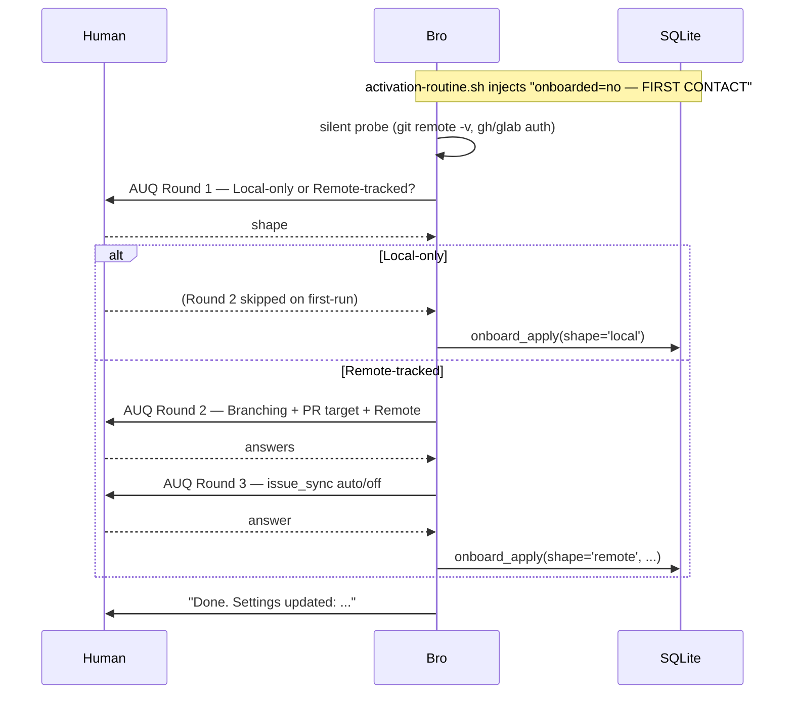
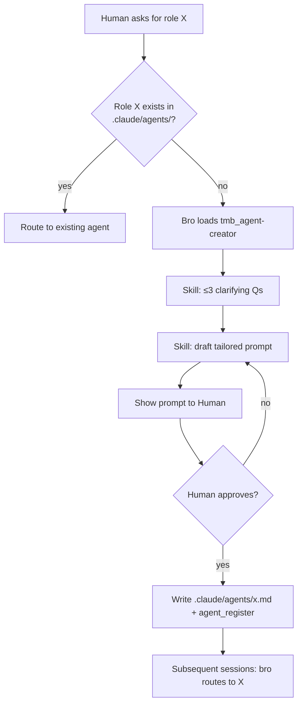

# TMB Workflows

The decision chain is **Human → bro → SWE** with two distinct gates:
- **bro is the task gate** — closes after SWE returns + verifies.
- **pr-reviewer is the push gate** — fires only at `git push` over a batch of unsigned commits.

All consultants (architect, cto, ceo, pm, project-local) advise but never write workflow state. The full role × tool matrix lives in [`RESPONSIBILITIES.md`](RESPONSIBILITIES.md); enforcement layers in [`ENFORCEMENT.md`](ENFORCEMENT.md); schema in [`ERD.md`](ERD.md).

## Quick index

| # | Flow | Trigger | Agents | DB tables touched | Distinguishing hooks |
|---|---|---|---|---|---|
| 1 | First contact | `onboard_state_get().first_run === true` (i.e. `plugin_config('onboarded')` absent) | bro | `plugin_config`, `audit` | `activation-routine` (auto-fire trigger) |
| 2 | **Code-touching task** (canonical) | Code change ask | bro → swe; pr-reviewer at push | `issues`, `tasks`, `discussions`, `audit` (+ `validation_attempts` at push) | `require-task-spec`, `git-push-guard`, `git-guards`, `cleanup-worktree-on-task-close` |
| 3 | Architectural change | Touches `docs/trustmybot/architecture/`, schema, public API, external side effects | bro authors ADR + decision audit, then standard SWE flow | + `discussions(kind='decision')`; ADR file lands at `docs/trustmybot/architecture/manual/decisions/N-*.md` | `adr-required-hint`, universal `decision_gate` on `task_create_batch` |
| 4 | Agent-creator | Routing hits role not in `.claude/agents/` | bro | — (file-based outcome) | — |
| 5 | Skill creation | Recurring pattern needs encoding | bro | `skills` (registered via `skill_register`) | — |
| 6 | Push gate / PR review | `git push` to protected branch | bro → pr-reviewer (one per unsigned task, parallel) | `validation_attempts` | `git-push-guard` |
| 7 | Scan + world-model refresh | First code-touching ask of session, `/scan`, OR `post-task-close-rescan.sh` hook fires after `bro_atomic_close` | bro (or hook in background) | `repos` (SQLite) + Directory nodes / CONTAINS edges (kuzu graph; summary preferentially from `<dir>/README.md`), `audit(event_type='deep_scan_completed')` | `post-task-close-rescan` |
| 8 | SWE retry / escalation | Bro verification or pr-reviewer verdict='fail' | bro ↔ swe (↔ pr-reviewer at push) | `validation_attempts` (multiple), `discussions` | `task_retry_batch` composite |
| 9 | Roundtable | Multi-consultant deliberation with AUQ ratification | bro orchestrates 2–4 consultants | `roundtables`, `roundtable_votes`, `discussions`, `audit` | `roundtable-auq-shape`, `roundtable-cleanup-postcheck` |
| 13 | Bulk cleanup | Human pre-authorizes a bulk delete | bro (direct Bash, no SWE spawn) | — | — |
| 33 | Multi-repo path discipline | `tmb_default_repo` set; bro indexes inner repo | bro | kuzu Directory nodes (repo-relative paths; `repo` property scopes to the right inner git repo) | — |
| **C** | Consultant invocation | Human asks for second opinion | bro → consultant | `discussions(kind='analysis'/'concern')` | — |
| **M** | Monitor PR comments | `/monitor <PR_number>` (invokes `tmb_review` §C) | bro → pr-reviewer per actionable comment batch | `pr_review_runs`, `issues`, `tasks`, `audit` | — |

---

## 1. First contact (auto-fired `/onboard`)

Bro's `activation-routine.sh` UserPromptSubmit hook reads `plugin_config('onboarded')`. If the key is absent (or `value_json != 'true'`) it injects a `FIRST CONTACT` directive. Bro reads the directive, fires `/onboard` immediately, and runs the slash command's branched ceremony before any reply.

**Round 1** asks the project shape (local-only vs remote-tracked). **Round 2** asks the per-shape question set:

| Shape | Round 2 questions | Persisted |
|---|---|---|
| Local-only | (none — github-flow defaulted silently) | `plugin_config('onboarded')`, `branching_model`, derived `pr_target`, `remotes=[]`, `issue_sync='off'` |
| Remote-tracked | Branching, PR target, Remote (multiSelect) | + `remotes` array, then a Round 3 for `issue_sync` |

A **silent probe** (origin URL, gh/glab installed/authed) pre-selects defaults so most questions become 1-tap confirms. Local re-onboard adds the Branching question with a `Keep` option so the user can change models without first switching shape.



`/onboard` re-runs on demand for later changes — same flow with `Keep "<current>"` pre-selects. Identity is a pure onboarded marker (no name or other fields stored).

---

## 2. Code-touching task (canonical chain)

Bro is both planner AND task gate. pr-reviewer is the push gate, NOT the task gate. Tasks close as soon as SWE returns + bro verifies.

```mermaid
sequenceDiagram
    participant H as Human
    participant B as Bro (planner + task gate)
    participant S as SWE (worktree)
    participant DB as SQLite

    H->>B: "implement X"
    B->>B: tmb_planning skill loaded; pick approach; write kind='decision'
    B->>DB: issue_create + discussion_append(kind='intent') + branch_id_propose
    B->>B: pre-create branch from origin/<pr_target>; author spec_body

    Note over B,DB: BATCHED — one response, three tool_use blocks
    par
        B->>DB: task_create_batch(emit_planning_complete=true)
    and
        B->>S: spawn Task(swe, task_id=N) [hook: require-task-spec verifies]
    and
        B->>DB: audit_log(event_type='planning_complete')
    end

    Note over S: BATCHED — first SWE response
    par
        S->>DB: task_get(task_id=N)
    and
        S->>S: git worktree add <path> <branch>  (attached, no --detach)
    end
    S->>S: implement per spec; run ## Verification commands
    S->>S: git commit (## Commit message from spec)
    S->>DB: task_update_status(status='completed', commit_sha)

    B->>B: V1/V2/V3 verify (files, verification commands, success criteria)
    B->>DB: bro_atomic_close (audit + summaries + status='closed' + optional issue close)
    B-->>H: "task closed — push when ready"
```

**Notes**
- `require-task-spec.sh` blocks SWE spawn unless `tasks` row has `status IN (pending, open)` AND non-empty `spec_body`.
- `no-worktree-branch-create.sh` blocks `-b/-B/--create-branch/--detach` — bro pre-creates the branch; the worktree attaches to it directly.
- `git-push-guard.sh` blocks the eventual push if any pushed commit's task lacks a passing `validation_attempts` row.

---

## 3. Architectural change (Δ vs flow 2)

Same chain as flow 2, plus: before `task_create_batch`, bro co-authors an ADR and applies the blast-radius checklist. The universal decision gate still requires a `kind='decision'` row regardless of flow.

- Skills: `tmb_planning` triggers the architectural ceremony when the change touches `docs/trustmybot/architecture/`, schema, public API, or has external side effects (see SKILL.md §"Architectural changes").
- Hook: `adr-required-hint.sh` (UserPromptSubmit) detects architectural intent (`switch to clerk`, `migrate to postgres`, etc.) and injects an advisory pointing at the ADR template + the blast-radius checklist.
- ADR file lands at `docs/trustmybot/architecture/manual/decisions/N-*.md` (template: `templates/docs-trustmybot/architecture/manual/decisions/0001-example.md`).
- For human-driven deliberation, the user enters Claude Code's native plan mode (Shift+Tab) — bro doesn't run a bespoke Q+A loop. The `kind='decision'` row captures the outcome.
- Bro's V1/V2/V3 verification after SWE returns is unchanged — never skipped, even for architectural changes.

---

## 4. Agent-creator



Reserved names — `bro`, `architect`, `swe`, `pr-reviewer` — are refused. New agent files commit to the project; every dev gets it on next pull.

---

## 5. Skill creation

Same shape as flow 4 — bro drafts via `tmb_skill-creator`, Human approves, file lands at `<project>/.claude/skills/<name>/SKILL.md`. Bro never edits agent body files; instead writes a project-local override agent file that extends `skills:`.

---

## 6. Push gate / PR review

```mermaid
sequenceDiagram
    participant H as Human
    participant B as Bro
    participant P as pr-reviewer (subagents — parallel)
    participant DB as SQLite

    H->>B: git push origin <feature>
    Note over B: git-push-guard.sh denies if any unsigned commit exists
    B-->>H: surface deny message
    B->>B: list unsigned tasks for the push
    par one pr-reviewer per unsigned task
        B->>P: spawn Task(pr-reviewer, task_id=N)
        P->>DB: task_get(task_id=N) — read spec + commit_sha
        P->>P: diff against ## Files / ## Success Criteria / ## Verification
        P->>DB: validation_record(verdict='pass'|'fail', feedback)
    end

    alt all pass
        B->>B: re-run git push (push-guard now allows)
        B-->>H: pushed; MR opened
    else any fail
        B-->>H: surface failures verbatim → AUQ to spawn SWE retry or abort
    end
```

`validation_record.feedback` MUST start with `MCP available: yes` or `MCP available: no — honor-system fallback` (schema CHECK enforces; push-gate parses). Subagents that lack MCP access fall back to honor-system review with the `no` prefix.

---

## 7. Scan + architecture refresh

`scan_run` is the single scan-side MCP tool. Triggered three ways:

| Trigger | `source` value | Who fires |
|---|---|---|
| User typed `/scan` | `user_manual` | The slash command body passes it |
| `post-task-close-rescan.sh` hook on `bro_atomic_close` | `bro_auto_post_close` | Hook runs `scripts/maintenance/run-scan.mjs` in background |
| Bro hits the registry-cold gate and remediates | `bro_auto_initial` | Default when no `source` is passed |

`scan_run`'s `deep_scan_completed` audit row carries `content_json` with:

- `source` (one of the four values above)
- `structural_change` — true if the repos set OR top-level dir set differs from the previous scan
- `repos_seen[]`, `top_dirs[]` — current snapshot of the project shape


---

## 8. SWE retry / escalation

Triggered when bro V1/V2/V3 fails OR pr-reviewer verdict='fail'. Bro uses the `task_retry_batch` MCP composite — one transaction inserts: a `discussion_append(kind='note', body='retry rationale: ...')`, a new `tasks` row keyed off the failed task's branch, and an `audit_log(event_type='swe_retry_spawned')`. Then spawns SWE on the new task.

After 3 consecutive retries, bro flips status to `escalated` and surfaces to Human (CLAUDE.md routing — judgment-bound).

---

## 9. Roundtable

Multi-consultant deliberation. Bro orchestrates 2–4 consultants on a topic, then renders an AUQ for Human ratification.

- `roundtable_create` opens the table.
- Bro spawns each consultant via `Agent` with the shared topic; consultants write `discussion_append(kind='analysis'|'concern')`.
- Each consultant `roundtable_vote(participant=<role>, vote, rationale)`.
- `roundtable_close` flips state to `awaiting_human` + emits a `discussion_append(kind='decision', body=summary)`.
- `roundtable-auq-shape.sh` validates the ratification AUQ structure.
- After Human picks: `roundtable_finalize_decisions` + `roundtable_summarize`.
- `roundtable-cleanup-postcheck.sh` verifies the capture surface (audit + discussion rows) actually landed.

---

## 13. Bulk cleanup (pre-authorized destructive ops)

When the Human's prompt names what to delete (branches, temp files, etc.), bro executes in one Bash call with no AUQ and no re-confirmation. Defensive checks (which files match? any active worktrees?) belong *before* the Human authorizes. Re-asking treats a standing directive as a question — wastes time and ignores intent.

---

## 33. Multi-repo path discipline

When a workspace has multiple inner git repos (siblings or submodules), `tmb_default_repo` config or per-task `tasks.repo` names the active inner repo. Directory node `path` properties are stored repo-relative — `scan_run` does NOT prepend the inner repo directory when writing nodes.

The L5 row `tests/dogfood/rows/33-multirepo-commit/` catches regressions at the storage layer: a Cypher `MATCH (d:Directory) WHERE d.path STARTS WITH 'api/' OR d.path STARTS WITH 'app/'` returns ≥1 node only on a workspace-rooted path leak.

---

## C. Consultant invocation

Human types `/tmb:agent-create <ask>` OR a naturalistic question matching `/tmb:agent-create`'s description. Either path loads the skill, which calls `agent_list` to resolve the role in the registry, then spawns the consultant via `Agent`. Consultant writes its analysis as `discussion_append(kind='analysis')`. Bro reports to Human; **the Human decides** — never the consultant.

`consultant-spawn-required.sh` UserPromptSubmit hook detects domain-keyword prompts and injects a routing hint (advisory; bro decides whether to spawn).

---

## M. Monitor PR comments

`/monitor <PR_number>` slash command. Bro fetches the PR's review comments via `pr_comments_get`, triages actionable ones, files them as new `issues` + `tasks`, and dispatches SWE per ratified comment batch. Run state lives in `pr_review_runs` so re-runs of the same PR start from the last fetched comment ID.
