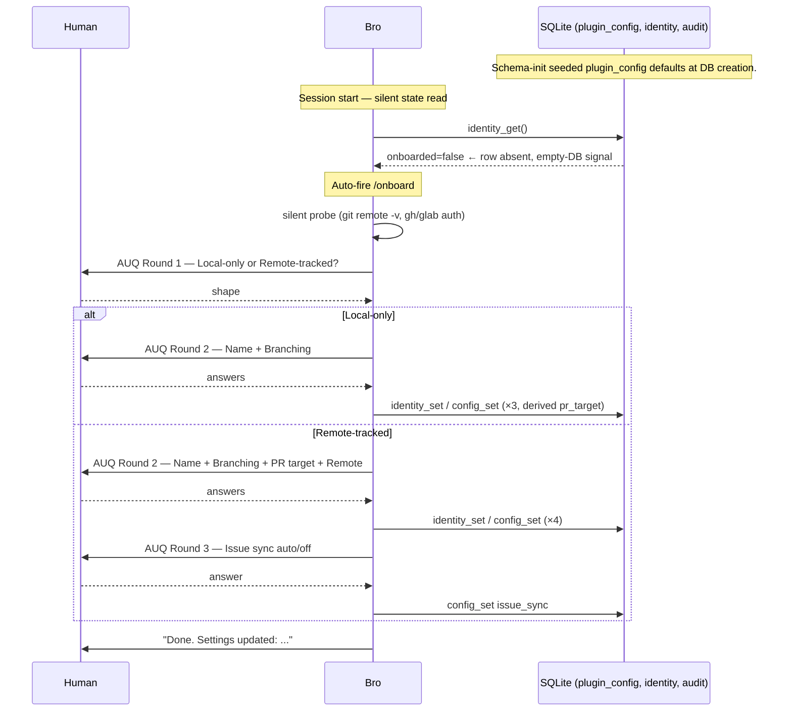
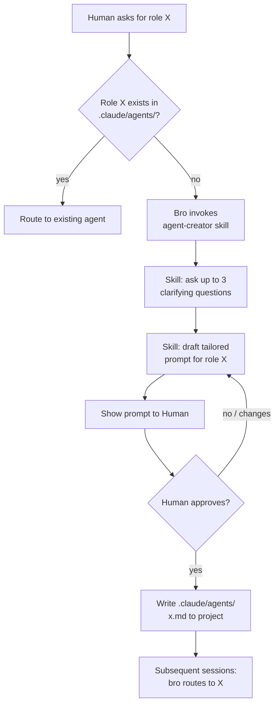
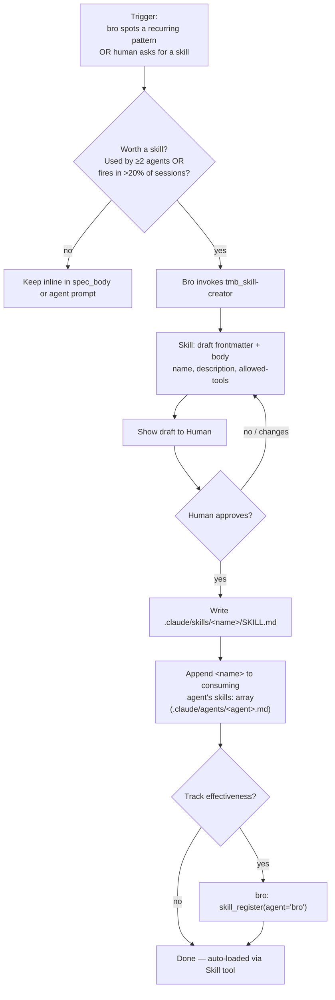
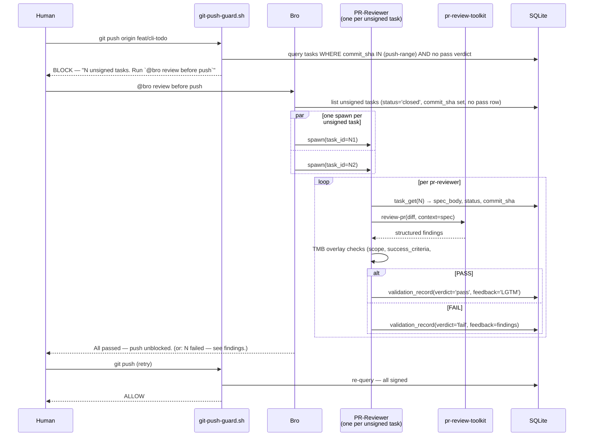
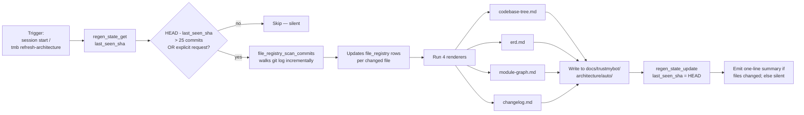
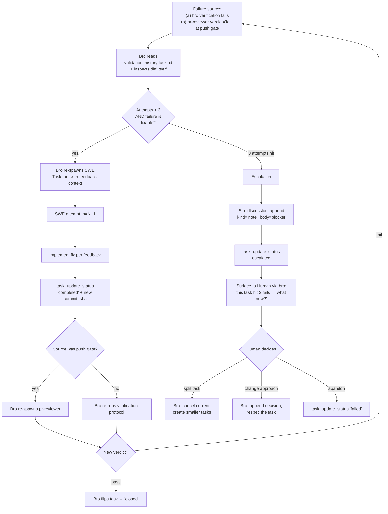
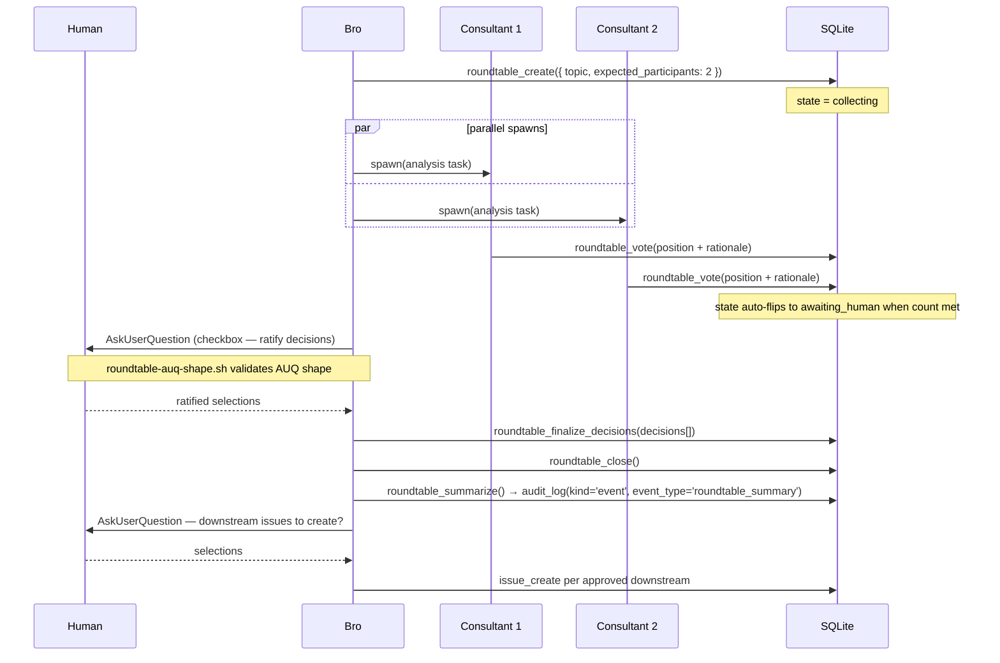
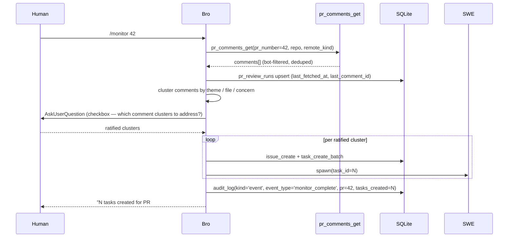

# TMB Workflows — Flowcharts

> **As of v0.3.0:** the decision chain is `Human → bro → SWE` with two
> distinct gates — bro is the **task gate** (closes after SWE returns +
> verifies); pr-reviewer is the **push gate** (fires only at `git push`
> over a batch of unsigned commits). All consultants (architect, cto,
> ceo, pm, project-local) advise but never write workflow state.
>
> **Two-layer agent model.** Bro is a CLAUDE.md persona on main Claude.
> The workflow backbone — `swe` and `pr-reviewer` — ships globally in
> the plugin's `agents/` directory and is always available; project-local
> `<project>/.claude/agents/<name>.md` overrides per-name. Consultants
> (`architect`, `cto`, `ceo`, `pm`) ship as templates in `templates/agents/`
> and are instantiated per-project on demand via `tmb_agent-creator`.
>
> All skills — both `tmb_*` protocol skills and the default workflow
> skills (`tmb_swe-checklist`, `tmb_code-quality`, `tmb_docs-conventions`, etc.) —
> live in `plugin/skills/` and are globally discoverable. Project-local
> `<project>/.claude/skills/<name>/SKILL.md` overrides by name.

Reference workflows — onboarding, simple/difficult task, agent-creator, skill creation, PR review, architecture regen, SWE retry, roundtable, consultant invocation — with the agent / skill / MCP-tool / DB-table / hook involvement spelled out for each.

Companion docs: [`ERD.md`](ERD.md) for schema, [`FILES.md`](FILES.md) for the file map, [`SCENARIOS.md`](../../tests/manual/scenarios.md) for the **trigger prompts that exercise each flow** (dogfood test plan, refresh tracked in [#51](https://github.com/trustmybot/plugin/issues/51)), [`../../CLAUDE.md`](../../CLAUDE.md) for top-level rules.

## Quick index

| # | Flow | Trigger | Agents | Key skills | DB tables touched | Hooks |
|---|---|---|---|---|---|---|
| 1 | [First contact](#1-first-contact-auto-fired-onboard) | First activation when `identity_get()` is empty | bro | `commands/onboard.md` (auto-fired slash command) | `plugin_config`, `identity`, `audit` | — |
| 2 | [Simple task](#2-simple-task) | Code change, no architecture impact | bro → swe (pr-reviewer at push time only) | `tmb_planning-simple` (bro), `tmb_swe-checklist` (lazy on demand) | `issues`, `tasks`, `audit` (per task) + `validation_attempts` (at push) | `require-task-spec`, `git-push-guard`, `git-guards` |
| 3 | [Difficult task](#3-difficult-task) | Code change touching `docs/trustmybot/architecture/` | bro (full discussion + ADR) → swe (pr-reviewer at push time) | + `tmb_planning-difficult` (env probe, Q+A, ADR) | + `discussions`, ADR file | same |
| 4 | [Agent-creator](#4-agent-creator-on-demand-domain-agent) | Routing hits a role not in `.claude/agents/` | bro → human | `tmb_agent-creator` | — | — |
| 5 | [Skill creation](#5-skill-creation) | Recurring pattern needs encoding | bro | `tmb_skill-creator` | `skills` (optional, for tracking) | — |
| 6 | [Push gate / PR review](#6-push-gate--pr-review) | `git push` to protected branch | bro → pr-reviewer (one per unsigned task, parallel) | `tmb_review-protocol`, `tmb_review-findings`, `tmb_code-quality` | `tasks` (read), `validation_attempts` (write), `discussions` (optional FAIL) | `git-push-guard` |
| 7 | [Architecture regen](#7-architecture-regen) | First code-touching ask of session OR `/tmb refresh-architecture` | bro | `tmb_refresh-architecture` | `regen_state`, `file_registry` | `session-start-regen-check`, `lazy-regen-postcheck` |
| 8 | [SWE retry / escalation](#8-swe-retry--escalation) | Bro verification or pr-reviewer verdict='fail' | bro ↔ swe (↔ pr-reviewer when at push gate) | `tmb_feedback-loop` | `validation_attempts` (multiple rows), `discussions` | `git-push-guard` |
| 9 | [Roundtable](#9-roundtable-multi-agent-deliberation) | Multi-consultant deliberation with AUQ ratification | bro orchestrates 2-4 project-local consultants | `tmb_roundtable` | `roundtables`, `roundtable_votes`, `discussions`, `audit` | `roundtable-auq-shape`, `roundtable-cleanup-postcheck` |
| 13 | [Bulk cleanup](#13-bulk-cleanup-pre-authorized-destructive-ops) | Human pre-authorizes a bulk delete in the prompt | bro (direct Bash, no SWE spawn) | — | none (filesystem hygiene) | — |
| 33 | [Multi-repo path discipline](#33-multi-repo-path-discipline) | Multi-repo workspace; `tmb_default_repo` set; bro indexes inner repo | bro | — | `file_registry` (repo-relative paths) | — |
| **C** | [Consultant invocation](#c-consultant-invocation) | Human asks for second opinion **OR** bro spawns one | bro → consultant (architect / cto / pm / domain) | n/a (consultants follow their own prompts) | `discussions` (kind='analysis'/'concern') | — |
| **M** | [Monitor PR comments](#m-monitor-pr-comments) | `/monitor <PR_number>` | bro → pr-reviewer (one per actionable comment batch) | `tmb_pr-review-handler` | `pr_review_runs`, `issues`, `tasks`, `audit` | `git-push-guard` |

---

## 1. First Contact (auto-fired `/onboard`)

**Trigger:** Bro at session start finds `identity_get()` returns `onboarded=false` (no row at id=1 — the empty-DB heuristic). Bro auto-fires the `/onboard` slash command without asking permission.

**Involved:**
- Agent: `bro` (no spawn — runs the slash command inline)
- Slash command: `/onboard` (defined in `commands/onboard.md`)
- MCP tools: `identity_get`, `config_list`, `config_set` (×N per branch), `identity_set`/`identity_reset`, `audit_log`
- Bash (read-only probe): `git remote -v`, `git rev-parse`, `command -v gh`, `command -v glab`, `gh auth status`, `glab auth status`
- DB tables written: `plugin_config`, `identity`, `audit`
- Hooks: none
- **Filesystem ops: NONE.** swe + pr-reviewer + default skills serve globally; nothing is copied into the project.

**Doctrine: silent trigger, branched ceremony.** Defaults are seeded into `plugin_config` at schema-init via `INSERT OR IGNORE`, so bro never operates on null state. The auto-fired `/onboard` is the only path for the Human to override those defaults. Round 1 asks the **project shape** (local-only vs remote-tracked); Round 2's question set depends on the shape:

| Shape | Round 2 questions | Persisted |
|---|---|---|
| Local-only | Name, Branching | `identity`, `branching_model`, derived `pr_target`, `remotes=[]`, `issue_sync='off'` |
| Remote-tracked | Name, Branching, PR target, Remote | + `remotes` array, then a 2nd round for `issue_sync` |

The pre-fire **silent probe** (origin URL, gh/glab installed/authed) pre-selects defaults so most questions become 1-tap confirms.

**Realized by:**
```text
plugin/
├── CLAUDE.md                                           # bro persona + first-action chain
├── commands/onboard.md                                 # the slash command (auto-fired on empty identity)
└── mcp/trajectory-server/src/
    ├── schema.sql                                      # seeds plugin_config defaults via INSERT OR IGNORE
    ├── tools/config.ts                                 # config_list / config_set
    ├── tools/identity.ts                               # identity_get / identity_set / identity_reset
    ├── tools/audit.ts                                  # audit_log
    └── sync/backend.ts                                 # detectPreferred() — origin → github/gitlab inference
```



**Notes:**
- **No `identity` row** exists until `/onboard` runs. The empty-DB heuristic is `identity_get().onboarded === false` (row absent at id=1). The identity table is a pure onboarded-marker — no user name or any other field is stored.
- **The slash command is auto-fired**, not Human-typed, on first contact. `/onboard` re-runs on demand for later changes — same flow, with `Keep "<current>"` options pre-selected.
- **Defaults stay schema-seeded.** `/onboard` writes user choices on top; without it, the schema defaults still serve.
- **Welcome banner is mandatory** (CLAUDE.md). Two variants: pending work (resume) or idle (greeting). On first contact the banner appears AFTER `/onboard` completes.
- Resolution rule for backbone agents: if `<project>/.claude/agents/swe.md` (or `pr-reviewer.md`) exists → use local; else use the global plugin-shipped one. Local creation is opt-in via `tmb_agent-creator` with explicit Human approval.

---

## 2. Simple Task

**Trigger:** Human asks for a code change; bro triages as `simple` (does NOT require an update to `docs/trustmybot/architecture/`).

**New chain (post #64):** bro is both planner AND task gate; pr-reviewer is the **push gate**, not the task gate. Tasks close as soon as SWE returns.

**Involved:**
- Agents: `bro` (planner + task gate), `swe` (executor)
- Skills loaded by bro on demand: `tmb_planning-simple` or `tmb_planning-difficult` per triage, `tmb_swe-spawn-workflow` (right before SWE handoff)
- Skills loaded by swe: `tmb_swe-checklist` **only on demand** (when spec verification needs interpretation; not eager)
- MCP tools: `issue_create`, `discussion_append`, `task_create_batch`, `task_get`, `task_update_status`, `audit_log(kind='event')` (no `validation_record` per task — that fires at push time)
- DB tables: `issues`, `tasks`, `discussions`, `audit`
- Hooks: `require-task-spec` (gates SWE spawn), `git-push-guard` (gates `git push`), `git-guards` (commit branch check)

**Realized by:**
```text
plugin/
├── agents/swe.md                                       # SWE executor subagent
├── CLAUDE.md                                           # bro persona + planning chain
├── skills/
│   ├── tmb_planning-simple/SKILL.md                    # bro triage: simple task plan
│   ├── tmb_planning-difficult/SKILL.md                 # bro triage: difficult task plan
│   ├── tmb_swe-spawn-workflow/SKILL.md                 # bro pre-handoff spawn protocol
│   └── tmb_swe-checklist/SKILL.md                     # SWE on-demand verification aid
├── scripts/hooks/
│   ├── require-task-spec.sh                            # gates SWE spawn on valid spec row
│   ├── git-push-guard.sh                               # blocks push without pass verdict
│   └── git-guards.sh                                   # commit branch check
└── mcp/trajectory-server/src/tools/
    ├── issues.ts                                       # issue_create
    ├── tasks.ts                                        # task_create_batch / task_get / task_update_status
    ├── discussions.ts                                  # discussion_append
    └── audit.ts                                        # audit_log (kind='event' and kind='tool_call')
```

```mermaid
sequenceDiagram
    participant H as Human
    participant B as Bro (planner + task gate)
    participant S as SWE (worktree)
    participant DB as SQLite

    H->>B: "implement X"
    B->>B: triage → simple; load tmb_planning-simple skill
    B->>DB: issue_create(agent='bro')
    B->>DB: discussion_append(kind='intent')
    B->>DB: discussion_append(kind='note', body='Triage: simple')
    B->>B: pick defaults (simple fast-lane); author trivial-template spec_body

    Note over B,DB: BATCHED IN ONE RESPONSE — three tool_use blocks in parallel
    par
        B->>DB: task_create_batch(agent='bro', spec_body, waive_scope_gate=true)
    and
        B->>S: spawn Task(swe, task_id=N) [hook: require-task-spec verifies row]
    and
        B->>DB: audit_log(kind='event', event_type='planning_complete')
    end

    Note over S: BATCHED IN SWE'S FIRST RESPONSE
    par
        S->>DB: task_get(agent='swe', task_id=N)
    and
        S->>S: git worktree add (parallel cold-start)
    end
    S->>DB: task_update_status(agent='swe', status='running')
    S->>S: implement per spec, run verification
    S->>S: git commit
    S->>DB: task_update_status(agent='swe', status='completed', commit_sha)  [#W4 atomic]

    B->>DB: task_update_status(agent='bro', status='closed')  [no pr-reviewer at this stage]
    B-->>H: "task closed — push when ready (pr-reviewer fires at push time)"
```

**Notes:**
- Bro is the only mutator of `issues`, the planning side of `tasks`, `audit` (event kind), and the closing-side `task_update_status('closed')`. `requireRoles` enforces this server-side.
- The whole loop runs without surfacing to the Human until task close.
- `require-task-spec.sh` verifies the `tasks` row has `status IN (pending, open)` AND non-empty `spec_body` BEFORE allowing the SWE spawn — silent block if the row isn't real.
- **`git-push-guard.sh`** (formerly `require-review-sign.sh`) blocks pushes to protected branches if any pushed commit's task lacks a `validation_attempts.verdict='pass'` row. See **Flow R — Push Gate** below for what happens then.

---

## 3. Difficult Task

**Trigger:** Human asks for a code change that requires updating `docs/trustmybot/architecture/`; bro triages as `difficult`. Same chain as flow 2 — bro is still the planner — plus an alignment loop + ADR commit before `task_create_batch` fires.

**Extra components vs flow 2:**
- Skills: bro loads `tmb_planning-difficult` (instead of `tmb_planning-simple`)
- MCP tools: + `discussion_append`, `discussion_list`
- DB tables: + `discussions`
- Files: ADR at `docs/trustmybot/architecture/manual/decisions/N-*.md`

**Realized by:**
```text
plugin/
├── agents/swe.md                                       # SWE executor subagent
├── CLAUDE.md                                           # bro persona + difficult-triage chain
├── skills/
│   ├── tmb_planning-difficult/SKILL.md                 # Q+A loop + ADR authoring
│   ├── tmb_swe-spawn-workflow/SKILL.md                 # bro pre-handoff spawn protocol
│   └── tmb_swe-checklist/SKILL.md                     # SWE on-demand verification aid
├── scripts/hooks/
│   ├── require-task-spec.sh                            # gates SWE spawn on valid spec row
│   ├── git-push-guard.sh                               # blocks push without pass verdict
│   └── git-guards.sh                                   # commit branch check
├── templates/docs-trustmybot/architecture/manual/decisions/0001-example.md  # ADR template
└── mcp/trajectory-server/src/tools/
    ├── issues.ts                                       # issue_create
    ├── tasks.ts                                        # task_create_batch / task_get / task_update_status
    ├── discussions.ts                                  # discussion_append / discussion_list
    └── audit.ts                                        # audit_log (kind='event')
```

```mermaid
sequenceDiagram
    participant H as Human
    participant B as Bro (planner + task gate)
    participant S as SWE (worktree)
    participant DB as SQLite

    H->>B: "refactor module X to support Y"
    B->>B: triage → difficult; load tmb_planning-difficult skill
    B->>DB: issue_create(agent='bro')
    B->>DB: discussion_append(kind='intent')
    B->>DB: discussion_append(kind='note', body='Triage: difficult …')

    Note over B: env probe — Read/Glob/Grep on relevant code paths
    loop until aligned with Human (sequential, one Q at a time)
        B->>H: AskUserQuestion (radio, ≤4 options) OR free-text Q
        H-->>B: selected label OR Other free-text
        B->>DB: discussion_append(kind='question', body=Q + options)
        B->>DB: discussion_append(kind='answer', body=selected)
    end

    B->>DB: discussion_append(kind='decision', body=architectural plan)
    B->>B: write docs/trustmybot/architecture/manual/decisions/N-*.md (ADR)

    Note over B,DB: BATCHED IN ONE RESPONSE — three tool_use blocks in parallel
    par
        B->>DB: task_create_batch(agent='bro', spec_body, standard template)
    and
        B->>S: spawn Task(swe, task_id=N) [hook: require-task-spec]
    and
        B->>DB: audit_log(kind='event', event_type='planning_complete')
    end

    Note over S,B: → flow 2 "SWE returns" onwards: bro verifies, flips → 'closed'
    Note over B: pr-reviewer fires only at git push (flow 6), not per task
```

**Notes:**
- **Bro is the only planner.** No architect-as-decider. If the Human wants an architect's read on the design, bro spawns the project-local `architect.md` consultant via flow C — but bro retains the decision and the spec-authoring responsibility.
- ADR file is the durable architectural record. The `discussions` table holds the conversation that produced it; bro reconstructs the narrative via `issue_report_md` / `issue_snapshot_md`.
- **Sequential AskUserQuestion, not batched.** Per dogfood feedback, bro asks one question at a time for better UX in the difficult flow — the radio UI is still used per question, but multiple Q's aren't bundled in one prompt.
- Falls back to plain `discussion_append(kind='question')` when the answer shape isn't enumerable.
- Bro's verification step after SWE returns runs the same protocol as the simple flow (re-run spec's `## Verification`, sanity-check diff against `## Files`, confirm each `## Success Criteria` bullet) — never skipped, even when the task was difficult-triaged.

---

## 4. Agent-creator (on-demand domain agent)

**Trigger:** Bro routing finds the named role (e.g., "I need a `legal-reviewer`") doesn't exist in `.claude/agents/`.

**Involved:**
- Agents: `bro` (or `architect` as alternative invoker)
- Skill: `agent-creator`
- DB tables: none (no MCP write — file-based outcome)
- Files written: `.claude/agents/<name>.md` (project-local, on user approval only)
- Hooks: none

**Realized by:**
```text
plugin/
├── skills/tmb_agent-creator/SKILL.md                  # drafts and writes the new agent file
└── templates/agents/                                  # base templates for shipped agent roles
    ├── architect.md
    ├── ceo.md
    ├── cto.md
    ├── pm.md
    ├── pr-reviewer.md
    └── swe.md
```



**Notes:**
- **Every** new agent requires explicit Human "yes". Skill enforces this.
- Reserved names — `bro`, `architect`, `swe`, `pr-reviewer` — are refused (these are the plugin's shipped roster).
- Agent file lives in the user's project, not the plugin. Once committed, every dev on the repo gets it on next pull.

---

## 5. Skill Creation

**Trigger:** Recurring pattern that needs encoding for reproducibility (e.g., a checklist agents keep skipping; a procedure invoked from multiple agents). Bro can spot the pattern itself, OR the Human can ask explicitly (`@bro create a skill that …`).

**Lego doctrine matters here.** Agents are immutable identity (Lego studs). Skills are additive bricks that extend an agent's capabilities. **Bro never edits the agent body**; instead, when a new skill is created, bro appends its name to the consuming agent's `skills:` array. For backbone agents (swe, pr-reviewer) shipped globally, this means writing a project-local override file (`<project>/.claude/agents/<name>.md`) that copies the global body and extends the `skills:` array — the plugin-shipped global file stays untouched.

**Involved:**
- Agent: `bro` (drives the flow inline, asks the Human to confirm)
- Skill: `tmb_skill-creator` (the meta-skill that authors the new skill)
- DB tables (optional): `skills` — for effectiveness tracking via `skill_register` + `skill_record_outcome`
- Files: `<project>/.claude/skills/<name>/SKILL.md` (project-local) — plugin-shipped `tmb_*` skills are out of scope for this flow
- Hooks: none

**Realized by:**
```text
plugin/
├── skills/tmb_skill-creator/SKILL.md                  # meta-skill: drafts the new skill file
└── mcp/trajectory-server/src/tools/
    └── skills.ts                                      # skill_register / skill_record_outcome
```



**When NOT to create a skill:**
- One-off procedure used by one agent → keep inline in the task spec.
- Pure read/grep operations → use Glob + Grep directly.
- Domain-specific advice that varies per project → user-curated, not plugin-shipped.

**Plugin-shipped vs project-local:**
- Plugin-shipped protocol skills (`tmb_*` in `plugin/skills/`) are reserved — projects can't override them by name. New plugin-shipped skills require a contribution PR (see [`CONTRIBUTING.md`](../../CONTRIBUTING.md)).
- Project-local skills go to `<project>/.claude/skills/<name>/SKILL.md` (no `tmb_` prefix).

---

## 6. Push Gate / PR Review

**Trigger:** Human runs `git push` (or `gh pr create`) → `git-push-guard.sh` PreToolUse hook scans for unsigned commits in the push range → blocks with a "Run `@bro review before push`" message → Human invokes that → bro spawns pr-reviewer for each unsigned task.

PR-reviewer no longer fires per-task at task-close. It fires at push time over a batch of unsigned commits. This amortizes the cost across multiple tasks per push.

**Involved:**
- Agents: `bro` (orchestrator + push-gate driver), `pr-reviewer` (one per unsigned task, parallel where possible)
- External: `pr-review-toolkit:review-pr` (mechanical pass; plugin dependency)
- MCP tools: `task_get`, `validation_record`, `discussion_append` (on FAIL), `issue_snapshot_md` (on PASS), `regen_state_get` (auto-dir check)
- DB tables: `tasks` (read), `validation_attempts` (write), `discussions` (optional FAIL note)
- Hooks: `git-push-guard.sh` blocks `git push` until all push-range tasks have a `validation_attempts.verdict='pass'` row

**Realized by:**
```text
plugin/
├── agents/pr-reviewer.md                              # the reviewer subagent
├── skills/
│   ├── tmb_push-gate/SKILL.md                         # bro push-gate orchestration
│   ├── tmb_review-protocol/SKILL.md                   # reviewer phases 1-7
│   ├── tmb_review-findings/SKILL.md                   # pattern catalog
│   └── tmb_code-quality/SKILL.md                      # shared quality criteria
├── scripts/hooks/git-push-guard.sh                    # blocks push without pass verdicts
└── mcp/trajectory-server/src/
    ├── tools/validation.ts                            # validation_record write path
    ├── tools/tasks.ts                                 # task_get (read)
    ├── tools/discussions.ts                           # discussion_append on FAIL
    ├── tools/regen-state.ts                           # regen_state_get for auto-dir check
    └── schema.sql                                     # validation_attempts table
```



**Notes:**
- pr-reviewer has **no Edit tool**. All sign-off is via MCP, never by editing files.
- Auto/architecture-dir check: any staged change under `docs/trustmybot/architecture/auto/` must preserve the generated-header comment. If broken → FAIL with "regenerate via `/tmb refresh-architecture`".
- The `git-push-guard.sh` hook is the structural enforcement. Bro drives the actual review when the Human invokes the magic phrase.
- Multiple unsigned tasks in one push → parallel pr-reviewer spawns where independent. Bro waits for all to return before reporting outcome.
- WIP pushes to feature/fix/etc. branches are NOT gated (per existing #13 convention) — only protected-branch pushes trigger the gate.

---

## 7. Architecture Regen

**Trigger:**
- Lazy: bro at first code-touching ask of a session, when `regen_state.last_seen_sha` is > 25 commits behind HEAD.
- On-demand: Human says "refresh architecture docs", "regen architecture", `/tmb refresh-architecture`.

**Involved:**
- Agent: `bro` (orchestrates inline)
- Skill: `tmb_refresh-architecture`
- MCP tools: `regen_state_get`, `regen_state_update`, `file_registry_scan_commits`, `architecture_regen`
- DB tables: `regen_state`, `file_registry`
- Files written: `docs/trustmybot/architecture/auto/{codebase-tree,erd,module-graph,changelog}.md`
- Hooks: none

**Realized by:**
```text
plugin/
├── skills/tmb_refresh-architecture/SKILL.md           # thin wrapper over architecture_regen MCP tool
├── scripts/hooks/session-start-regen-check.sh        # SessionStart drift nudge (>25 commits)
├── scripts/hooks/lazy-regen-postcheck.sh             # PostToolUse on file_registry_update_summaries — drift warn
├── mcp/trajectory-server/src/
│   ├── tools/regen-state.ts                           # regen_state_get / regen_state_update
│   ├── tools/file-registry.ts                         # file_registry_scan_commits
│   ├── tools/architecture-regen.ts                    # architecture_regen (4 renderers)
│   ├── renderers/codebase-tree.ts                     # codebase-tree.md renderer
│   ├── renderers/erd.ts                               # erd.md renderer
│   ├── renderers/module-graph.ts                      # module-graph.md renderer
│   ├── renderers/changelog.ts                         # changelog.md renderer
│   └── regen/git-walker.ts                            # incremental git log walker
└── templates/docs-trustmybot/architecture/auto/       # placeholder templates for auto outputs
    ├── codebase-tree.md
    ├── erd.md
    ├── module-graph.md
    └── changelog.md
```



**Notes:**
- The 4 auto files carry a generated-header comment (`<!-- Generated YYYY-MM-DD via /tmb refresh-architecture. Do not edit; regenerate. -->`). pr-reviewer's overlay check FAILs on missing header.
- Output is deterministic from git log — different devs running regen produce identical output, so merge conflicts on auto files resolve by re-running.
- The `manual/` ADRs and narrative docs are NOT touched by regen — those are architect-curated.

---

## 8. SWE Retry / Escalation

**Trigger:** EITHER bro's task-gate verification fails (re-run of spec's `## Verification` doesn't pass, diff doesn't match `## Files`, or a `## Success Criteria` bullet isn't met) OR pr-reviewer records `validation_record(verdict='fail', feedback=…)` at the push gate. Bro runs the retry loop in both cases.

**Involved:**
- Agents: `bro` (retry orchestrator), `swe` (re-spawned with feedback), `pr-reviewer` (only at push-gate retries)
- Skill: `tmb_feedback-loop` (defines the retry/escalation protocol)
- MCP tools: `validation_history`, `task_update_status`, `discussion_append`
- DB tables: `validation_attempts` (one row per pr-reviewer attempt; UNIQUE(task_id, attempt_n)), `discussions`
- Hooks: `git-push-guard` (still enforces — no push until a `verdict='pass'` row exists for every commit-bearing task)

**Realized by:**
```text
plugin/
├── agents/swe.md                                      # re-spawned executor
├── agents/pr-reviewer.md                             # re-spawned at push-gate retries
├── skills/tmb_feedback-loop/SKILL.md                  # retry/escalation protocol
├── scripts/hooks/git-push-guard.sh                    # still enforces pass verdict
└── mcp/trajectory-server/src/tools/
    ├── validation.ts                                  # validation_history read + record write
    ├── tasks.ts                                       # task_update_status
    └── discussions.ts                                 # discussion_append (escalation note)
```



**Notes:**
- Each pr-reviewer attempt is a separate `validation_attempts` row — full audit trail of what failed each time. Bro-verification fails are recorded as `discussions(kind='note')` rather than validation_attempts (validation_attempts is reserved for the push gate's structured verdicts).
- Escalation never auto-merges. The Human is the only one who decides "give up" or "respec".
- `tmb_feedback-loop` skill (loaded by bro) defines what counts as "fixable" vs "needs escalation".

---

## 9. Roundtable (multi-agent deliberation)

**Prerequisite — REQUIRED, no exceptions:** At least **2 consultant agents** must exist in `<project>/.claude/agents/`. The plugin ships ZERO consultants — they're all templates that bro copies into the project on demand (see flow C). So out-of-the-box, roundtable cannot run; it becomes available after the project has at least 2 of `architect`, `cto`, `ceo`, `pm`, or any user-created domain consultant. SWE is an executor and is always excluded; pr-reviewer reviews code, not strategy.

If the skill finds < 2 suitable participants, it escalates back to bro — roundtable requires at least 2 voices.

**Trigger conditions** (any of these — see `skills/tmb_roundtable/SKILL.md` for the authoritative list):

- **Divergent opinions need structured airing** — different consultants have given conflicting recommendations on the same issue (visible via `discussion_list`).
- **Multi-dimension trade-offs** — a decision spans product / technical / business axes; no single consultant owns all dimensions.
- **Cross-discipline calls** — domain-specific question (e.g., legal/compliance/UX) where one consultant alone can't credibly decide.
- **Human explicitly requests deliberation** — phrases like "convene a roundtable", "discuss with X and Y", "let's get more opinions".

**Do NOT use roundtable for:**

- Quick factual questions (bro answers OR spawns one consultant directly via flow C).
- Single-discipline decisions (spawn that one consultant via flow C).
- A caller who wants a binding decision (roundtable produces a synthesis; the Human still decides).

**Involved:**

- Convener: `bro` (loads the `tmb_roundtable` skill)
- Participants: 2-4 project-local consultants. SWE + pr-reviewer always excluded.
- Skills: `tmb_roundtable` (mechanics)
- Hook: `scripts/hooks/roundtable-cleanup-postcheck.sh` (post-synthesis verification — was the prior `tmb_roundtable-cleanup` skill)
- MCP tools: `roundtable_create({ expected_participants })`, `roundtable_vote` (per participant), `roundtable_finalize_decisions`, `roundtable_close`, `roundtable_summarize`, `audit_log(kind='event')`, `discussion_list`, `discussion_append(kind='analysis')`
- DB tables: `roundtables` (state machine row), `roundtable_votes` (one per participant), `discussions` (one `kind='analysis'` row per consultant), `audit` (summary)
- Hooks: `roundtable-auq-shape.sh` (PreToolUse AskUserQuestion — validates AUQ shape during `awaiting_human` state)

**Realized by:**
```text
plugin/
├── skills/
│   └── tmb_roundtable/SKILL.md                        # roundtable mechanics + state machine
├── commands/roundtable.md                             # /roundtable slash command
├── scripts/hooks/roundtable-auq-shape.sh              # validates AUQ shape in awaiting_human state
├── scripts/hooks/roundtable-cleanup-postcheck.sh      # post-close capture-surface verification
└── mcp/trajectory-server/src/tools/
    ├── roundtable.ts                                  # roundtable_create/vote/finalize/close/summarize
    ├── discussions.ts                                 # discussion_append / discussion_list
    └── audit.ts                                       # audit_log(kind='event', roundtable_summary)
```



**Notes:**

- **Deterministic state machine.** `roundtable_create` sets `state='collecting'`; each `roundtable_vote` increments the count; server auto-flips to `awaiting_human` when all expected votes are in. Bro cannot proceed to ratification until the state transitions.
- **AUQ shape enforced.** The `roundtable-auq-shape.sh` hook validates that the ratification AUQ uses checkbox (multi-select) for compound decisions and radio for single-option ratification. Malformed AUQ is denied.
- **`roundtable_finalize_decisions` is atomic.** Decision rows are written in a single call; partial writes are rejected.
- **Parallel spawn, sequential synthesis.** Consultants are spawned in one message (multiple `Task` calls); each runs in its own context window so there's no cross-contamination. Bro waits for all responses, then synthesizes.
- **No groupthink.** If all participants agree immediately, the skill instructs bro to probe the weakest shared assumption before accepting consensus.
- **Protect dissent.** A lone dissenter may be right — dissenting views get explicit airtime in the synthesis's `<tensions>` section.
- **One voice ≠ roundtable.** If the project only has one consultant (or none), the skill refuses. Bro surfaces it as "I'd need a `pm` (or similar) for this — want me to create one?" and routes through flow #4.
- **Bro never auto-applies the synthesis.** Even when consultants converge unanimously, the recommendation goes to the Human, not into a task spec.

---

## 13. Bulk Cleanup (pre-authorized destructive ops)

**Trigger:** Human's prompt contains explicit authorization to delete or overwrite a set of files/branches/artifacts (e.g. "clean all .DS_Store files", "delete these branches, keep only main and dev").

**Doctrine:** When the Human pre-authorizes bulk deletion, bro executes in one Bash call, no AskUserQuestion, no SWE spawn. This is filesystem hygiene, not a code change — it doesn't warrant the issue→task→SWE chain.

**Involved:**
- Agent: `bro` only (direct Bash — no SWE spawn, no issue/task created)
- Skills: none
- MCP tools: `audit_log(kind='event')` (if project-state-affecting, e.g. branch deletes; skip for filesystem hygiene)
- DB tables: none (for `.DS_Store` removal; `audit` for branch deletes)
- Hooks: none specific to this flow

**Realized by:**
```text
plugin/
├── CLAUDE.md                                          # bro pre-authorized cleanup doctrine
└── mcp/trajectory-server/src/tools/
    └── audit.ts                                       # audit_log(kind='event') for branch deletes
```

```mermaid
flowchart TD
    A["Human: 'clean all .DS_Store files'<br/>(or 'delete these branches…')"] --> B{Pre-authorized in<br/>current message?}
    B -->|no| C[Bro asks for explicit authorization<br/>before destructive op]
    B -->|yes| D[Bro: one-shot Bash<br/>find . -name '.DS_Store' -delete]
    D --> E{Project-state-affecting?<br/>e.g. branch deletes}
    E -->|yes| F[audit_log(kind='event') the cleanup]
    E -->|no – filesystem hygiene| G[Done — report what was removed]
    F --> G
```

**Notes:**
- No re-confirmation after the Human has authorized. Re-asking treats a standing directive as a question — wastes time and ignores intent.
- Defensive checks (which files match? any active worktrees?) belong *before* the Human authorizes, not after.
- AskUserQuestion is explicitly forbidden for this flow (see `tools-forbidden.json` in the L5 flow fixture).

---

## 33. Multi-repo path discipline

**Trigger:** workspace has multiple inner git repos (siblings or submodules); `tmb_default_repo` is configured; bro is asked to index or operate on the default repo.

**Doctrine:** `file_registry` paths are stored repo-relative — scoped per inner repo via `tasks.repo` (per-task) or `tmb_default_repo` (workspace default). Bro does NOT prepend the inner repo directory when writing rows.

**Workspace shape:**

```
PROJECT/
├── .claude/tmb/trajectory.db   ← workspace-rooted; MCP DB lives here
├── api/                         ← inner repo, tmb_default_repo='api'
│   └── handler.py
└── app/                         ← sibling inner repo (untouched in this flow)
    └── src/index.ts
```

**Steps:**

1. Bro reads `tmb_default_repo` via `config_get` (or relies on `tasks.repo` if a task was already created).
2. Bro globs / reads files in `<workspace>/api/`.
3. Bro inserts `file_registry` rows with **repo-relative** paths: `handler.py`, NOT `api/handler.py`.
4. Sibling repos (`app/`) are not touched.

**Notes:**
- Path-discipline regressions are the recurring root cause behind several "MCP server is workspace-rooted but commit paths are plugin-rooted" incidents. The L5 fixture (`tests/dogfood/flows/33-multirepo-commit/`) catches this at the storage layer: `file_registry.path LIKE 'api/%' OR LIKE 'app/%'` returns ≥1 row only on a regression.
- Same discipline applies to git operations — bro should use `git -C <inner-repo>` with repo-relative paths, never workspace-rooted prefixes against an outer repo that doesn't track those files.

---

## C. Consultant invocation

**Trigger:** Human asks for a second opinion (`@bro get the cto's read on X`) **OR** bro decides it wants to challenge its own plan and spawns a consultant on its own initiative.

Consultants are **project-local** — the plugin ships none. The first time a consultant of a given name is needed, bro invokes `agent-creator` to draft + write the file with explicit Human approval. Every subsequent ask in the same project reuses the file.

**Involved:**
- Agents: `bro` (decision-maker), one consultant subagent (project-local, e.g. `architect`, `cto`, `legal-reviewer`)
- Skills: `agent-creator` (first-time create), each consultant follows its own prompt
- MCP tools: `issue_get_with_discussions` (read), `discussion_append(kind='analysis'|'concern')` (write)
- DB tables: `discussions` (one or more `kind='analysis'` or `kind='concern'` rows)
- Hooks: none

**Realized by:**
```text
plugin/
├── skills/tmb_agent-creator/SKILL.md                  # drafts consultant agent on first use
├── templates/agents/                                  # base templates for consultant roles
│   ├── architect.md
│   ├── ceo.md
│   ├── cto.md
│   └── pm.md
└── mcp/trajectory-server/src/tools/
    ├── issues.ts                                      # issue_get_with_discussions
    └── discussions.ts                                 # discussion_append (analysis/concern)
```

```mermaid
sequenceDiagram
    participant H as Human
    participant B as Bro
    participant C as Consultant (project-local)
    participant DB as SQLite

    H->>B: "get architect's read on the SQLite-vs-JSON storage choice"
    alt .claude/agents/architect.md exists
        B->>B: skip create
    else first time
        B->>B: invoke agent-creator skill
        B->>H: propose agent spec
        H-->>B: approve
        B->>B: write .claude/agents/architect.md
    end
    B->>C: spawn(consultant: analysis-only, issue_id=<N>, question)
    C->>DB: issue_get_with_discussions(issue_id) — reads context
    C->>C: read code if relevant; build analysis
    C->>DB: discussion_append(kind='analysis', author='<consultant-name>', body=analysis)
    C-->>B: structured analysis (position + risks + recommendation if asked)
    B->>B: summarize for Human
    B-->>H: "architect says: X, with these risks. Your call."
    Note over B,DB: Server-rejected for consultants: task_create_batch, task_update_status,<br/>validation_record, issue_create — all return 'forbidden' via requireRoles
```

**Notes:**
- The consultant returns analysis as its final assistant message AND persists key points to MCP. Bro reads both: the message in conversation, the rows when assembling the summary.
- **Server-side enforcement** (post `feat/bro-as-planner` cleanup): `requireRoles` rejects any consultant call to `task_create_batch`, `task_update_status`, `validation_record`, or `issue_create`. The decision chain is structurally protected, not just prompt-discipline.
- For multi-consultant deliberation (cto + architect + ceo voting), see flow 9 (Roundtable). The voting protocol is tracked in [#57](https://github.com/trustmybot/plugin/issues/57).
- The Human always decides; bro never auto-applies a consultant's recommendation.

---

---

## SWE Atomic-Close Safety Net

**Doctrine:** SWE is expected to call `task_update_status(agent='swe', status='completed', commit_sha)` as the last step of every task (#W4 atomic close). Three documented occurrences (#87) showed SWE silently skipping this step without an error, leaving tasks stuck in `pending` after the subagent stopped.

**Safety net — `swe-atomic-close.sh` SubagentStop hook (additive, non-blocking):**

On every SWE `SubagentStop` event, the hook:
1. Reads the current branch name via `git rev-parse --abbrev-ref HEAD`.
2. Looks up the most-recent `pending` task for that branch in the trajectory DB.
3. If none, exits silently.
4. Checks git state: any commits beyond merge-base with `dev`? Is `origin/<branch>` at the same SHA as `HEAD`?
5. Decision:
   - **Committed + pushed** → writes `status='completed'` and `commit_sha` directly via `sqlite3` (hooks operate at a lower trust layer than agents and may write directly; the `readonly-fallback` constraint applies only to bro in degraded mode). Logs the action to `mcp-health.log`.
   - **Committed + not pushed** → emits `additionalContext` to bro: "SWE for task #N committed but did not push."
   - **No commits** → emits `additionalContext` to bro: "SWE for task #N stopped without committing."

The hook is a **defensive safety net only** — it does not remove or replace the atomic-close step in `agents/swe.md`. SWE is still required to call `task_update_status` itself; this hook catches the rare failure mode where it doesn't. Reference: issue #87 and memory `feedback_swe_atomic_close_unreliable.md`.

---

## Linear backfill workflow

When Linear-imported issues have truncated descriptions, bro can backfill them using the `issue_update_description` tool. The workflow is: (1) bro fetches the full description via the Linear MCP (`mcp__linear-server__get_issue` or equivalent); (2) bro calls `issue_update_description(agent='bro', issue_id='<N>', description='<full>')` to overwrite the truncated row; (3) bro verifies via `issue_get(include_description=true)` that the row reflects the new description. The tool is gated to the bro role via `requireRoles` — SWE, pr-reviewer, and architect cannot rewrite issue descriptions, preserving the audit trail of who changed what and when.

---

---

## M. Monitor PR comments

**Trigger:** Human runs `/monitor <PR_number>` (or `@bro monitor PR N`). The `/monitor` slash command wraps the `tmb_pr-review-handler` skill.

**Purpose:** Fetch open review comments from a PR/MR, cluster them by theme, present them to the Human for ratification, then dispatch SWE tasks to address each ratified comment batch.

**Involved:**
- Agent: `bro` (orchestrator), `swe` (one per ratified comment task)
- Skill: `tmb_pr-review-handler`
- MCP tools: `pr_comments_get` (gh + glab backends), `roundtable_create` / `roundtable_vote` / `roundtable_finalize_decisions` / `roundtable_close` (for structured ratification), `issue_create`, `task_create_batch`, `audit_log(kind='event')`
- DB tables: `pr_review_runs` (tracks last fetched comment per PR+repo), `issues`, `tasks`, `audit`
- External: `gh`/`glab` CLI (via `pr_comments_get` backend)
- Hooks: `git-push-guard` (usual push gate when SWE commits land)

**Realized by:**
```text
plugin/
├── agents/swe.md                                      # spawned per ratified comment task
├── skills/tmb_pr-review-handler/SKILL.md              # /monitor orchestration protocol
├── commands/monitor.md                                # /monitor slash command definition
├── scripts/hooks/git-push-guard.sh                    # push gate when SWE commits land
└── mcp/trajectory-server/src/
    ├── tools/pr_comments.ts                           # pr_comments_get (gh + glab backends)
    ├── tools/roundtable.ts                            # roundtable ratification flow
    ├── tools/issues.ts                                # issue_create
    ├── tools/tasks.ts                                 # task_create_batch
    ├── tools/audit.ts                                 # audit_log(kind='event', monitor_complete)
    └── sync/backend.ts                                # gh/glab CLI backend adapter
```



**Notes:**
- `pr_comments_get` auto-detects `remote_kind` from `plugin_config.remotes`; falls back to gh CLI if glab is absent.
- Bot comments are filtered via DEFAULT_BOT_PATTERNS (Dependabot, Renovate, GitHub Actions, etc.) before presentation.
- `pr_review_runs` tracks `last_comment_id` so repeated `/monitor` calls on the same PR only surface new comments since the last run.
- The Human always decides which clusters to address — bro never auto-creates tasks without ratification.

---

## How to add a new flow to this doc

1. Add a row to the **Quick index** table.
2. Add a section with: Trigger, Involved (agents/skills/MCP/DB/files/hooks), Mermaid diagram, Notes.
3. Cross-link from any agent prompt or skill that drives the flow.
4. If the flow touches the schema, also update [`ERD.md`](ERD.md) "How agents use this" section.
