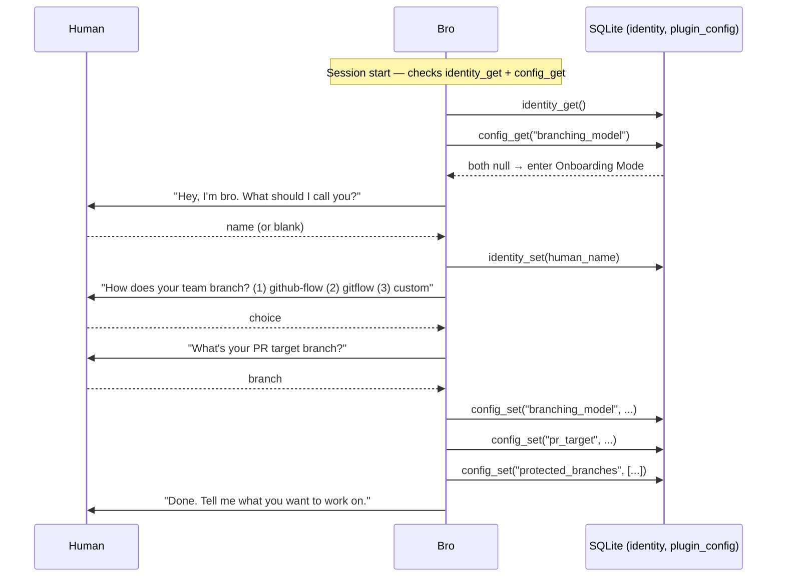
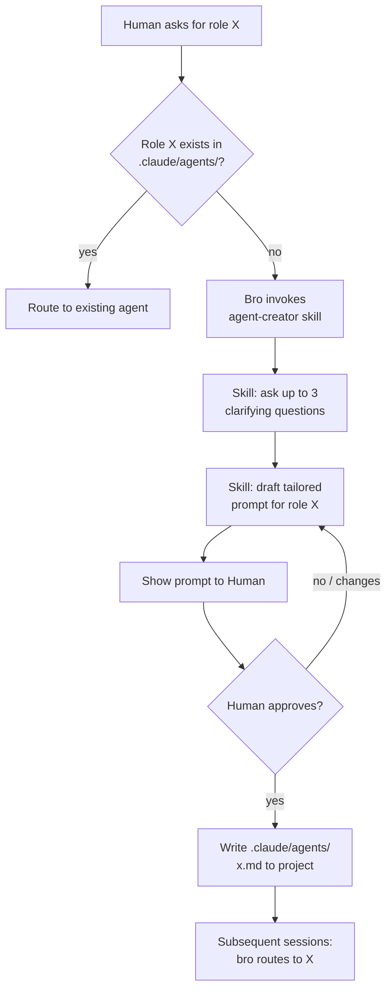
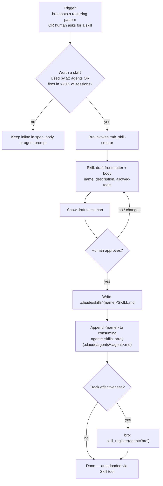
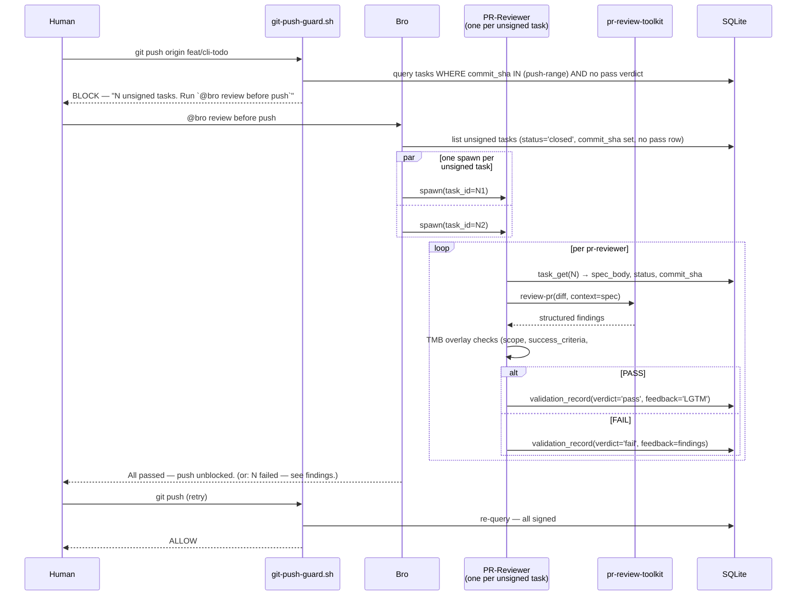
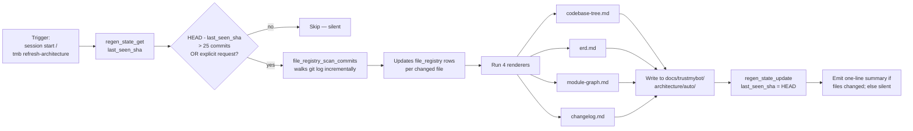
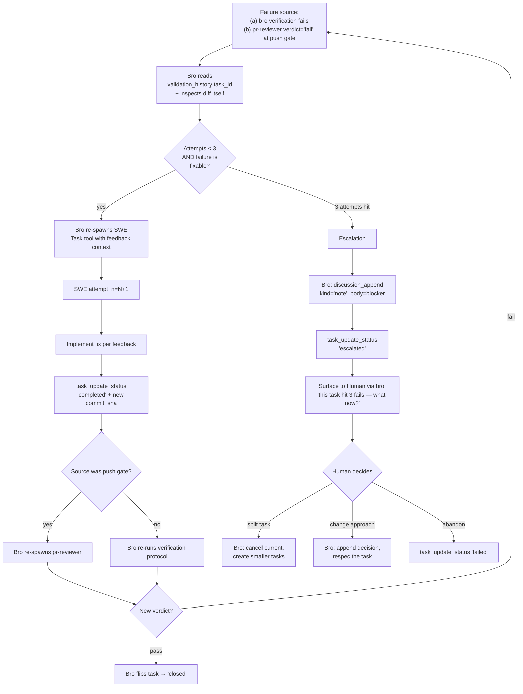
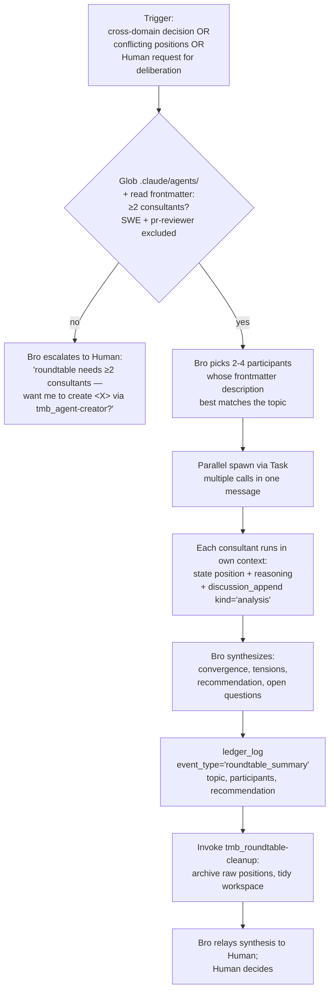

# TMB Workflows — Flowcharts

> **As of v0.1.2:** the decision chain is `Human → bro → SWE` with two
> distinct gates — bro is the **task gate** (closes after SWE returns +
> verifies); pr-reviewer is the **push gate** (fires only at `git push`
> over a batch of unsigned commits). All consultants (architect, cto,
> ceo, pm, project-local) advise but never write workflow state.
>
> **Plugin ships ZERO subagents.** Bro is a CLAUDE.md persona on main
> Claude. SWE, pr-reviewer, and the four consultant templates live in
> `templates/agents/` and are copied into `<project>/.claude/agents/`
> on demand. The protocol skills referenced below all carry the `tmb_`
> prefix (in `plugin/skills/`); template skills carry no prefix
> (in `plugin/templates/skills/`, copied into projects).

Reference workflows — onboarding, simple/difficult task, agent-creator, skill creation, PR review, architecture regen, SWE retry, roundtable, consultant invocation — with the agent / skill / MCP-tool / DB-table / hook involvement spelled out for each.

Companion docs: [`ERD.md`](ERD.md) for schema, [`FILES.md`](FILES.md) for the file map, [`SCENARIOS.md`](../../tests/manual/scenarios.md) for the **trigger prompts that exercise each flow** (dogfood test plan, refresh tracked in [#51](https://github.com/trustmybot/plugin/issues/51)), [`../../CLAUDE.md`](../../CLAUDE.md) for top-level rules.

## Quick index

| # | Flow | Trigger | Agents | Key skills | DB tables touched | Hooks |
|---|---|---|---|---|---|---|
| 1 | [Onboarding](#1-first-run-onboarding) | First activation in a project | bro | `tmb_first-run-onboarding` | `identity`, `plugin_config` | — |
| 2 | [Simple task](#2-simple-task) | Code change, no architecture impact | bro → swe (pr-reviewer at push time only) | `tmb_planning-simple` (bro), `swe-checklist` (lazy on demand) | `issues`, `tasks`, `ledger` (per task) + `validation_attempts` (at push) | `require-task-spec`, `git-push-guard`, `git-guards` |
| 3 | [Difficult task](#3-difficult-task) | Code change touching `docs/trustmybot/architecture/` | bro (full discussion + ADR) → swe (pr-reviewer at push time) | + `tmb_planning-difficult` (env probe, Q+A, ADR) | + `discussions`, ADR file | same |
| 4 | [Agent-creator](#4-agent-creator-on-demand-domain-agent) | Routing hits a role not in `.claude/agents/` | bro → human | `tmb_agent-creator` | — | — |
| 5 | [Skill creation](#5-skill-creation) | Recurring pattern needs encoding | bro | `tmb_skill-creator` | `skills` (optional, for tracking) | — |
| 6 | [Push gate / PR review](#6-push-gate--pr-review) | `git push` to protected branch | bro → pr-reviewer (one per unsigned task, parallel) | `review-protocol`, `review-findings`, `code-quality` | `tasks` (read), `validation_attempts` (write), `discussions` (optional FAIL) | `git-push-guard` |
| 7 | [Architecture regen](#7-architecture-regen) | First code-touching ask of session OR `/tmb refresh-architecture` | bro | `tmb_refresh-architecture`, `tmb_lazy-regen-check` | `regen_state`, `file_registry` | — |
| 8 | [SWE retry / escalation](#8-swe-retry--escalation) | Bro verification or pr-reviewer verdict='fail' | bro ↔ swe (↔ pr-reviewer when at push gate) | `tmb_feedback-loop` | `validation_attempts` (multiple rows), `discussions` | `git-push-guard` |
| 9 | [Roundtable](#9-roundtable-multi-agent-deliberation) | Multi-consultant deliberation | bro orchestrates 2-4 project-local consultants | `tmb_roundtable`, `tmb_roundtable-cleanup` | `discussions`, `ledger` (and reserved: `roundtables`, `roundtable_votes`) | — |
| **C** | [Consultant invocation](#c-consultant-invocation) | Human asks for second opinion **OR** bro spawns one | bro → consultant (architect / cto / pm / domain) | n/a (consultants follow their own prompts) | `discussions` (kind='analysis'/'concern') | — |
| **D** | [Direct Mode](#d-direct-mode-narrow-bypass) | Trivial single-file change ≤3 lines, no public API / docs / tests | bro only (no spawn) | — | `ledger` (event_type='direct_mode_used') | `git-guards` (commit branch check) |

---

## 1. First-Run Onboarding

**Trigger:** Bro at session start finds `config_get("branching_model")` returns null **OR** `identity_get().created_at` is null.

**Involved:**
- Agent: `bro` (no spawn — handles inline)
- MCP tools: `identity_get`, `identity_set`, `config_get`, `config_set`
- DB tables written: `identity`, `plugin_config`
- Skills: none (inline in bro prompt)
- Hooks: none



**Notes:**
- Onboarding mode HOLDS any code-touching ask received during the flow — runs to completion first, then proceeds.
- Read-only asks during onboarding (e.g., "what is this repo?") are answered, then onboarding resumes.
- Re-runnable any time via the `tmb_reonboard` skill (bro invokes it on phrases like "rename yourself", "switch to gitflow", etc.).

---

## 2. Simple Task

**Trigger:** Human asks for a code change; bro triages as `simple` (does NOT require an update to `docs/trustmybot/architecture/`).

**New chain (post #64):** bro is both planner AND task gate; pr-reviewer is the **push gate**, not the task gate. Tasks close as soon as SWE returns.

**Involved:**
- Agents: `bro` (planner + task gate), `swe` (executor)
- Skills loaded by bro on demand: `tmb_planning-simple` or `tmb_planning-difficult` per triage, `tmb_swe-spawn-workflow` (right before SWE handoff)
- Skills loaded by swe: `swe-checklist` **only on demand** (when spec verification needs interpretation; not eager)
- MCP tools: `issue_create`, `discussion_append`, `task_create_batch`, `task_get`, `task_update_status`, `ledger_log` (no `validation_record` per task — that fires at push time)
- DB tables: `issues`, `tasks`, `discussions`, `ledger`, `audit`
- Hooks: `require-task-spec` (gates SWE spawn), `git-push-guard` (gates `git push`), `git-guards` (commit branch check)

```mermaid
sequenceDiagram
    participant H as Human
    participant B as Bro (planner + task gate)
    participant S as SWE (worktree)
    participant DB as SQLite

    H->>B: "implement X"
    B->>B: triage → simple; load tmb_planning-simple skill
    B->>DB: issue_create(agent='bro')
    B->>DB: discussion_append(kind='intent')
    B->>DB: discussion_append(kind='note', body='Triage: simple')
    B->>B: pick defaults (simple fast-lane); author trivial-template spec_body

    Note over B,DB: BATCHED IN ONE RESPONSE — three tool_use blocks in parallel
    par
        B->>DB: task_create_batch(agent='bro', spec_body, waive_scope_gate=true)
    and
        B->>S: spawn Task(swe, task_id=N) [hook: require-task-spec verifies row]
    and
        B->>DB: ledger_log(event_type='planning_complete')
    end

    Note over S: BATCHED IN SWE'S FIRST RESPONSE
    par
        S->>DB: task_get(agent='swe', task_id=N)
    and
        S->>S: git worktree add (parallel cold-start)
    end
    S->>DB: task_update_status(agent='swe', status='running')
    S->>S: implement per spec, run verification
    S->>S: git commit
    S->>DB: task_update_status(agent='swe', status='completed', commit_sha)  [#W4 atomic]

    B->>DB: task_update_status(agent='bro', status='closed')  [no pr-reviewer at this stage]
    B-->>H: "task closed — push when ready (pr-reviewer fires at push time)"
```

**Notes:**
- Bro is the only mutator of `issues`, the planning side of `tasks`, `ledger`, and the closing-side `task_update_status('closed')`. `requireRoles` enforces this server-side.
- The whole loop runs without surfacing to the Human until task close.
- `require-task-spec.sh` verifies the `tasks` row has `status IN (pending, open)` AND non-empty `spec_body` BEFORE allowing the SWE spawn — silent block if the row isn't real.
- **`git-push-guard.sh`** (formerly `require-review-sign.sh`) blocks pushes to protected branches if any pushed commit's task lacks a `validation_attempts.verdict='pass'` row. See **Flow R — Push Gate** below for what happens then.

---

## 3. Difficult Task

**Trigger:** Human asks for a code change that requires updating `docs/trustmybot/architecture/`; bro triages as `difficult`. Same chain as flow 2 — bro is still the planner — plus an alignment loop + ADR commit before `task_create_batch` fires.

**Extra components vs flow 2:**
- Skills: bro loads `tmb_planning-difficult` (instead of `tmb_planning-simple`)
- MCP tools: + `discussion_append`, `discussion_list`
- DB tables: + `discussions`
- Files: ADR at `docs/trustmybot/architecture/manual/decisions/N-*.md`

```mermaid
sequenceDiagram
    participant H as Human
    participant B as Bro (planner + task gate)
    participant S as SWE (worktree)
    participant DB as SQLite

    H->>B: "refactor module X to support Y"
    B->>B: triage → difficult; load tmb_planning-difficult skill
    B->>DB: issue_create(agent='bro')
    B->>DB: discussion_append(kind='intent')
    B->>DB: discussion_append(kind='note', body='Triage: difficult …')

    Note over B: env probe — Read/Glob/Grep on relevant code paths
    loop until aligned with Human (sequential, one Q at a time)
        B->>H: AskUserQuestion (radio, ≤4 options) OR free-text Q
        H-->>B: selected label OR Other free-text
        B->>DB: discussion_append(kind='question', body=Q + options)
        B->>DB: discussion_append(kind='answer', body=selected)
    end

    B->>DB: discussion_append(kind='decision', body=architectural plan)
    B->>B: write docs/trustmybot/architecture/manual/decisions/N-*.md (ADR)

    Note over B,DB: BATCHED IN ONE RESPONSE — three tool_use blocks in parallel
    par
        B->>DB: task_create_batch(agent='bro', spec_body, standard template)
    and
        B->>S: spawn Task(swe, task_id=N) [hook: require-task-spec]
    and
        B->>DB: ledger_log(event_type='planning_complete')
    end

    Note over S,B: → flow 2 "SWE returns" onwards: bro verifies, flips → 'closed'
    Note over B: pr-reviewer fires only at git push (flow 6), not per task
```

**Notes:**
- **Bro is the only planner.** No architect-as-decider. If the Human wants an architect's read on the design, bro spawns the project-local `architect.md` consultant via flow C — but bro retains the decision and the spec-authoring responsibility.
- ADR file is the durable architectural record. The `discussions` table holds the conversation that produced it; bro reconstructs the narrative via `issue_report_md` / `issue_snapshot_md`.
- **Sequential AskUserQuestion, not batched.** Per dogfood feedback, bro asks one question at a time for better UX in the difficult flow — the radio UI is still used per question, but multiple Q's aren't bundled in one prompt.
- Falls back to plain `discussion_append(kind='question')` when the answer shape isn't enumerable.
- Bro's verification step after SWE returns runs the same protocol as the simple flow (re-run spec's `## Verification`, sanity-check diff against `## Files`, confirm each `## Success Criteria` bullet) — never skipped, even when the task was difficult-triaged.

---

## 4. Agent-creator (on-demand domain agent)

**Trigger:** Bro routing finds the named role (e.g., "I need a `legal-reviewer`") doesn't exist in `.claude/agents/`.

**Involved:**
- Agents: `bro` (or `architect` as alternative invoker)
- Skill: `agent-creator`
- DB tables: none (no MCP write — file-based outcome)
- Files written: `.claude/agents/<name>.md` (project-local, on user approval only)
- Hooks: none



**Notes:**
- **Every** new agent requires explicit Human "yes". Skill enforces this.
- Reserved names — `bro`, `architect`, `swe`, `pr-reviewer` — are refused (these are the plugin's shipped roster).
- Agent file lives in the user's project, not the plugin. Once committed, every dev on the repo gets it on next pull.

---

## 5. Skill Creation

**Trigger:** Recurring pattern that needs encoding for reproducibility (e.g., a checklist agents keep skipping; a procedure invoked from multiple agents). Bro can spot the pattern itself, OR the Human can ask explicitly (`@bro create a skill that …`).

**Lego doctrine matters here.** Agents are immutable identity (Lego studs). Skills are additive bricks that extend an agent's capabilities. **Bro never edits the agent template body**; instead, when a new skill is created, bro appends its name to the consuming agent's `skills:` array on the project-local copy in `.claude/agents/`. The plugin-shipped templates in `templates/agents/` stay untouched.

**Involved:**
- Agent: `bro` (drives the flow inline, asks the Human to confirm)
- Skill: `tmb_skill-creator` (the meta-skill that authors the new skill)
- DB tables (optional): `skills` — for effectiveness tracking via `skill_register` + `skill_record_outcome`
- Files: `<project>/.claude/skills/<name>/SKILL.md` (project-local) — plugin-shipped `tmb_*` skills are out of scope for this flow
- Hooks: none



**When NOT to create a skill:**
- One-off procedure used by one agent → keep inline in the task spec.
- Pure read/grep operations → use Glob + Grep directly.
- Domain-specific advice that varies per project → user-curated, not plugin-shipped.

**Plugin-shipped vs project-local:**
- Plugin-shipped protocol skills (`tmb_*` in `plugin/skills/`) are reserved — projects can't override them by name. New plugin-shipped skills require a contribution PR (see [`CONTRIBUTING.md`](../../CONTRIBUTING.md)).
- Project-local skills go to `<project>/.claude/skills/<name>/SKILL.md` (no `tmb_` prefix).

---

## 6. Push Gate / PR Review

**Trigger:** Human runs `git push` (or `gh pr create`) → `git-push-guard.sh` PreToolUse hook scans for unsigned commits in the push range → blocks with a "Run `@bro review before push`" message → Human invokes that → bro spawns pr-reviewer for each unsigned task.

PR-reviewer no longer fires per-task at task-close. It fires at push time over a batch of unsigned commits. This amortizes the cost across multiple tasks per push.

**Involved:**
- Agents: `bro` (orchestrator + push-gate driver), `pr-reviewer` (one per unsigned task, parallel where possible)
- External: `pr-review-toolkit:review-pr` (mechanical pass; plugin dependency)
- MCP tools: `task_get`, `validation_record`, `discussion_append` (on FAIL), `issue_snapshot_md` (on PASS), `regen_state_get` (auto-dir check)
- DB tables: `tasks` (read), `validation_attempts` (write), `discussions` (optional FAIL note)
- Hooks: `git-push-guard.sh` blocks `git push` until all push-range tasks have a `validation_attempts.verdict='pass'` row



**Notes:**
- pr-reviewer has **no Edit tool**. All sign-off is via MCP, never by editing files.
- Auto/architecture-dir check: any staged change under `docs/trustmybot/architecture/auto/` must preserve the generated-header comment. If broken → FAIL with "regenerate via `/tmb refresh-architecture`".
- The `git-push-guard.sh` hook is the structural enforcement. Bro drives the actual review when the Human invokes the magic phrase.
- Multiple unsigned tasks in one push → parallel pr-reviewer spawns where independent. Bro waits for all to return before reporting outcome.
- WIP pushes to feature/fix/etc. branches are NOT gated (per existing #13 convention) — only protected-branch pushes trigger the gate.

---

## 7. Architecture Regen

**Trigger:**
- Lazy: bro at first code-touching ask of a session, when `regen_state.last_seen_sha` is > 25 commits behind HEAD.
- On-demand: Human says "refresh architecture docs", "regen architecture", `/tmb refresh-architecture`.

**Involved:**
- Agent: `bro` (orchestrates inline)
- Skill: `tmb_refresh-architecture`
- MCP tools: `regen_state_get`, `regen_state_update`, `file_registry_scan_commits`, `architecture_regen`
- DB tables: `regen_state`, `file_registry`
- Files written: `docs/trustmybot/architecture/auto/{codebase-tree,erd,module-graph,changelog}.md`
- Hooks: none



**Notes:**
- The 4 auto files carry a generated-header comment (`<!-- Generated YYYY-MM-DD via /tmb refresh-architecture. Do not edit; regenerate. -->`). pr-reviewer's overlay check FAILs on missing header.
- Output is deterministic from git log — different devs running regen produce identical output, so merge conflicts on auto files resolve by re-running.
- The `manual/` ADRs and narrative docs are NOT touched by regen — those are architect-curated.

---

## 8. SWE Retry / Escalation

**Trigger:** EITHER bro's task-gate verification fails (re-run of spec's `## Verification` doesn't pass, diff doesn't match `## Files`, or a `## Success Criteria` bullet isn't met) OR pr-reviewer records `validation_record(verdict='fail', feedback=…)` at the push gate. Bro runs the retry loop in both cases.

**Involved:**
- Agents: `bro` (retry orchestrator), `swe` (re-spawned with feedback), `pr-reviewer` (only at push-gate retries)
- Skill: `tmb_feedback-loop` (defines the retry/escalation protocol)
- MCP tools: `validation_history`, `task_update_status`, `discussion_append`
- DB tables: `validation_attempts` (one row per pr-reviewer attempt; UNIQUE(task_id, attempt_n)), `discussions`
- Hooks: `git-push-guard` (still enforces — no push until a `verdict='pass'` row exists for every commit-bearing task)



**Notes:**
- Each pr-reviewer attempt is a separate `validation_attempts` row — full audit trail of what failed each time. Bro-verification fails are recorded as `discussions(kind='note')` rather than validation_attempts (validation_attempts is reserved for the push gate's structured verdicts).
- Escalation never auto-merges. The Human is the only one who decides "give up" or "respec".
- `tmb_feedback-loop` skill (loaded by bro) defines what counts as "fixable" vs "needs escalation".

---

## 9. Roundtable (multi-agent deliberation)

**Prerequisite — REQUIRED, no exceptions:** At least **2 consultant agents** must exist in `<project>/.claude/agents/`. The plugin ships ZERO consultants — they're all templates that bro copies into the project on demand (see flow C). So out-of-the-box, roundtable cannot run; it becomes available after the project has at least 2 of `architect`, `cto`, `ceo`, `pm`, or any user-created domain consultant. SWE is an executor and is always excluded; pr-reviewer reviews code, not strategy.

If the skill finds < 2 suitable participants, it escalates back to bro — roundtable requires at least 2 voices.

**Trigger conditions** (any of these — see `skills/tmb_roundtable/SKILL.md` for the authoritative list):

- **Divergent opinions need structured airing** — different consultants have given conflicting recommendations on the same issue (visible via `discussion_list`).
- **Multi-dimension trade-offs** — a decision spans product / technical / business axes; no single consultant owns all dimensions.
- **Cross-discipline calls** — domain-specific question (e.g., legal/compliance/UX) where one consultant alone can't credibly decide.
- **Human explicitly requests deliberation** — phrases like "convene a roundtable", "discuss with X and Y", "let's get more opinions".

**Do NOT use roundtable for:**

- Quick factual questions (bro answers OR spawns one consultant directly via flow C).
- Single-discipline decisions (spawn that one consultant via flow C).
- A caller who wants a binding decision (roundtable produces a synthesis; the Human still decides).

**Involved:**

- Convener: `bro` (loads the `tmb_roundtable` skill)
- Participants: 2-4 project-local consultants. SWE + pr-reviewer always excluded.
- Skills: `tmb_roundtable` (mechanics), `tmb_roundtable-cleanup` (post-synthesis archive)
- MCP tools: `ledger_log` (records the summary as `event_type='roundtable_summary'`); `discussion_list` to inspect prior conflicting positions; `discussion_append(kind='analysis')` per consultant
- DB tables: `discussions` (one `kind='analysis'` row per consultant), `ledger` (summary). Reserved-but-unused: `roundtables` + `roundtable_votes` (schema exists; no MCP tool wrappers yet — tracked in [#57](https://github.com/trustmybot/plugin/issues/57) / [#67](https://github.com/trustmybot/plugin/issues/67) / [#68](https://github.com/trustmybot/plugin/issues/68))
- Hooks: none



**Notes:**

- **Parallel spawn, sequential synthesis.** Consultants are spawned in one message (multiple `Task` calls); each runs in its own context window so there's no cross-contamination. Bro waits for all responses, then synthesizes.
- **No groupthink.** If all participants agree immediately, the skill instructs bro to probe the weakest shared assumption before accepting consensus.
- **Protect dissent.** A lone dissenter may be right — dissenting views get explicit airtime in the synthesis's `<tensions>` section.
- **Ledger is the current record store.** `roundtables` + `roundtable_votes` tables in the schema are reserved structure; today the skill writes summaries to `ledger`. A future schema-uplift task can migrate to the structured tables when there's reason to query roundtable history independently.
- **One voice ≠ roundtable.** If the project only has one consultant (or none), the skill refuses. Bro surfaces it as "I'd need a `pm` (or similar) for this — want me to create one?" and routes through flow #4.
- **Bro never auto-applies the synthesis.** Even when consultants converge unanimously, the recommendation goes to the Human, not into a task spec.

---

## C. Consultant invocation

**Trigger:** Human asks for a second opinion (`@bro get the cto's read on X`) **OR** bro decides it wants to challenge its own plan and spawns a consultant on its own initiative.

Consultants are **project-local** — the plugin ships none. The first time a consultant of a given name is needed, bro invokes `agent-creator` to draft + write the file with explicit Human approval. Every subsequent ask in the same project reuses the file.

**Involved:**
- Agents: `bro` (decision-maker), one consultant subagent (project-local, e.g. `architect`, `cto`, `legal-reviewer`)
- Skills: `agent-creator` (first-time create), each consultant follows its own prompt
- MCP tools: `issue_get_with_discussions` (read), `discussion_append(kind='analysis'|'concern')` (write)
- DB tables: `discussions` (one or more `kind='analysis'` or `kind='concern'` rows)
- Hooks: none

```mermaid
sequenceDiagram
    participant H as Human
    participant B as Bro
    participant C as Consultant (project-local)
    participant DB as SQLite

    H->>B: "get architect's read on the SQLite-vs-JSON storage choice"
    alt .claude/agents/architect.md exists
        B->>B: skip create
    else first time
        B->>B: invoke agent-creator skill
        B->>H: propose agent spec
        H-->>B: approve
        B->>B: write .claude/agents/architect.md
    end
    B->>C: spawn(consultant: analysis-only, issue_id=<N>, question)
    C->>DB: issue_get_with_discussions(issue_id) — reads context
    C->>C: read code if relevant; build analysis
    C->>DB: discussion_append(kind='analysis', author='<consultant-name>', body=analysis)
    C-->>B: structured analysis (position + risks + recommendation if asked)
    B->>B: summarize for Human
    B-->>H: "architect says: X, with these risks. Your call."
    Note over B,DB: Server-rejected for consultants: task_create_batch, task_update_status,<br/>validation_record, issue_create — all return 'forbidden' via requireRoles
```

**Notes:**
- The consultant returns analysis as its final assistant message AND persists key points to MCP. Bro reads both: the message in conversation, the rows when assembling the summary.
- **Server-side enforcement** (post `feat/bro-as-planner` cleanup): `requireRoles` rejects any consultant call to `task_create_batch`, `task_update_status`, `validation_record`, or `issue_create`. The decision chain is structurally protected, not just prompt-discipline.
- For multi-consultant deliberation (cto + architect + ceo voting), see flow 9 (Roundtable). The voting protocol is tracked in [#57](https://github.com/trustmybot/plugin/issues/57).
- The Human always decides; bro never auto-applies a consultant's recommendation.

---

## D. Direct Mode (narrow bypass)

**Trigger:** Bro receives a code-touching ask that meets ALL of:

- Single file change.
- ≤3 lines diff (typo fix, comment, constant bump, one-line README rewording).
- No public API change, no new file, no test change required.
- No `docs/trustmybot/architecture/` touched (architecture-touching is always difficult-triage → no Direct Mode).

**Involved:**
- Agent: `bro` only (no spawn)
- Skills: none
- MCP tools: `ledger_log` (event_type='direct_mode_used')
- DB tables: `ledger`
- Hooks: `git-guards` (commit branch check)

```mermaid
sequenceDiagram
    participant H as Human
    participant B as Bro
    participant FS as Filesystem
    participant DB as SQLite

    H->>B: "@bro fix typo 'recieve' → 'receive' in README.md"
    B->>B: triage → trivial; auto-engage Direct Mode
    B->>FS: Edit README.md (single ≤3-line change)
    B->>FS: Bash: git commit -m "chore: typo fix"
    B->>DB: ledger_log(agent='bro', event_type='direct_mode_used', summary=...)
    B-->>H: "fixed + committed."
```

**Notes:**
- Direct Mode is the ONLY narrow exception to "every code change goes through SWE." It exists to make trivial fixes feel as fast as pure Claude (~10–20s).
- If the change creeps past 3 lines or touches state bro can't reason about in one read, bro falls back to the default chain (flow 2 or 3 with task_create_batch + SWE spawn).
- The discipline is the narrow scope. Resist extending Direct Mode "just for this one case" — that's the slippery slope this rule explicitly guards against.
- Pre-push gate (flow 6) does NOT fire for Direct-Mode commits because no `tasks` row exists for them — they're recorded as `ledger.direct_mode_used` events instead.

---

## How to add a new flow to this doc

1. Add a row to the **Quick index** table.
2. Add a section with: Trigger, Involved (agents/skills/MCP/DB/files/hooks), Mermaid diagram, Notes.
3. Cross-link from any agent prompt or skill that drives the flow.
4. If the flow touches the schema, also update [`ERD.md`](ERD.md) "How agents use this" section.
