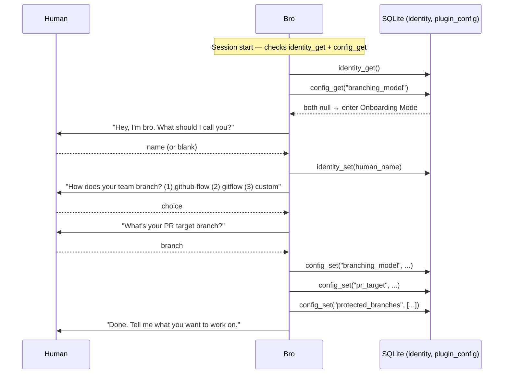
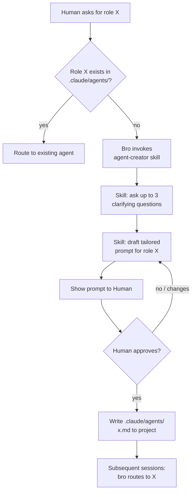
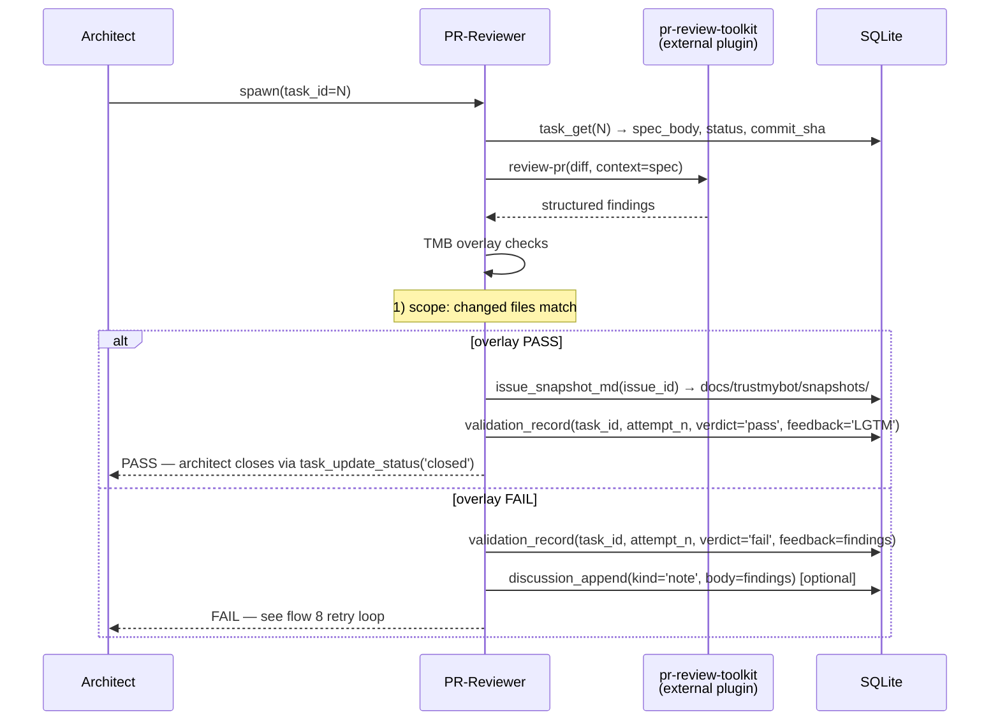
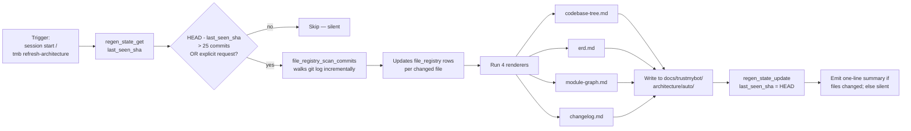
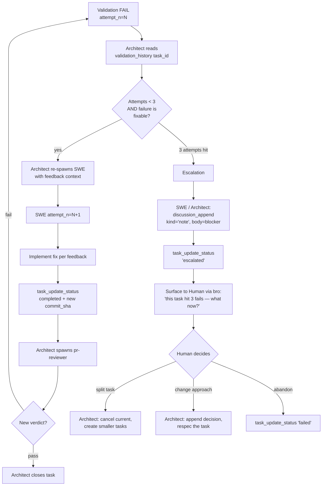
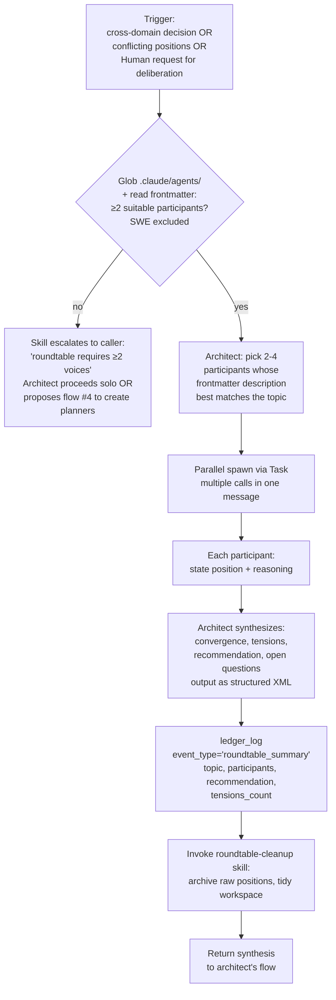

# TMB Workflows — Flowcharts

> **As of `feat/bro-as-planner`:** the decision chain is `Human → bro → SWE`
> with `pr-reviewer` as the gate. Bro is the planner; architect is a
> consultant on-demand. Flows below are partially refreshed:
>
> | Flow | State |
> |---|---|
> | 1 (Onboarding) | Current |
> | 2 (Simple task) | **Refreshed** below |
> | 3 (Difficult task) | STALE — refresh pending |
> | 4 (Agent-creator) | Current (bro invokes; new agents default to consultant scope) |
> | 5 (Skill creation) | STALE |
> | 6 (PR review) | Current with one substitution: pr-reviewer returns to **bro** (not architect) |
> | 7 (Architecture regen) | Current — bro is the only caller |
> | 8 (SWE retry) | STALE — architect→bro substitution needed throughout |
> | 9 (Roundtable) | STALE — multi-consultant voting tracked in #57 |
> | **C (Consultant invocation)** | **NEW** — added below |

Reference workflows — onboarding, simple/difficult task, agent-creator, skill creation, PR review, architecture regen, SWE retry, consultant invocation — with the agent / skill / MCP-tool / DB-table / hook involvement spelled out for each.

Companion docs: [`ERD.md`](ERD.md) for schema, [`FILES.md`](FILES.md) for the file map, [`SCENARIOS.md`](../../tests/manual/scenarios.md) for the **trigger prompts that exercise each flow** (dogfood test plan), [`../../CLAUDE.md`](../../CLAUDE.md) for top-level rules.

## Quick index

| # | Flow | Trigger | Agents | Key skills | DB tables touched | Hooks |
|---|---|---|---|---|---|---|
| 1 | [Onboarding](#1-first-run-onboarding) | First activation in a project | bro | `first-run-onboarding` | `identity`, `plugin_config` | — |
| 2 | [Simple task](#2-simple-task) | Code change, no architecture impact | bro → swe → pr-reviewer | `architect-workflow` (loaded by bro), `swe-checklist`, `validate-swe-output`, `review-protocol` | `issues`, `tasks`, `discussions`, `validation_attempts`, `ledger` | `require-task-spec`, `require-review-sign`, `git-guards` |
| 3 | [Difficult task](#3-difficult-task) | Code change touching `docs/trustmybot/architecture/` | bro (full discussion phase) → swe → pr-reviewer | + `architect-workflow` discussion + ADR step | + ADR file | same |
| 4 | [Agent-creator](#4-agent-creator-on-demand-domain-agent) | Routing hits a role not in `.claude/agents/` | bro → user | `agent-creator` | — | — |
| 5 | [Skill creation](#5-skill-creation) | Recurring pattern needs encoding | bro | — | `skills` | — |
| 6 | [PR review](#6-pr-review) | After SWE marks task `completed` | pr-reviewer (returns to bro) | `review-protocol`, `review-findings`, `code-quality` | `tasks` (read), `validation_attempts` (write), `discussions` (optional) | `require-review-sign` |
| 7 | [Architecture regen](#7-architecture-regen) | First code-touching ask of session OR `/tmb refresh-architecture` | bro | `refresh-architecture` | `regen_state`, `file_registry` | — |
| 8 | [SWE retry / escalation](#8-swe-retry--escalation) | `validation_record(verdict='fail')` | bro ↔ swe ↔ pr-reviewer | `feedback-loop` | `validation_attempts` (multiple rows), `discussions` | `require-review-sign` |
| 9 | [Roundtable](#9-roundtable-multi-agent-deliberation) | Multi-consultant deliberation | bro orchestrates 2-4 consultants | `roundtable`, `roundtable-cleanup` | `discussions`, `ledger` | — |
| **C** | [Consultant invocation](#c-consultant-invocation-new) | Human asks for second opinion **OR** bro spawns one | bro → consultant (architect / cto / etc.) | `architect-workflow` (architect side, when consulted) | `discussions` (kind='analysis'/'concern') | — |

---

## 1. First-Run Onboarding

**Trigger:** Bro at session start finds `config_get("branching_model")` returns null **OR** `identity_get().created_at` is null.

**Involved:**
- Agent: `bro` (no spawn — handles inline)
- MCP tools: `identity_get`, `identity_set`, `config_get`, `config_set`
- DB tables written: `identity`, `plugin_config`
- Skills: none (inline in bro prompt)
- Hooks: none



**Notes:**
- Onboarding mode HOLDS any code-touching ask received during the flow — runs to completion first, then proceeds.
- Read-only asks during onboarding (e.g., "what is this repo?") are answered, then onboarding resumes.
- Re-runnable any time via the `tmb-reonboard` skill (bro invokes it on phrases like "rename yourself", "switch to gitflow", etc.).

---

## 2. Simple Task

**Trigger:** Human asks for a code change; bro triages as `simple` (does NOT require an update to `docs/trustmybot/architecture/`).

**Involved:**
- Agents: `bro` (planner), `swe` (executor), `pr-reviewer` (gate)
- Skills loaded by bro on demand: `architect-workflow` (the planner protocol), `swe-spawn-workflow` (right before SWE handoff), `validate-swe-output` (when SWE returns)
- Skills loaded by swe: `swe-checklist`
- Skills loaded by pr-reviewer: `review-protocol`, `review-findings`, `code-quality`
- MCP tools: `issue_create`, `discussion_append`, `task_create_batch`, `task_get`, `task_update_status`, `validation_record`, `ledger_log`
- DB tables: `issues`, `tasks`, `discussions`, `validation_attempts`, `ledger`, `audit`
- Hooks: `require-task-spec` (gates SWE spawn), `require-review-sign` (gates push), `git-guards` (commit branch check)

```mermaid
sequenceDiagram
    participant H as Human
    participant B as Bro (planner)
    participant S as SWE (worktree)
    participant P as PR-Reviewer
    participant DB as SQLite

    H->>B: "implement X"
    B->>B: triage → simple; load architect-workflow skill
    B->>DB: issue_create(agent='bro', objective, description)
    DB-->>B: issue_id
    B->>DB: discussion_append(kind='intent', author='human')
    B->>DB: discussion_append(kind='note', body='Triage: simple')
    B->>B: pick defaults (simple fast-lane); author trivial-template spec_body
    B->>DB: task_create_batch(agent='bro', spec_body, waive_scope_gate=true, reason)
    DB-->>B: task_id
    B->>DB: ledger_log(event_type='planning_complete')

    B->>S: spawn(task_id=N) [hook: require-task-spec verifies row]
    S->>DB: task_get(agent='swe', task_id=N)
    S->>DB: task_update_status(agent='swe', status='running')
    S->>S: create worktree, implement, run verification
    S->>S: git commit
    S->>DB: task_update_status(agent='swe', status='completed', commit_sha)  [#W4 atomic]

    B->>B: load validate-swe-output skill (forked Explore subagent)
    B->>P: spawn(task_id=N)
    P->>DB: task_get(agent='pr-reviewer', task_id=N)
    P->>P: pr-review-toolkit + TMB overlay checks
    alt PASS
        P->>DB: validation_record(agent='pr-reviewer', task_id, verdict='pass', feedback)
        B->>DB: task_update_status(agent='bro', status='closed')
    else FAIL
        P->>DB: validation_record(agent='pr-reviewer', task_id, verdict='fail', feedback)
        Note over B,S: → flow 8 (bro drives retry; re-spawns SWE with feedback)
    end

    B-->>H: result summary ("Trust me bro, it works.")
```

**Notes:**
- Bro is the only mutator of `issues`, the planning side of `tasks`, `ledger`, and (post-review) `task_update_status('closed')`. `requireRoles` enforces this server-side.
- The whole loop runs without surfacing to the Human until result.
- `require-task-spec.sh` verifies the `tasks` row has `status IN (pending, open)` AND non-empty `spec_body` BEFORE allowing the SWE spawn — silent block if the row isn't real.
- `require-review-sign.sh` blocks pushes to protected branches if any `tasks.status='completed'` row lacks a `validation_attempts.verdict='pass'` row.

---

## 3. Difficult Task

**Trigger:** Human asks for a code change that requires updating `docs/trustmybot/architecture/`; bro triages as `difficult`.

**Same chain as flow 2, plus:** alignment loop + ADR commit before any task is created.

**Extra components:**
- Skills: + `architect-workflow` discussion phase
- MCP tools: + `discussion_append`, `discussion_list`
- DB tables: + `discussions`
- Files: ADR at `docs/trustmybot/architecture/manual/decisions/N-*.md`

```mermaid
sequenceDiagram
    participant H as Human
    participant G as Bro
    participant A as Architect
    participant DB as SQLite

    H->>G: "refactor module X to support Y"
    G->>G: triage → difficult
    G->>A: spawn (triage:difficult)

    A->>A: re-evaluate triage; confirm difficult
    A->>DB: issue_create(objective, description)
    A->>DB: discussion_append(kind='note', body='Triage: difficult …')

    loop until aligned with Human
        A->>H: AskUserQuestion(radio form, ≤4 options per Q, batched)
        H-->>A: selected label OR Other free-text
        A->>DB: discussion_append(kind='question', body=Q + options)
        A->>DB: discussion_append(kind='answer', body=selected)
    end

    A->>DB: discussion_append(kind='decision', body=architectural plan)
    A->>A: write docs/trustmybot/architecture/manual/decisions/N-*.md (ADR)

    A->>DB: task_create_batch(spec_body, …)  [standard template, deeper sections]

    Note over A,DB: → flow 2 from "spawn SWE" onwards
```

**Notes:**
- Architect's triage is binding; bro's classification is a proposal. If architect downgrades to `simple`, no ADR needed and standard template not required.
- ADR file is the durable architectural record. Discussions table holds the conversation that produced it.
- Alignment uses `AskUserQuestion` — a proper radio form — for any question with 2–4 enumerable answers (scope, tech choice, priority). Every Q/A round persists TO `discussions` as a `question` + `answer` pair so the trajectory is replayable via `issue_report_md` / `issue_snapshot_md`. See `skills/architect-workflow/SKILL.md#interactive-alignment` for the pattern.
- Falls back to plain text `discussion_append(kind='question')` when the answer shape isn't enumerable (e.g., "what constraints do you have?").

---

## 4. Agent-creator (on-demand domain agent)

**Trigger:** Bro routing finds the named role (e.g., "I need a `legal-reviewer`") doesn't exist in `.claude/agents/`.

**Involved:**
- Agents: `bro` (or `architect` as alternative invoker)
- Skill: `agent-creator`
- DB tables: none (no MCP write — file-based outcome)
- Files written: `.claude/agents/<name>.md` (project-local, on user approval only)
- Hooks: none



**Notes:**
- **Every** new agent requires explicit Human "yes". Skill enforces this.
- Reserved names — `bro`, `architect`, `swe`, `pr-reviewer` — are refused (these are the plugin's shipped roster).
- Agent file lives in the user's project, not the plugin. Once committed, every dev on the repo gets it on next pull.

---

## 5. Skill Creation

**Trigger:** Recurring pattern that needs encoding for reproducibility (e.g., a checklist agents keep skipping; a workflow that's invoked from multiple agents).

**Involved:**
- Agent: `architect` (authors the skill markdown)
- DB tables (optional): `skills` — for effectiveness tracking via `skill_register` + `skill_record_outcome`
- Files: `plugin/skills/<name>/SKILL.md` (or `.claude/skills/<name>/SKILL.md` for project-local skills)
- Hooks: none



```mermaid
flowchart TD
    A["Architect notices pattern:<br/>repeated checklist, drifting<br/>workflow, or duplicated logic<br/>across multiple agent prompts"] --> B{"Worth a skill?<br/>Used by ≥2 agents OR<br/>fires &lt; 20% of sessions?"}
    B -->|no| C[Inline in agent prompt]
    B -->|yes| D[Decide scope]
    D --> E{Plugin-shipped<br/>or project-local?}
    E -->|reusable across<br/>all projects| F["plugin/skills/X/SKILL.md"]
    E -->|specific to<br/>this project| G[".claude/skills/X/SKILL.md"]
    F --> H["Write SKILL.md with<br/>frontmatter: name, description,<br/>agent allowlist, allowed-tools"]
    G --> H
    H --> I["Update calling agent's<br/>frontmatter: skills: &#91;X&#93;"]
    I --> J{Track effectiveness?}
    J -->|yes| K[Architect calls<br/>skill_register MCP tool]
    J -->|no| L[Done — Claude Code<br/>auto-loads via name]
    K --> L
```

**When NOT to create a skill:**
- One-off workflow used by one agent → keep inline.
- Pure read/grep operations → use Glob + Grep tools directly.
- Domain-specific advice that varies per project → user-authored, not plugin-shipped.

---

## 6. PR Review

**Trigger:** SWE marks `task_update_status(status='completed', commit_sha=X)`; architect spawns pr-reviewer to validate.

**Involved:**
- Agent: `pr-reviewer`
- Skills: `review-protocol`, `review-findings`, `code-quality`
- External: `pr-review-toolkit:review-pr` (mechanical pass; plugin dependency)
- MCP tools: `task_get`, `validation_record`, `discussion_append` (on FAIL), `issue_snapshot_md` (on PASS), `regen_state_get` (auto-dir check)
- DB tables: `tasks` (read), `validation_attempts` (write), `discussions` (optional FAIL note)
- Hooks: `require-review-sign.sh` enforces this gate at push time



**Notes:**
- pr-reviewer has **no Edit tool**. All sign-off is via MCP, never by editing files.
- Auto/architecture-dir check: any staged change under `docs/trustmybot/architecture/auto/` must preserve the generated-header comment. If broken → FAIL with "regenerate via `/tmb refresh-architecture`".
- The `require-review-sign.sh` hook enforces the gate at push time — pushes to protected branches blocked until every `completed` task has a `validation_record(verdict='pass')`.

---

## 7. Architecture Regen

**Trigger:**
- Lazy: bro at first code-touching ask of a session, when `regen_state.last_seen_sha` is > 25 commits behind HEAD.
- On-demand: Human says "refresh architecture docs", "regen architecture", `/tmb refresh-architecture`.

**Involved:**
- Agent: `bro` (orchestrates inline)
- Skill: `refresh-architecture`
- MCP tools: `regen_state_get`, `regen_state_update`, `file_registry_scan_commits`, `architecture_regen`
- DB tables: `regen_state`, `file_registry`
- Files written: `docs/trustmybot/architecture/auto/{codebase-tree,erd,module-graph,changelog}.md`
- Hooks: none



**Notes:**
- The 4 auto files carry a generated-header comment (`<!-- Generated YYYY-MM-DD via /tmb refresh-architecture. Do not edit; regenerate. -->`). pr-reviewer's overlay check FAILs on missing header.
- Output is deterministic from git log — different devs running regen produce identical output, so merge conflicts on auto files resolve by re-running.
- The `manual/` ADRs and narrative docs are NOT touched by regen — those are architect-curated.

---

## 8. SWE Retry / Escalation

**Trigger:** pr-reviewer records `validation_record(verdict='fail', feedback=…)`. Architect runs the retry loop.

**Involved:**
- Agents: `architect`, `swe`, `pr-reviewer`
- Skill: `feedback-loop` (defines the retry/escalation protocol)
- MCP tools: `validation_history`, `task_update_status`, `discussion_append`
- DB tables: `validation_attempts` (one row per attempt; UNIQUE(task_id, attempt_n)), `discussions`
- Hooks: `require-review-sign` (still enforces — no push until a `verdict='pass'` row exists)



**Notes:**
- Each attempt is a separate `validation_attempts` row — full audit trail of what failed each time.
- Escalation never auto-merges. Human is the only one who decides "give up" or "respec".
- `feedback-loop` skill (loaded by architect + pr-reviewer) defines what counts as "fixable" vs "needs escalation".

---

## 9. Roundtable (multi-agent deliberation)

**Prerequisite — REQUIRED, no exceptions:** At least **2 planning-capable agents** must exist in `.claude/agents/` for the skill to run. The plugin ships exactly **one planner** — `architect`. SWE is an executor and is always excluded; pr-reviewer reviews code, not strategy. So out-of-the-box, roundtable can't run. It becomes available only after the user has created additional planning agents via flow [#4 (agent-creator)](#4-agent-creator-on-demand-domain-agent) — typically `ceo`, `cto`, `pm`, `designer`, or domain reviewers.

If the skill finds < 2 suitable participants, it escalates back to the caller — roundtable requires at least 2 voices.

**Trigger conditions** (any of these — see `skills/roundtable/SKILL.md` for the authoritative list):

- **Divergent opinions need structured airing** — different agents have given conflicting recommendations on the same issue (visible via `discussion_list`).
- **Multi-dimension trade-offs** — a decision spans product / technical / business axes; no single agent owns all dimensions.
- **Cross-discipline calls** — domain-specific question (e.g., legal/compliance/UX) where the architect alone can't credibly decide.
- **Human explicitly requests deliberation** — phrases like "convene a roundtable", "discuss with X and Y", "let's get more opinions".

**Do NOT use roundtable for:**

- Quick factual questions (architect just answers).
- Single-discipline decisions (spawn that one agent directly via `Task`).
- A caller who wants one voice (roundtable is deliberation, not delegation).

**Involved:**

- Convener: `architect` (skill is in architect's frontmatter)
- Participants: 2-4 user-created planning agents from `.claude/agents/`. SWE always excluded.
- Skills: `roundtable` (mechanics), `roundtable-cleanup` (post-synthesis archive)
- MCP tools: `ledger_log` (records the summary as `event_type='roundtable_summary'`); `discussion_list` to inspect prior conflicting positions
- DB tables: `ledger` (where the summary lands today). The `roundtables` + `roundtable_votes` tables exist in the schema as reserved structure for a future structured-record upgrade; current skill writes to `ledger`.
- Hooks: none



**Notes:**

- **Parallel spawn, sequential synthesis.** Participants are spawned in one message (multiple `Task` calls); each runs in its own context window so there's no cross-contamination. Architect waits for all responses, then synthesizes.
- **No groupthink.** If all participants agree immediately, the skill instructs the convener to probe the weakest shared assumption before accepting consensus.
- **Protect dissent.** A lone dissenter may be right — dissenting views get explicit airtime in the synthesis's `<tensions>` section.
- **Ledger is the current record store.** `roundtables` + `roundtable_votes` tables in the schema are forward-looking; the skill writes summaries to `ledger` today. A future schema-uplift task can migrate to the structured tables when there's reason to query roundtable history independently.
- **One voice ≠ roundtable.** If the user only has architect, the skill refuses. Telling architect to "discuss with itself" is a smell; surface it back to the user as "I'd need a `pm` (or similar) for this — want me to create one?" and route through flow #4.

---

## C. Consultant invocation (NEW)

**Trigger:** Human asks for a second opinion (`@bro get the cto's read on X`) **OR** bro decides it wants to challenge its own plan and spawns a consultant on its own initiative.

**Involved:**
- Agents: `bro` (decision-maker), one consultant subagent (e.g. `architect`, `cto`, or any user-created agent)
- Skills: `architect-workflow` (the consultant agent loads this if it's the architect; other consultants follow their own prompts)
- MCP tools: `issue_get_with_discussions` (read), `discussion_append(kind='analysis'|'concern')` (write)
- DB tables: `discussions` (one or more `kind='analysis'` or `kind='concern'` rows)
- Hooks: none

```mermaid
sequenceDiagram
    participant H as Human
    participant B as Bro
    participant C as Consultant (e.g. architect)
    participant DB as SQLite

    H->>B: "get architect's read on the SQLite-vs-JSON storage choice"
    B->>C: spawn(consultant: analysis-only, issue_id=<N>, question)
    C->>DB: issue_get_with_discussions(issue_id) — reads context
    C->>C: read code if relevant; build analysis
    C->>DB: discussion_append(kind='analysis', author='architect', body=analysis)
    C-->>B: structured analysis (position + risks + recommendation if asked)
    B->>B: summarize for Human
    B-->>H: "architect says: X, with these risks. Your call."
    Note over B,DB: Forbidden for the consultant: task_create_batch, task_update_status,<br/>validation_record, issue_create — all server-rejected with 'forbidden'
```

**Notes:**
- The consultant returns analysis as its final assistant message AND persists key points to MCP. Bro reads both: the message in conversation, the rows when assembling the summary.
- **Server-side enforcement** (post `feat/bro-as-planner` cleanup): `requireRoles` rejects any consultant call to `task_create_batch`, `task_update_status`, `validation_record`, or `issue_create`. The decision chain is structurally protected, not just prompt-discipline.
- For multi-consultant deliberation (cto + architect + ceo voting), see flow 9 (Roundtable). The voting protocol is tracked in [#57](https://github.com/trustmybot/plugin/issues/57).
- The Human always decides; bro never auto-applies a consultant's recommendation.

---

## How to add a new flow to this doc

1. Add a row to the **Quick index** table.
2. Add a section with: Trigger, Involved (agents/skills/MCP/DB/files/hooks), Mermaid diagram, Notes.
3. Cross-link from any agent prompt or skill that drives the flow.
4. If the flow touches the schema, also update [`ERD.md`](ERD.md) "How agents use this" section.
