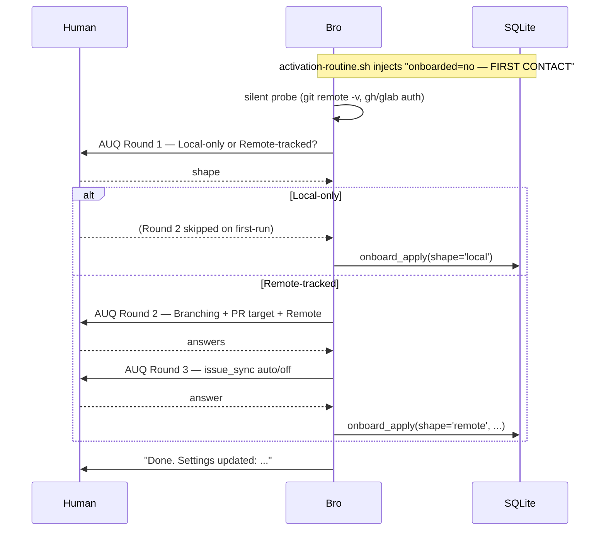
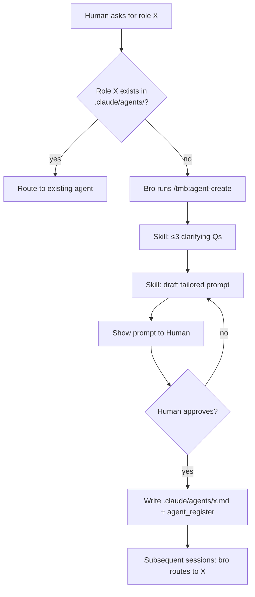

# TMB Workflows

The decision chain is **Human → bro → SWE** with two distinct gates:
- **bro is the task gate** — closes after SWE returns + verifies.
- **pr-reviewer is the push gate** — fires only at `git push` over a batch of unsigned commits.

All consultants (architect, cto, ceo, pm, project-local) advise but never write workflow state. The full role × tool matrix lives in [`RESPONSIBILITIES.md`](RESPONSIBILITIES.md); enforcement layers in [`ENFORCEMENT.md`](../prompt-engineering/ENFORCEMENT.md); schema in [`ERD.md`](ERD.md).

## Quick index

| # | Flow | Trigger | Agents | DB tables touched | Distinguishing hooks |
|---|---|---|---|---|---|
| 1 | First contact | `onboard_state_get().first_run === true` (i.e. `plugin_config('onboarded')` absent) | bro | `plugin_config`, `repos`, `audit` | `activation-routine` (auto-fire trigger) |
| 2 | **Code-touching task** (canonical) | Code change ask | bro → swe; pr-reviewer at push | `issues`, `tasks`, `discussions`, `audit` (+ `validation_attempts` at push) | `require-task-spec`, `git-push-guard`, `git-guards`, `cleanup-worktree-on-task-close` |
| 3 | Architectural change | New boundary/module, schema, public API, external side effects | bro records a `kind=decision` discussion + blast-radius, then standard SWE flow | + `discussions(kind='decision')` | universal `decision_gate` on `task_create_batch` |
| 4 | Agent-creator | Routing hits role not in `.claude/agents/` | bro | — (file-based outcome) | — |
| 5 | Skill creation | Recurring pattern needs encoding | bro | `cheatcodes` (skill row via `skill_register`) | — |
| 6 | Push gate / PR review | `git push` to protected branch | bro → pr-reviewer (one per unsigned task, parallel) | `validation_attempts` | `git-push-guard` |
| 7 | Scan + world-model refresh | First code-touching ask of session when the graph is EMPTY (`source='bro_auto_initial'`), `/scan` (`user_manual`), OR `post-task-close-rescan.sh` after `bro_atomic_close` (`bro_auto_post_close`) | bro (or hook in background) | `repos` (SQLite) + Directory nodes / CONTAINS edges (kuzu graph; summary preferentially from `<dir>/README.md`) + `cheatcodes` (on-disk resources, `source_url='scan_discovered'`), `audit(event_type='deep_scan_completed'\|'scan_discovered')` | `post-task-close-rescan` |
| 8 | SWE retry / escalation | Bro verification or pr-reviewer verdict='fail' | bro ↔ swe (↔ pr-reviewer at push) | `validation_attempts` (multiple), `discussions` | `task_retry` composite |
| 9 | Roundtable | Multi-consultant deliberation with AUQ ratification | bro orchestrates 2–4 consultants | `roundtables`, `roundtable_votes`, `discussions`, `audit` | `roundtable-auq-shape`, `roundtable-cleanup-postcheck` |
| 10 | Cheatcode lifecycle | bro hits a capability wall, Human says "cheatcode", OR a proactive reuse-check before building | bro (Human approves install) | `cheatcodes`, `audit` | `cheatcode-install-approval`, `cheatcode-healthcheck`, `prompt-intent-hints` |
| 13 | Bulk cleanup | Human pre-authorizes a bulk delete | bro (direct Bash, no SWE spawn) | — | — |
| 33 | Multi-repo path discipline | Inner repos registered in `repos`; bro indexes them | bro | kuzu Directory nodes (repo-relative paths; `repo` property scopes to the right inner git repo) | — |
| **C** | Consultant invocation | Human asks for second opinion | bro → consultant | `discussions(kind='analysis'/'concern')` | — |
| **M** | Monitor PR comments | `/monitor <PR_number>` (invokes `tmb_comment-triage`) | bro → pr-reviewer per actionable comment batch | `pr_review_runs`, `issues`, `tasks`, `audit` | — |

---

## 1. First contact (auto-fired `/onboard`)

Bro's `activation-routine.sh` UserPromptSubmit hook reads `plugin_config('onboarded')`. If the key is absent (or `value_json != 'true'`) it injects a `FIRST CONTACT` directive. Bro reads the directive, fires `/onboard` immediately, and runs the slash command's branched ceremony before any reply.

**Round 1** asks the project shape (local-only vs remote-tracked). **Round 2** asks the per-shape question set:

| Shape | Round 2 questions | Persisted |
|---|---|---|
| Local-only | (none — github-flow defaulted silently) | global `plugin_config('onboarded')` + `issue_sync='off'`; per-repo `repos` rows get `branching_model`, derived `target_branch`, `protected_branches`, `remotes=[]` |
| Remote-tracked | Branching, PR target, Remote (multiSelect) | + each repo row's `remotes` array, then a Round 3 for the global `issue_sync` |

A **silent probe** (origin URL, gh/glab installed/authed) pre-selects defaults so most questions become 1-tap confirms. Local re-onboard adds the Branching question with a `Keep` option so the user can change models without first switching shape.



`/onboard` re-runs on demand for later changes — same flow with `Keep "<current>"` pre-selects. Identity is a pure onboarded marker (no name or other fields stored).

---

## 2. Code-touching task (canonical chain)

Bro is both planner AND task gate. pr-reviewer is the push gate, NOT the task gate. Tasks close as soon as SWE returns + bro verifies.

```mermaid
sequenceDiagram
    participant H as Human
    participant B as Bro (planner + task gate)
    participant S as SWE (worktree)
    participant DB as SQLite

    H->>B: "implement X"
    B->>B: tmb_planning skill loaded; pick approach; write kind='decision'
    B->>DB: issue_create + discussion_append(kind='intent') + branch_id_propose
    B->>B: pre-create branch from origin/<pr_target>; author spec_body

    Note over B,DB: BATCHED — one response, three tool_use blocks
    par
        B->>DB: task_create_batch(emit_planning_complete=true)
    and
        B->>S: spawn Task(swe, isolation='worktree', task_id=N) [hooks: require-task-spec verifies; worktree-create adds the worktree]
    and
        B->>DB: audit_append(event_type='planning_complete')
    end

    Note over S: arrives already inside the hook-created worktree
    par
        S->>DB: task_brief(task_id=N)
    and
        S->>S: cd <worktree>
    end
    S->>S: implement per spec; run ## Verification commands
    S->>S: git commit (## Commit message from spec)
    S->>DB: task_update_status(status='completed', commit_sha)

    B->>B: V1/V2/V3 verify (files, verification commands, success criteria)
    B->>DB: bro_atomic_close (audit + summaries + status='closed' + optional issue close)
    B-->>H: "task closed — push when ready"
```

**Notes**
- `require-task-spec.sh` blocks SWE spawn unless `tasks` row has `status IN (pending, open)` AND non-empty `spec_body`.
- `no-worktree-branch-create.sh` blocks `-b/-B/--create-branch/--detach` — bro pre-creates the branch; the worktree attaches to it directly.
- `git-push-guard.sh` blocks the eventual push if any pushed commit's task lacks a passing `validation_attempts` row.
- `swe-verification-gate.sh` fires on SWE's `task_update_status(completed)`: it runs the task's typed `verification[]` commands in the task worktree and denies if any fail. When no worktree resolves (e.g. SWE ran in the main checkout), it does NOT fail open — it runs verification in the active checkout (the git toplevel, falling back to PWD), and if no runnable checkout resolves at all it denies rather than skip (#82). An empty `verification[]` skips the gate with a warning; a `waive_verification_gate_reason` (≥10 chars) waives it with an audit row.

---

## 3. Architectural change (Δ vs flow 2)

Same chain as flow 2, plus: before `task_create_batch`, bro records a `kind=decision` discussion and applies the blast-radius checklist. The universal decision gate requires a `kind='decision'` row regardless of flow.

- Skills: `tmb_planning` triggers the architectural ceremony when the change introduces a new boundary/module, touches schema or public API, or has external side effects (see SKILL.md §"Architectural changes").
- For human-driven deliberation, the user enters Claude Code's native plan mode (Shift+Tab) — bro doesn't run a bespoke Q+A loop. The `kind='decision'` row captures the outcome.
- Bro's V1/V2/V3 verification after SWE returns is unchanged — never skipped, even for architectural changes.

---

## 4. Agent-creator



Reserved names — `bro`, `architect`, `swe`, `pr-reviewer` — are refused. New agent files commit to the project; every dev gets it on next pull.

---

## 5. Skill creation

Same shape as flow 4 — bro drafts via `tmb_skill-creator`, Human approves, file lands at `<project>/.claude/skills/<name>/SKILL.md`. Bro never edits agent body files; instead writes a project-local override agent file that extends `skills:`.

---

## 6. Push gate / PR review

```mermaid
sequenceDiagram
    participant H as Human
    participant B as Bro
    participant P as pr-reviewer (subagents — parallel)
    participant DB as SQLite

    H->>B: git push origin <feature>
    Note over B: git-push-guard.sh denies if any unsigned commit exists
    B-->>H: surface deny message
    B->>B: list unsigned tasks for the push
    par one pr-reviewer per unsigned task
        B->>P: spawn Task(pr-reviewer, task_id=N)
        P->>DB: task_get(task_id=N) — read spec + commit_sha
        P->>P: diff against ## Files / ## Success Criteria / ## Verification
        P->>DB: validation_record(verdict='pass'|'fail', feedback)
    end

    alt all pass
        B->>B: re-run git push (push-guard now allows)
        B-->>H: pushed; MR opened
    else any fail
        B-->>H: surface failures verbatim → AUQ to spawn SWE retry or abort
    end
```

`validation_record` carries a typed `mcp_available` boolean (required for pr-reviewer; written to the `validation_attempts.mcp_available` column). The push-gate reads it from the row — `1` = MCP-backed review, `0` = honor-system fallback (a subagent that lacks MCP access reviews via the sqlite3 fallback path and records `mcp_available: false`). `feedback` is free-prose rationale.

---

## 7. Scan + world-model refresh

`scan_run` is the single scan-side MCP tool. It forks the deterministic `scripts/scan.sh`, then writes the **world-model graph**: a `Directory` node per tracked directory (summary preferentially from `<dir>/README.md`, else a structural fallback over file/subdir names; plus a file count), linked to its parent by a `CONTAINS` edge. See [`WORLD_MODEL.md`](./WORLD_MODEL.md); inner-repo path scoping is in [`REPO_RESOLUTION.md`](./REPO_RESOLUTION.md).

Triggered four ways (the `source` value is verified against `scan.ts`):

| Trigger | `source` value | Who fires |
|---|---|---|
| First code-touching ask when the graph is EMPTY | `bro_auto_initial` | Default when no `source` is passed; bro hits the `world-model-empty` gate (`tmb_planning` §1) and remediates |
| User typed `/scan` | `user_manual` | The slash command body passes it |
| `post-task-close-rescan.sh` hook on `bro_atomic_close` | `bro_auto_post_close` | Hook runs `scripts/maintenance/run-scan.mjs` in background |
| Bro decides to rescan mid-session | `bro_auto_post_change` | Bro passes it explicitly |

`scan_run`'s `deep_scan_completed` audit row carries `content_json` with:

- `source` (one of the four values above)
- `structural_change` — true if the repos set OR top-level dir set differs from the previous scan
- `repos_seen[]`, `top_dirs[]` — current snapshot of the project shape

**Resource discovery (#124/#846).** The same scan ALSO reconciles on-disk capabilities into the `cheatcodes` table: project-local skills (`.claude/skills/<name>/SKILL.md`), enabled plugins (`claude plugin list`), and configured MCP servers (`claude mcp list`). Each resource not already tracked (matched on name+kind) is inserted as `origin='installed'`, `status='installed'`, `source_url='scan_discovered'` (distinguishing it from a pipeline install) and emits a `scan_discovered` audit row — so a cheatcode added out-of-band still becomes visible to the lifecycle flow below.


---

## 8. SWE retry / escalation

Triggered when bro V1/V2/V3 fails OR pr-reviewer verdict='fail'. Bro uses the `task_retry` MCP composite — one transaction inserts: a `discussion_append(kind='note', body='retry rationale: ...')`, a new `tasks` row keyed off the failed task's branch, and an `audit_append(event_type='swe_retry_spawned')`. Then spawns SWE on the new task.

After 3 consecutive retries, bro flips status to `escalated` and surfaces to Human (CLAUDE.md routing — judgment-bound).

---

## 9. Roundtable

Multi-consultant deliberation. Bro orchestrates 2–4 consultants on a topic, then renders an AUQ for Human ratification.

- `roundtable_create` opens the table.
- Bro spawns each consultant via `Agent` with the shared topic; consultants write `discussion_append(kind='analysis'|'concern')`.
- Each consultant `roundtable_vote(participant=<role>, vote, rationale)`.
- `roundtable_close` flips state to `awaiting_human` + emits a `discussion_append(kind='decision', body=summary)`.
- `roundtable-auq-shape.sh` validates the ratification AUQ structure.
- After Human picks: `roundtable_finalize_decisions` + `roundtable_summarize`.
- `roundtable-cleanup-postcheck.sh` verifies the capture surface (audit + discussion rows) actually landed.

---

## 10. Cheatcode lifecycle

Bro acquires a capability (skill, MCP toolkit, or plugin) on demand instead of grinding it out by hand. The mechanical pipeline is deterministic tools + hooks; only the judgments stay prose — "do I lack a capability this task needs?", "is this candidate trustworthy?", and "which agent consumes it?". Architecture-of-record: [`CHEATCODES.md`](./CHEATCODES.md). This is the full lifecycle.

```mermaid
flowchart TD
  T{{Trigger}} -->|capability wall / Human says cheatcode / proactive reuse-check| SEARCH[cheatcode_search\nranked candidates + audit]
  SEARCH -->|none fit| BUILD[Build it instead:\ntmb_skill-creator or write from scratch]
  SEARCH -->|candidate| VET[cheatcode_vet\ntrust_tier + capabilities; never decides]
  VET --> APPROVE{cheatcode_approve\nHuman AUQ}
  APPROVE -->|rejected| STOP[Stop: no install]
  APPROVE -->|approved — PreToolUse gate now open| TARGET{Decide consuming agent}
  TARGET -->|Human named it| HAST[target = named agent]
  TARGET -->|infer by domain| INFER[coding/test/refactor/debug → swe\nreview/quality → pr-reviewer\norchestration/routing → bro\nconsultant-domain → that consultant]
  TARGET -->|ambiguous| ASK[AskUserQuestion: which agent?]
  TARGET -->|pure MCP/plugin server tool,\nno agent surface| NOTGT[no target needed — registration IS attachment]
  HAST --> INSTALL
  INFER --> INSTALL
  ASK --> INSTALL
  NOTGT --> INSTALL
  INSTALL[cheatcode_install\nmarketplace/MCP path, no seed/copy\nidempotent on name+source_url\none txn: cheatcodes row + attachments + audit]
  INSTALL -->|kind=skill or skill-contributing plugin, target set| MAT{Materialize / attach — LEGO}
  INSTALL -->|kind=mcp/pure-server plugin| AUTOATT[registration IS attachment\nscript attachment rows recorded — never an orphan]
  INSTALL -->|kind=skill, NO target| UNATT[hard-rejected (#883) — no resolved target,\nno install; orphan can't occur]
  MAT -->|target=bro| CMD[copy → project .claude/CLAUDE.md reference]
  MAT -->|target=other| AMD[copy global agents/&lt;target&gt;.md → .claude/agents/&lt;target&gt;.md if absent\n+ add name to skills: header — idempotent]
  CMD --> ACT
  AMD --> ACT
  AUTOATT --> ACT
  ACT{cheatcode_activate}
  ACT -->|skill| LIVE[usable in-session — activated]
  ACT -->|mcp/plugin| RESTART[restart_required — loads next cold start]
  LIVE --> USE[Consuming agent carries the skill in its header → invokes it]
  RESTART --> USE
  USE --> HEALTH[SessionStart cheatcode-healthcheck.sh\nreconcile status vs runtime; audit on drift]
  HEALTH --> SCANP[scan_run also discovers on-disk resources\n→ cheatcodes table, source_url='scan_discovered']
  USE -.unused.-> UNINST{cheatcode_uninstall\nHuman-confirmed AUQ}
  UNINST -->|teardown removed| REV[reverse via marketplace/MCP path\n+ DELETE cheatcodes & attachment rows\n+ de-materialize the skills: header entry\n+ audit]
  UNINST -->|teardown failed — honesty gate #114| BROKEN[keep row, status → broken, audit;\nreport uninstalled:false]
  UNINST -->|absent / partial| NOOP[idempotent no-op]
```

**Phase by phase:**
- **Trigger** — bro hits a capability wall, the Human says "cheatcode" (`prompt-intent-hints.sh` nudges), or a proactive reuse-check before building from scratch.
- **Search** — `cheatcode_search` (forks `scripts/cheatcode-search.sh`) returns ranked candidates + an audit row. No candidate fits → build it (`tmb_skill-creator` or from scratch).
- **Vet** — `cheatcode_vet` gathers reputation/security signals + a deterministic `trust_tier` and `capabilities[]`; it reports, never decides.
- **Approve** — `cheatcode_approve` records the per-candidate Human approval; `cheatcode-install-approval.sh` (PreToolUse) fails closed without it. Rejected → stop.
- **Decide consuming agent** — `target` is optional as an *input* (the Human may not name one), but for a skill it is **mandatory as an output**: a skill install MUST end attached to ≥1 agent's markdown, or it is an **orphan** — installed but bound to nothing, hence unusable. So deciding the consuming agent is mandatory for skills: if the Human named the agent, use it; otherwise bro **resolves one before install** — infer from the cheatcode's domain (coding/test/refactor/debug → `swe`; code-review/quality → `pr-reviewer`; orchestration/routing → `bro`; a consultant domain → that consultant), and ask via AskUserQuestion only when genuinely ambiguous. Exception: a kind=mcp server (or a pure-server plugin) needs no target — its `claude mcp add` registration **is** its attachment, its tools are callable by any agent, so it carries no `skills:` header entry and is **not** an orphan. The mandatory-output-attachment rule applies specifically to skills and skill-contributing plugins.
- **Install** — `cheatcode_install` installs via the marketplace/MCP path (no seed/copy), idempotent on (name, source_url); one transaction records the `cheatcodes` row + every `cheatcode_attachments` row + the `cheatcode_install`/`cheatcode_installed` audit rows. `scope` defaults to project-local.
- **Materialize / attach (LEGO)** — for a skill or skill-contributing plugin, the install writes the consuming agent's prompt surface IN THE USER PROJECT (never the plugin repo): `target=bro` → a `.claude/CLAUDE.md` reference; any other target → copy the global `agents/<target>.md` into `.claude/agents/<target>.md` (if absent) and add the cheatcode name to its `skills:` frontmatter array — idempotent, the Lego edit. This attachment is mandatory output: a skill with no target lands as an **orphan** — installed but unattached, and not usable until a target is resolved (a defect to eliminate, not a supported path). A kind=mcp server (or pure-server plugin) is exempt: its registration is its attachment, so it needs no `skills:` entry and is never an orphan.
- **Activate** — `cheatcode_activate`: a skill is usable in-session; an MCP/plugin returns `restart_required` (loads on the next cold start).
- **Use** — the consuming agent now carries the cheatcode in its `skills:` header and invokes it like any skill.
- **Reconcile** — `cheatcode-healthcheck.sh` (SessionStart) checks each row's `status` against the real runtime (skill file on disk, MCP/plugin present + enabled) and audits drift. `scan_run` (flow 7) discovers on-disk resources into the table (`source_url='scan_discovered'`).
- **Uninstall** — `cheatcode_uninstall` (Human-confirmed AUQ; not PreToolUse-gated) reverses each attachment via the marketplace/MCP path, de-materializes the `skills:` header entry, and deletes the `cheatcodes` + `cheatcode_attachments` rows in one transaction. The honesty gate (#114) keeps the row and flips `status → broken` (reporting `uninstalled:false`) when a teardown fails rather than claiming a clean removal. Absent/partial → idempotent no-op.

**Enforcement (#883):** (1) a skill install is **hard-rejected** without a resolved target — no orphan can land (the mcp/pure-server registration-is-attachment path needs no target and is exempt); (2) `cheatcode_uninstall` de-materializes the `skills:` header entry so no dangling reference remains. Both are enforced.

---

## 13. Bulk cleanup (pre-authorized destructive ops)

When the Human's prompt names what to delete (branches, temp files, etc.), bro executes in one Bash call with no AUQ and no re-confirmation. Defensive checks (which files match? any active worktrees?) belong *before* the Human authorizes. Re-asking treats a standing directive as a question — wastes time and ignores intent.

---

## 33. Multi-repo path discipline

When a workspace has multiple inner git repos (siblings or submodules), each is identified by its `repos` row (path-keyed resolution; an operation matches its path against `repos.path`, or a task names its repo via `tasks.repo`). Directory node `path` properties are stored repo-relative — `scan_run` does NOT prepend the inner repo directory when writing nodes. See [`REPO_RESOLUTION.md`](./REPO_RESOLUTION.md).

The L5 row `tests/l5-l6/rows/33-multirepo-commit/` catches regressions at the storage layer: a Cypher `MATCH (d:Directory) WHERE d.path STARTS WITH 'api/' OR d.path STARTS WITH 'app/'` returns ≥1 node only on a workspace-rooted path leak.

Registration also scopes the `no-source-edit-from-main.sh` guard: Rule 1 only protects registered repo subtrees, so absolute edits to unregistered sibling repos are allowed. See `docs/architecture/RESPONSIBILITIES.md` (#592).

---

## C. Consultant invocation

Human types `/tmb:agent-create <ask>` OR a naturalistic question matching `/tmb:agent-create`'s description. Either path loads the skill, which calls `agent_list` to resolve the role in the registry, then spawns the consultant via `Agent`. Consultant writes its analysis as `discussion_append(kind='analysis')`. Bro reports to Human; **the Human decides** — never the consultant.

`prompt-intent-hints.sh` UserPromptSubmit hook detects domain-keyword prompts and injects a routing hint (advisory; bro decides whether to spawn).

---

## M. Monitor PR comments

`/monitor <PR_number>` slash command. Bro fetches the PR's review comments via `pr_monitor_comments_get`, triages actionable ones, files them as new `issues` + `tasks`, and dispatches SWE per ratified comment batch. Run state lives in `pr_review_runs` so re-runs of the same PR start from the last fetched comment ID.
