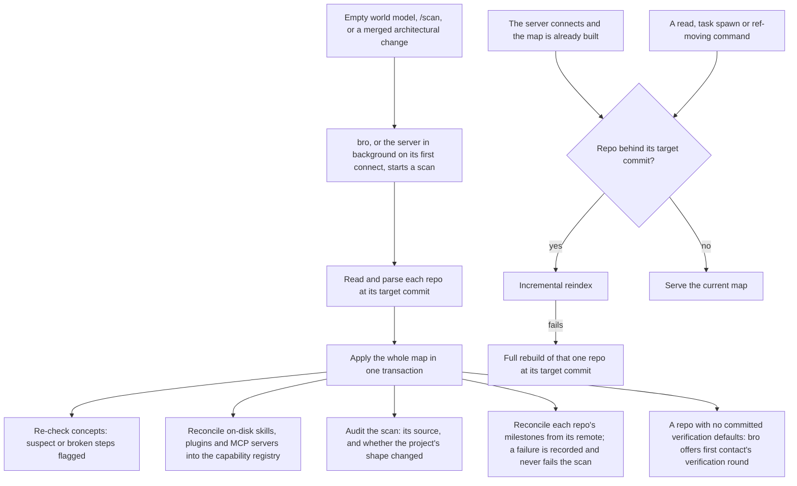
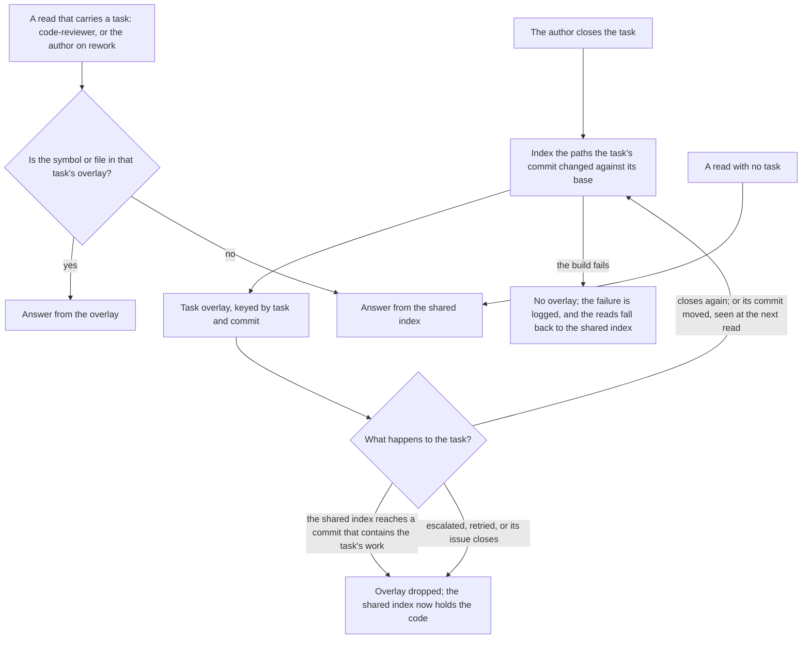

# World Model

Bro is the architect of every project it works on. The world model is the stable, queryable picture of the project bro reasons from: built by `/scan`, kept fresh on read, and consulted at every cold start. It is also the middle of the three knowledge layers TMB develops itself by ([README.md](README.md)): it holds the relationships these docs leave out and the code leaves implicit.

This page covers purpose, boundaries and the reasons behind the design. Its tables, tools and parsers are in the code; ask the world model itself where.

## Substrate

The world model lives in the trajectory DB, beside the workflow audit but with no link into it. It is a derived cache: every row can be rebuilt from git, so a scan can always start over. Because it is a cache and not part of the trajectory, it moves to its own file beside the trajectory DB (planned, GH 3225); deleting that file and scanning again restores it. [ERD.md](ERD.md#planned-for-the-world-model-file) lists what moves.

- **The file holds no fact of its own.** The map is derived from git. Concepts and author-written file purposes are written by agents, so each such write is recorded in the trajectory DB as a fact, and the world-model file holds only their current state. A scan of an empty file replays the newest write of each concept. Renaming a concept is one more write under the same identity, and a concept is marked `retired` by a write, never deleted, so a replay cannot bring one back. A `retired` concept is left out of search and of every read that does not ask for it, so it never crowds a live answer.
- **Scans and reindexes are trajectory.** That a scan ran, when, why and how it ended is a fact about the work, so it is recorded in the trajectory DB. The world-model file keeps only the latest state per repo.
- **Two files, no shared transaction.** A fact is written to the trajectory DB first and the cache second. When the two disagree after a crash, the trajectory DB is right and the next read or scan repairs the cache.

| | World model | Workflow records |
|---|---|---|
| Content | The project's map: directories, files, symbols and concepts | Issues, tasks, discussions, validation, plugin metadata |
| Answers | "What does this project look like?", "Where does X live?", "Who calls X?" | "What did we decide?", "What's open?", "What did swe commit?" |

## Layers

- **Directories and files.** Each directory carries a summary: its README when it has one, else a structural summary built from its contents. Each file carries a one-line purpose from its header, or a structural fallback; a purpose written by the swe that built the file outranks extraction. Summaries come from file contents, so every read frames them as untrusted.
- **Symbols.** An index of each file's definitions and the edges between them: calls, imports, table reads and writes, hook order, test coverage and bundle sources. It answers "where is X" and "who calls X" without re-reading code.
- **Concepts.** Agent-written flows, subsystems and invariants, each an ordered list of steps anchored to symbols or files, plus claims checked against the index. Every scan re-checks them and marks a step whose code moved as suspect, or broken when its code is gone. Concepts are the bridge from a design page here to the code that carries it out.

## Design rationale

- **Own index, exact references from LSP.** TMB builds its own index because no off-the-shelf indexer covered this repo's shell and SQL. The index links a reference to a definition only on proof: a resolved import, an explicit path, a definition that is the only one of its name, a known receiver type, or the same file. A bare-name match with no such proof stays unlinked, and an answer says which references it could not resolve, so the index never guesses. An edge whose target is never a symbol, such as a config key, is kept by name and marked as such, apart from both. An edit that needs exact references, such as a rename, uses Claude Code's LSP tool.
- **Anchors are stable keys.** A concept step stores the symbol's identity (repo, path, kind and qualified name), not a row id, and resolves it at read time. A re-parse never orphans a step; a rename breaks the anchor by design, so the concept is flagged for review instead of silently following the wrong code.
- **swe proposes, review admits.** The swe that built a flow proposes its concepts in the completion report. A scan applies a proposal only once its task has a passing code-reviewer verdict and every anchor and claim checks out. Bro and consultants write concepts directly.
- **Indexed from git, never the working tree.** Each repo is indexed from its target commit, the fetched target branch or else `HEAD`, so every session and worktree reads the same map. Reads, spawns and commands that move refs bring the index forward incrementally; a full rebuild is the fallback. A task's own commit is indexed too, from git, into its [task overlay](#task-overlay).
- **One snapshot per repo, not history.** The index holds each repo at one commit, its target commit, plus one overlay per open task. Every row can be traced to a commit: the repo's indexed commit, each file's last commit and content hash, each symbol's body hash, and each overlay's base and commit. A read compares the indexed commit with the target branch and brings the index forward first, so a node is never served stale. Git is the history store: what changed between two commits is a diff, and the index can be rebuilt at any commit. Keeping a graph per commit would multiply the file's size and its writes for a question git already answers.
- **One transaction per write.** A scan reads and parses first, then applies everything at once, so a reader sees the old map or the new one, never a mix.

## Scan

Every case of flow 2.2 in [FLOWS.md](FLOWS.md).

```mermaid
flowchart TD
    A[Empty world model, /scan, or a merged architectural change] --> B[bro, or the server in background on its first connect, starts a scan]
    A2[The server connects and the map is already built] --> I
    B --> C[Read and parse each repo at its target commit]
    C --> D[Apply the whole map in one transaction]
    D --> E[Re-check concepts: suspect or broken steps flagged]
    D --> F[Reconcile on-disk skills, plugins and MCP servers into the capability registry]
    D --> G[Audit the scan: its source, and whether the project's shape changed]
    D --> M[Reconcile each repo's milestones from its remote; a failure is recorded and never fails the scan]
    D --> N[A repo with no committed verification defaults: bro offers first contact's verification round]
    H[A read, task spawn or ref-moving command] --> I{Repo behind its target commit?}
    I -- yes --> J[Incremental reindex]
    J -- fails --> L[Full rebuild of that one repo at its target commit]
    I -- no --> K[Serve the current map]
```

A capability or a repo added out of band shows up at the next full scan, so the [cheatcode lifecycle](CHEATCODES.md) sees it. A server reconnect on a built map only brings each known repo forward; it discovers nothing new.

- **One writer per repo.** A second full scan is refused while one runs. A read that arrives during another session's reindex is answered at once from the current map, with the changed paths marked stale. A task spawn waits for the reindex, up to a fixed limit.
- **A failed or killed scan changes nothing.** The old map stays. A full rebuild is the exception today: it keeps the stages that succeeded, records the one that failed and still marks the map current, where an incremental reindex rolls back whole. A scan that passes its time limit stops and releases its lock, a reindex killed midway is marked failed at the next server connect, and the next trigger retries.
- **Offline.** The target branch is fetched at most once per fixed interval per repo, and always at a task provision. When the fetch fails, the last fetched commit is the target.
- **Full rebuild of one repo.** Besides a failed incremental reindex, a repo is rebuilt in full when its recorded commit is gone, when its index was built by an older indexer, or when the daily comparison against a clean rebuild finds a difference.
- **A renamed repo is recognized.** A repo directory renamed since the last scan is recorded as a rename, not registered as a new repo.

## Task overlay

The shared index holds only what has merged into the target branch, so a task's own code is invisible to it until the PR merges. The overlay makes the task's commit readable through the world model for the agents working on that task, without touching the shared index.

```mermaid
flowchart TD
    A[The author closes the task] --> B[Index the paths the task's commit changed against its base]
    B --> C[Task overlay, keyed by task and commit]
    R[A read that carries a task: code-reviewer, or the author on rework] --> O{Is the symbol or file in that task's overlay?}
    O -- yes --> P[Answer from the overlay]
    O -- no --> S[Answer from the shared index]
    N[A read with no task] --> S
    C --> D{What happens to the task?}
    D -- "closes again; or its commit moved, seen at the next read" --> B
    D -- the shared index reaches a commit that contains the task's work --> X[Overlay dropped; the shared index now holds the code]
    D -- escalated, retried, or its issue closes --> X
    B -- the build fails --> F[No overlay; the failure is logged, and the reads fall back to the shared index]
```

- **Built at the close, not at provision.** Provision brings the shared index forward at the task's base. The overlay is built when the author closes the task, from the commit, so it is indexed from git like everything else.
- **Sized by the diff.** Only the paths the commit changed are indexed, so the cost grows with the diff, not the repo.
- **Scoped to its task.** A symbol that exists only on one task's branch resolves for reads that carry that task and for no other task.
- **One overlay per task.** Each close replaces it with one for the new commit. A rebase that moves the task's commit rebuilds it at the next read that carries the task, not at the rebase.
- **Dropped at a reindex, not at the merge.** No step watches the PR. The overlay goes at the first reindex whose commit contains the task's work, and when the task is escalated, retried or closed with its issue.
- **A read finds its task from the agent's open run.** An agent with exactly one open run reads through that task's overlay. With two open runs of the same agent kind, as in parallel lanes, the read is answered from the shared index and nothing says so; naming the task on the read is an open gap.
- **Only a symbol read uses the overlay.** The map, search, concepts and the task brief answer from the shared index alone.
- **Both task kinds.** A non-code task's overlay holds its files, with no symbols. No read uses those file rows yet.
- **A failed build never blocks the close.** The reviewer then reads the diff from git, as it does today.
- **It is cache.** The overlay holds no link into the workflow records, so it moves with the rest of the world model and can be rebuilt from the task's commit.

## Consumers

Bro queries the world model directly on cold starts and "where does X live" questions; the plugin's `CLAUDE.md` says which query fits which question. The task brief resolves a task's scope against it and bundles the result with the task and its discussion, so swe gets one read instead of several. The dashboard reads the same map.
