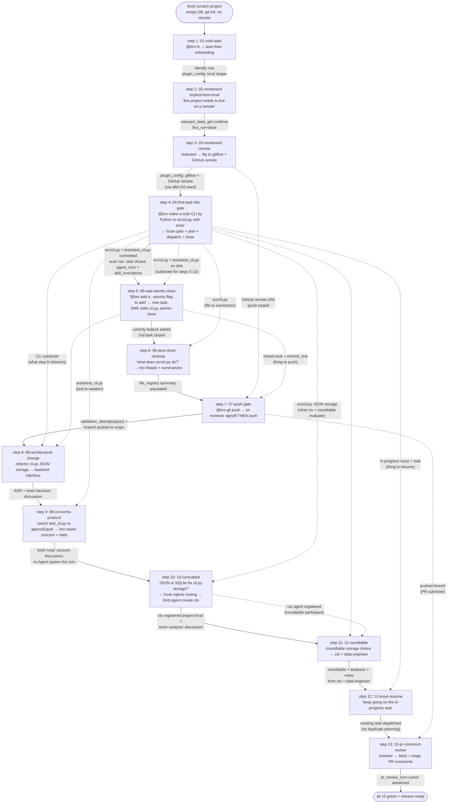

# Evaluation System (L5 + L6)

Two automated dogfood layers drive **real Claude Code through pre-seeded TMB workflows** and assert the result matches doctrine.

| Layer | Purpose | Scope per run | When to run |
|---|---|---|---|
| **L5** | Per-row independent unit tests. Each test starts from a fixture that pre-seeds the **cumulative state up to this row** (codebase, MCP DB, discussions, issues, tasks, audit, etc.). One row = one test. | Single bro turn (or short multi-turn) against pre-seeded state. Fast, isolated, ~$0.20/test. | Debug or regression-test a single row's contract. **First-line check after a fix** — if the L5 for that row doesn't pass, don't run L6. |
| **L6** | Single **chained integration test** that walks ALL 13 journey rows sequentially against ONE cumulative trajectory DB. Each row fires a fresh `claude -p` invocation; continuity is **DB-driven** (via bro's `tmb_recovery` + state-aware MCPs like `issue_state_get` / `task_first_actionable`), NOT LLM-session-driven. Row N's bro turn produces real DB writes that row N+1 inherits. The TODO-CLI codebase grows row by row. | Full 14-row chain. Slow, ~$0.30–1/scenario × 14 rows + per-row scoring. | After all relevant L5 rows pass, run L6 to verify cross-row DB continuity holds end-to-end. |

The full pyramid (L0 install-smoke → L1 lint → L2 unit → L3 integration → L4 workflow-sim → L5 → L6) lives in [`README.md`](./README.md). This doc is the reference for how L5 + L6 work and what each catches.

---

## L5/L6 contract — same task, same assertion, only the seed differs

**Every row's `prompt.txt` and outcome assertions are identical between L5 and L6.** The only legitimate difference is how the row's **input state** comes into existence:

| Mode | Input state source |
|---|---|
| **L5** | `setup-l5.sh` constructs the state from scratch (file scaffolds, git commits, SQL INSERTs). This **simulates** the cumulative state that would have existed after all prior chain steps. |
| **L6** | Prior chain steps **organically produced** the state. Row N's expected input IS row N-1's actual output, carried across via the cumulative trajectory DB + filesystem + git. |

Diagnostic doctrine when L6 fails:
```
L6 step N fails
        ↓
Run L5 step N standalone (uses its own setup-l5.sh seed)
        ↓
   pass        fail
    │           │
    ↓           ↓
 step N is   step N is
 sound;      itself broken
 fix is in   (fix it, then
 the chain   re-run both)
 step that
 should
 produce
 step Ns
 input
```

L6 catches **cross-row continuity drift** (the seam between steps); L5 catches **per-row contract drift** (the step itself). When both pass, the row is doctrinally sound AND fits into the chain.

---

## L6 chain flowchart

The 13 chain steps form a single workflow journey of a fictional TODO-CLI project. Each step is a fresh `claude -p` invocation; state passes via the cumulative trajectory DB, the project filesystem, and git.

The diagram has two arrow types:
- **Solid arrows** trace the linear chain progression (every step inherits SOMETHING from the prior step — even if just an unchanged DB).
- **Dotted arrows** are direct cross-step dependencies — a specific artifact created by step N is consumed verbatim by step M where M is not adjacent. These are the load-bearing seams to watch when a step regresses.



Reading the dotted edges:
- **S3 → S7**: the GitHub remote bro configured in step 3 is the URL step 7 pushes against. If step 3 forgot to write the remote (DB or git config), step 7 has nowhere to push.
- **S4 → S5/S6/S8/S9/S10/S11**: step 4 produces `src/cli.py` + `tests/test_cli.py` — the substrate every subsequent code-touching row consumes. Step 5 modifies the CLI; step 6 reads it; step 8 refactors its storage; step 9 modifies the test file; step 10/11 deliberate on the storage choice.
- **S5 → S7**: the committed task from step 5 is what step 7 pushes. The push gate scores `validation_attempts` on that task's `commit_sha`.
- **S4 → S12**: step 12 resumes the issue + task step 4 created. If step 4 didn't leave an in-progress task, step 12 has nothing to resume and would (incorrectly) re-plan from scratch.
- **S10 → S11**: cto is one of the two roundtable participants in step 11. The roundtable assertion checks BOTH `cto` (templated, from step 10 in chain or setup-l5 in isolation) AND `data-engineer` (from-scratch) voted.
- **S7 → S13**: the pushed branch becomes the PR step 13 monitors comments on.

**Note on retired step 14:** the `skill_invocations` hook-attribution assertion that step 14 used to own is now folded into step 04's outcome.sql — `skill_invocations` rows accumulate naturally on any chain step that invokes tmb skills, and step 04 is the first such step. The standalone row was redundant.

---

## Per-step I/O table

Each step lists what state it consumes (Input) and produces (Output). **In L5**, "Input" is what `setup-l5.sh` builds; **in L6**, "Input" is the previous step's "Output" (or the bare project start for step 1). The expected output is the same in both modes — the assertions key off it.

The "Carried from" column is the chain provenance: which prior step's Output produces this step's Input in L6. In L5 isolation, the same content comes from `setup-l5.sh` instead.

| # | Row | Input (= prior chain output OR L5 seed) | Carried from | What bro does | Output (asserted) |
|---|---|---|---|---|---|
| **1** | `01-cold-start` | Empty DB. Fresh git repo. No identity, no plugin_config rows. | (chain start) | `@bro hi` → bro detects `first_run=true`, fires `onboard_get_questions`. **Partial-test:** AUQ suppressed; assertion is the re-initiation MCP call. | `identity` row created (post-AUQ seed `after-01-cold-start.sql`). `plugin_config` set to local shape. |
| **2** | `02-reonboard-implicit-from-local` | Identity row exists. plugin_config: local shape. Local commits present, no remote. | step 1 | Implicit reonboard NL prompt → bro calls `onboard_state_get`, recognises reonboard intent, recommends `/onboard`. **No code work this turn.** | `onboard_state_get` was called. `identity` row unchanged. No new issues/tasks. |
| **3** | `03-reonboard-remote` | Identity + local-shape config from step 2. | step 2 | `/onboard` → `onboard_state_get` (sees `first_run=false`) → `onboard_get_questions(shape='remote')`. **Partial-test:** AUQ suppressed; post-AUQ seed `after-03-reonboard-remote.sql` applies the GitHub-remote/gitflow flip. | `plugin_config` now: `branching_model='gitflow'`, `pr_target='dev'`, `remotes=[{provider:'github',...}]` (via `after-03` seed). Identity intact. |
| **4** | `04-first-task-hits-gate` | gitflow + GitHub-remote config from step 3. No prior `deep_scan_completed` audit row. L5: scaffolds `src/__init__.py` + `tests/__init__.py` so `/scan` discovers structure. | step 3 | `@bro make a todo CLI by Python in src/cli.py with tests in tests/test_cli.py` → bro hits registry-cold gate → runs `/scan` → `task_create_batch` → SWE Agent spawn → SWE writes `src/cli.py` + `tests/test_cli.py` → `bro_atomic_close`. Also folds in the retired step-14 hook-attribution check. | `deep_scan_completed` audit; `tasks` ≥1; `repos` ≥1; `skill_invocations` (`tmb_*`) ≥1; `agent_runs` (`bro`) ≥1. |
| **5** | `05-swe-atomic-close` | TODO CLI from step 4 (full `src/cli.py` + `tests/test_cli.py` committed). L5 setup-l5 seeds the same shape. | step 4 | `@bro add a --priority flag to the add command so I can mark items high/medium/low` → bro plans a new task for the feature → SWE Agent edits `src/cli.py` (+ tests) → atomic-close. | `tasks` ≥1; no tasks at `pending`; `agent_runs` ≥1 with non-null `task_id`. |
| **6** | `06-post-close-cleanup` | `src/cli.py` on disk + `file_registry` row with NULL summary. L5: seeded by setup-l5. L6: `chain_setup_command` checks out the feature branch where step 04/05's SWE landed the file. | step 4 + 5 (TODO CLI commit) | `@bro what does src/cli.py do?` → bro Reads the file → calls `file_registry_update_summaries` to populate the summary. | `file_registry WHERE path='src/cli.py' AND summary IS NOT NULL` = 1. |
| **7** | `07-push-gate` | Closed task with `commit_sha`. Local commits ahead of remote. | step 3 (remote) + step 5 (task to push) | `@bro git push` → `push-intent-hint.sh` hook detects pending signoff (status=closed + no validation_attempts pass) → injects routing hint → bro spawns `pr-reviewer` → on PASS, push. | `validation_attempts` ≥1 with `verdict='pass'` and `agent='pr-reviewer'`. Branch pushed to origin. |
| **8** | `08-architectural-change` | TODO CLI with JSON-file storage. L5: setup-l5 commits full `src/cli.py`. | step 4 + 5 | `@bro extract the storage layer in src/cli.py into a backend interface so we can swap JSON for SQLite later.` → architectural decision triggers `tmb_planning` §Architectural-change path → bro writes `kind='decision'` discussion AND co-authors an ADR. Post-AUQ seed `after-08-architectural-change.sql` simulates the design conclusion. | `discussions WHERE kind='decision'` ≥1. ADR file under `docs/trustmybot/architecture/manual/decisions/`. |
| **9** | `09-concerns-protocol` | `src/cli.py` (with integer arithmetic helper) + `tests/test_cli.py` (with exact-equality assertion) committed. | step 4 (cli + tests) | `@bro tests/test_cli.py is using exact equality, switch it to approxEqual with tolerance 0.001.` → bro recognises the visibility-loss concern via `tmb_concerns-protocol` Path A → `discussion_append(kind='note', body='Concern: ...')` and **halts**. No `Agent` spawn. | `discussions WHERE LOWER(body) LIKE '%concern%'` ≥1. |
| **10** | `10-consultant` | `src/cli.py` from step 4/5 + an open "Evaluate TODO CLI storage scale-out" issue. `cto` is template-scope in the registry but NOT instantiated locally. | step 4 (cli) + earlier-step issue | `@bro should we keep src/cli.py's storage in JSON or move to SQLite as the CLI scales?` → `consultant-spawn-required.sh` hook injects "invoke /tmb:agent-create cto" routing → bro invokes the command → Branch B template-copy → `agent_register` + `audit_log(event_type='tmb_agent_created')` → spawn cto via `Agent`. | `audit WHERE event_type='tmb_agent_created'` ≥1. `agents WHERE name='cto' AND scope='project-local'` ≥1. |
| **11** | `11-roundtable` | `src/cli.py` + `cto` + `data-engineer` both registered project-local. L5: setup-l5 seeds both consultants. L6: `cto` from step 10; `data-engineer` from a prior chain step's from-scratch creation. | step 10 (cto) + earlier from-scratch | `/roundtable should the todo CLI's storage be JSON, SQLite, or a small backend service?` → bro calls `roundtable_create(participants=['cto','data-engineer'])` → spawns each via `Agent` → each writes `discussion_append(kind='analysis')` + `roundtable_vote`. | `roundtables` ≥1. `discussions WHERE kind='analysis'` ≥2. `roundtable_votes` from BOTH `cto` AND `data-engineer`. |
| **12** | `12-issue-resume` | An in-progress issue with a `planning_complete` audit and a task in `pending`. L5: pre-seeded by setup-l5. L6: organic from earlier in-progress work. | step 4 + step 5 (existing planned task) | `@bro let's keep going on the CLI entry-point work.` → bro picks up the existing task (no `issue_create`, no `task_create_batch`), dispatches SWE via `Agent`. | The pre-existing issue still exists exactly once (no duplicate). `Agent` was spawned. `issue_create` + `task_create_batch` were NOT called this turn. |
| **13** | `13-pr-comment-review` | A pushed PR with comments. L5: pre-seeded `pr_review_runs` cursor + simulated comment stream. L6: branch pushed in step 7. | step 7 | `/monitor 123` → bro fetches comments via `pr_comments_get` → triages actionables → files them as new issues/tasks. Cursor in `pr_review_runs` advances. | `pr_review_runs` row exists (cursor preserved). bro attempted `pr_comments_get`. `halt_on_fail: false` — chain continues even on partial fail (real PR backend not available in sandbox). |

### Seed bridges (between-row `seed_after` SQL files)

Three steps emit a `seed_after` SQL fixture that's applied to the cumulative DB **after** the row's bro turn completes — these encode the post-AUQ state that the partial-test rows can't drive end-to-end via real LLM-rendered AUQ:

| After step | Seed file | Reason |
|---|---|---|
| 1 | `seeds/after-01-cold-start.sql` | Insert the `identity` row + local-shape `plugin_config` (the post-AUQ Human answers for onboarding) |
| 3 | `seeds/after-03-reonboard-remote.sql` | Flip `plugin_config` to gitflow + GitHub remote (post-AUQ remote shape) |
| 8 | `seeds/after-08-architectural-change.sql` | Record the chosen architectural conclusion as decision data |
| 11 | `seeds/after-11-roundtable.sql` | Record the roundtable ratification (since the ratification AUQ is suppressed in test mode) |

For all other steps, bro's turn alone produces the row's expected Output organically.

---

## Single canonical row tree

All rows live in **`tests/dogfood/rows/`**. Every row is usable in both L5 (isolated) and L6 (chained) mode via the same prompt + scorer set. The difference between modes:

| Aspect | L5 mode | L6 chain mode |
|---|---|---|
| Runner | `tests/dogfood/run-l5.sh` | `tests/dogfood/run-l6-chain.sh` |
| Pre-seed | `fixture.txt` seeds DB; `setup-l5.sh` (if present) adds env state | `fixture.txt` applied ONLY at chain step 1; subsequent steps inherit cumulative DB |
| `setup-l5.sh` | Runs (simulates prior-step state for isolation) | NOT run (chain state carries from prior step) |
| Per-turn session | Fresh `claude -p` per turn (no `--resume`). Continuity within a row is DB-driven. | Same. |
| State threading | None — each row starts fresh | DB + filesystem + git carry across steps |

### Row layout

```
tests/dogfood/rows/<row-name>/
  prompt.txt              # shared by L5 + L6 — the user prompt fed to claude -p
  README.md               # scenario description for both L5 and L6 modes
  script.json             # max_turns, user_after_bro[], terminal_pattern
  fixture.txt             # named SQL fixture (e.g. onboarding-named) — applied in L5 always; L6 only at step 1
  setup-l5.sh             # L5-ONLY: pre-seeds env state that L6 inherits from prior chain step
  outcome.sql             # SQL assertions against trajectory.db (shared L5/L6)
  outcome-coherence.json  # cross-table row-count shape (shared)
  outcome-git.json        # git-state assertions (shared)
  outcome-files.json      # filesystem assertions (optional, shared)
  tools-required.json     # MCP / built-in tools that MUST appear in trajectory.jsonl (shared)
  tools-forbidden.json    # tools that MUST NOT appear (shared)
  cost-budget.json        # max tokens / max duration_ms (shared)
```

### `setup-l5.sh` convention

`setup-l5.sh` simulates the **state** that a prior chain step would have left behind. It receives two arguments:

```bash
bash setup-l5.sh <PROJECT_DIR> <SCENARIO_DIR>
```

It may create files in `$PROJECT`, run git commits in `$PROJECT`, or execute SQL against `$PROJECT/.claude/tmb/trajectory.db`. It MUST NOT modify `$SCENARIO_DIR` (read-only row dir).

Rows that need no extra state still ship a `setup-l5.sh` containing only `:` — this makes the runner's `[ -f setup-l5.sh ]` check universally safe.

---

## Standalone rows (L5 only — not in chain manifest)

These don't appear in the chain manifest. They test isolated behaviours that don't need to be threaded through the journey:

| Row | What it tests |
|---|---|
| `15-simple-task` | Simple task triage + dispatch |
| `16-difficult-task` | Difficult task triage |
| `17-agent-creator` | Agent-creator specialist spawned |
| `18-skill-creation` | Skill-creation workflow |
| `19-swe-retry` | SWE retry after failed attempt |
| `20-codebase-memory-cold-start` | Codebase memory on cold start |
| `21-codebase-memory-verify-on-drift` | Codebase memory drift detection |
| `22-source-edit-attempt` | Source edit routing through SWE |
| `23-bulk-cleanup` | Bulk cleanup of scattered artifacts |
| `32-team-config` | Team config change (gitflow switch) |
| `33-multirepo-commit` | Multi-repo workspace path discipline |
| `92-base-branch` | pr_target respected in task creation |
| `95-anonymous-cold-restart` | Anonymous session cold-restart regression |
| `96-halt-on-error` | Halt-on-error doctrine |
| `consultant-ad-hoc` | Ad-hoc consultant (architect) ask |
| `misc-reonboard-redirect` | Reonboard routing redirect |
| `misc-roundtable-routing-redirect` | Roundtable routing redirect |
| `misc-skill-register-on-creation` | Skill auto-register on creation |

---

## L5 — per-row runner

```bash
bash tests/dogfood/run-l5.sh 07-push-gate           # one row by substring, ~30-60s
bash tests/dogfood/run-l5.sh                        # all rows
```

When to use L5: debugging one row, regression-tracing after a fix, pre-flight before re-running L6.

### Per-row execution

1. Set up a fresh scratch project (`mktemp -d`, `git init -b main`, identity config, `.gitignore`, `.claude/tmb/` dir).
2. Seed the DB: apply `schema.sql` then the row's `fixture.txt` SQL fixture.
3. Run `setup-l5.sh "$PROJECT" "$ROW_DIR"` for extra pre-state (seed tasks, scatter files, copy templates).
4. Run claude per the row's `script.json`: turn 1 with `prompt.txt`, then turn N from `user_after_bro[N-1]`. **Each turn is a fresh `claude -p`** with a new session-id (no `--resume`); continuity within the row is DB-driven, matching real cross-session behaviour. Capture `trajectory.jsonl` per turn, concat into `trajectory.jsonl`.
5. Run every present scorer against the captured artifacts. The row passes only when every required scorer passes.

The trajectory is preserved at `~/.claude/tmb/l5-trajectories/<row>/<run_id>/` regardless of pass/fail.

### FILTER argument

```bash
bash tests/dogfood/run-l5.sh <SUBSTRING>
```

Runs only rows whose directory name contains `<SUBSTRING>`. Examples:
- `bash tests/dogfood/run-l5.sh 14` → runs `14-skill-invocation-recorded`
- `bash tests/dogfood/run-l5.sh consultant` → runs `consultant-ad-hoc`
- `bash tests/dogfood/run-l5.sh misc` → runs all three `misc-*` rows

---

## L6 — chained integration runner

```bash
bash tests/dogfood/run-l6-chain.sh                  # auto-resume from last halt, or fresh
bash tests/dogfood/run-l6-chain.sh --from 7         # resume from a specific row
bash tests/dogfood/run-l6-chain.sh --halt-on-fail 0 # don't stop at first fail
bash tests/dogfood/run-l6-chain.sh --fresh          # force fresh from row 1
```

When to use L6: integration smoke before any release; verifying cross-row continuity after fixes that span multiple rows.

### chain_setup_command — per-step pre-bro shell hook

Some chain steps need an L6-only state-shape adjustment that doesn't fit the L5 `setup-l5.sh` model (because it depends on chain progression, not initial state). The manifest supports a per-step `chain_setup_command` field — a shell command run in `$PROJECT` before bro's turn. L5 skips it (the row's `setup-l5.sh` constructs the same state shape from scratch).

Example: step 06 reads `src/cli.py`, but the work step 04/05 produced lives on a feature branch. In L5, `setup-l5.sh` puts the file in the working tree on whatever branch is HEAD. In L6, the chain has the file on `feat/todo-cli` only — so step 06's manifest entry sets `chain_setup_command: "git checkout feat/todo-cli 2>/dev/null || git checkout main"` to switch the working tree before bro's `Read`.

### Driver semantics

1. Single project, single DB, single git repo — initialised once at chain start.
2. `fixture.txt` from row 1 (`01-cold-start`) applied at chain start only.
3. For each row in `l6-chain/chain-manifest.json`:
   - Apply `seed_before` SQL (if present) — between-row state bridge.
   - **Do NOT run `setup-l5.sh`** — L5 isolation setups are not applied in chain mode.
   - For each turn: send the turn's prompt via a **fresh `claude -p`** invocation (unique session-id per turn, no `--resume`).
   - Score the post-state against the row's outcome bundle.
   - For partial-test rows: apply `seed_after` SQL to bridge the post-AUQ state into the next row.
   - Write per-step log section.
4. Halt on first row failure with `halt_on_fail: true` (subsequent rows not attempted).

### File layout

```
tests/dogfood/
├── run-l5.sh                 # orchestrator — iterates rows/ tree
├── run-l6-chain.sh           # chain runner — manifest-driven
├── lib/
│   ├── flow-helpers.sh       # row-level setup + run + score helpers
│   ├── l6-chain-helpers.sh   # l6c_run_step, l6c_score_step, l6c_snapshot_db, etc.
│   ├── scorers.sh            # outcome / coherence / git / trajectory / cost scorer impls
│   ├── smoke-helpers.sh      # pre-flight substrate health (MCP spawn + auth + plugin-load)
│   └── timeout-shim.sh       # cross-platform timeout wrapper
├── rows/<row-name>/          # canonical row layout (used by both L5 + L6)
│   └── ... (see "Row layout" above)
├── l6-chain/
│   ├── chain-manifest.json   # ordered list of chain rows + seed bridges
│   └── seeds/                # between-row SQL seeds (after-NN-name.sql)
└── fixtures/                 # SQL fixtures (empty / onboarding-named / onboarding-anonymous / …)
```

### Per-step log section

Every L6 run produces a per-step log so failures are debuggable without replaying the whole chain.

```
<run-id>/
├── chain-summary.md             # one-page report: row-by-row pass/fail + cost + duration
├── chain-trajectory.jsonl       # cumulative stream-json concatenated across all per-row claude -p turns
├── step-01-cold-start/
│   ├── pre-state.sql            # DB snapshot before this row fires
│   ├── user-input.txt           # the user prompt sent this turn
│   ├── bro-response.txt         # bro's text output (extracted from trajectory)
│   ├── tool-uses.jsonl          # MCP + built-in tool calls bro made this turn
│   ├── post-state.sql           # DB snapshot after this row's turn
│   ├── post-state.diff          # delta vs pre-state (rows added/changed)
│   ├── scorers.json             # per-scorer pass/fail
│   └── seed-applied.sql         # if partial-test, the post-AUQ pseudo-data injected before row N+1
├── step-02-reonboard-implicit-from-local/
│   └── …
…
└── step-14-skill-invocation-recorded/
    └── …
```

---

## Scorers

| Scorer | File | Asserts |
|---|---|---|
| **outcome** | `outcome.sql` | One or more SQL queries returning a `(pass, description)` tuple per assertion. Run against `.claude/tmb/trajectory.db`. |
| **outcome-coherence** | `outcome-coherence.json` | Cross-table row-count shape: `{"<table> [WHERE <clause>]": ">=N" / "<=N" / "=N" / "!=N"}`. Catches empty-table omissions. |
| **outcome-git** | `outcome-git.json` | Final git state: `base_branch_unchanged` / `worktree_head_branch` / etc. Catches workflow-violating commits on the wrong branch. |
| **trajectory_required** | `tools-required.json` | Every named tool appears at least once in `trajectory.jsonl`. |
| **trajectory_forbidden** | `tools-forbidden.json` | None of the named tools appear in `trajectory.jsonl`. |
| **cost** | `cost-budget.json` | `tokens_total` and `duration_ms` stay within budgets. Soft-warn or hard-fail per-row. |
| **files** *(optional)* | `outcome-files.json` | Filesystem assertions: `must_exist` / `must_not_exist` / `min_bytes` per path. |

A row passes when every scorer it ships passes. Missing optional scorers are skipped silently.

#### `outcome-coherence.json` shape

```json
{
  "expected_writes": {
    "issues":              ">=1",
    "tasks":               ">=1",
    "discussions":         ">=1",
    "audit":               ">=2",
    "validation_attempts": "0",
    "tasks WHERE branch_id != 'dev'": ">=1"
  }
}
```

#### `outcome-git.json` shape

```json
{
  "worktree_head_branch":      "<task.branch_id>",
  "worktree_head_not_branch":  ["dev", "main", "develop"],
  "base_branch_unchanged":     true,
  "uncommitted_in_worktree":   false
}
```

---

## Adding a new test

| Goal | Where | Pattern |
|---|---|---|
| New standalone L5 row | `tests/dogfood/rows/<name>/` | scaffold per canonical layout; chain manifest unchanged |
| New L6 chain step | `tests/dogfood/rows/<NN>-<name>/` + `l6-chain/chain-manifest.json` | add row dir; append entry to manifest with `step`, `id`, `row_dir`, `seed_before`/`seed_after` |
| New scorer type | `tests/dogfood/lib/scorers.sh` | add `score_<name>`; register in `l5_score_flow` / `l6c_score_step` |

When you add or modify a chain step, update the **Per-step I/O table** above so the Input/Output/Carried-from columns stay accurate — those columns are the contract the next-row author reads to know what their step inherits.

## Non-goals

- **Code quality.** L5 + L6 verify the **workflow** runs programmatically — bro hits the right gates, writes the right rows, dispatches the right subagents in the right order. They do NOT lint the SWE-produced code, score architectural quality, or assert specific implementation choices. Code-quality enforcement is the user's project's responsibility (their CI, their reviewers); TMB's tests cover only the orchestration layer.
- **Real remote operations.** The sandbox blocks `gh`, `git-remote-https`, `curl`, `wget` via PATH-prepended stubs. All "remote" operations in tests resolve to a local bare repo at `$TMB_TEST_REMOTE`. Real GitHub/GitLab API calls are out of scope for L5/L6 — they're exercised at L3 with mock servers.
